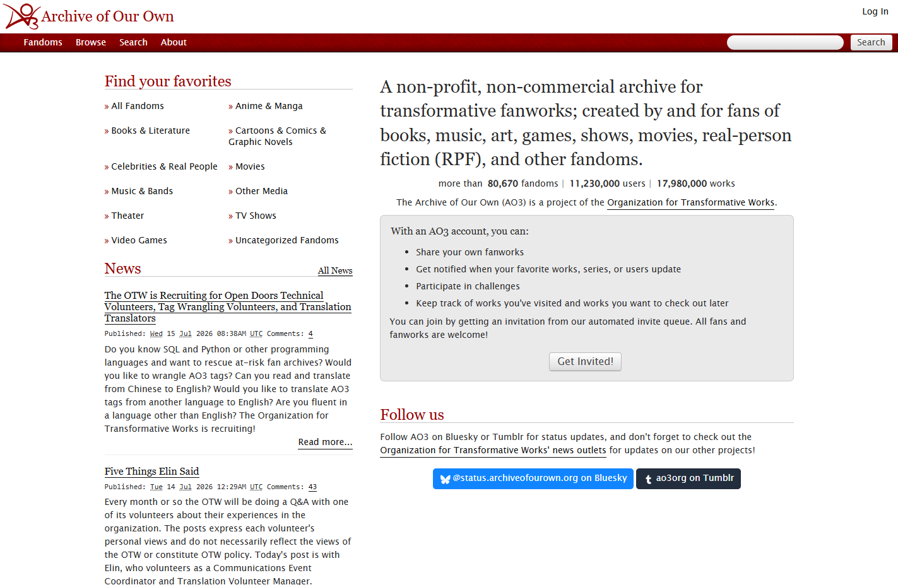
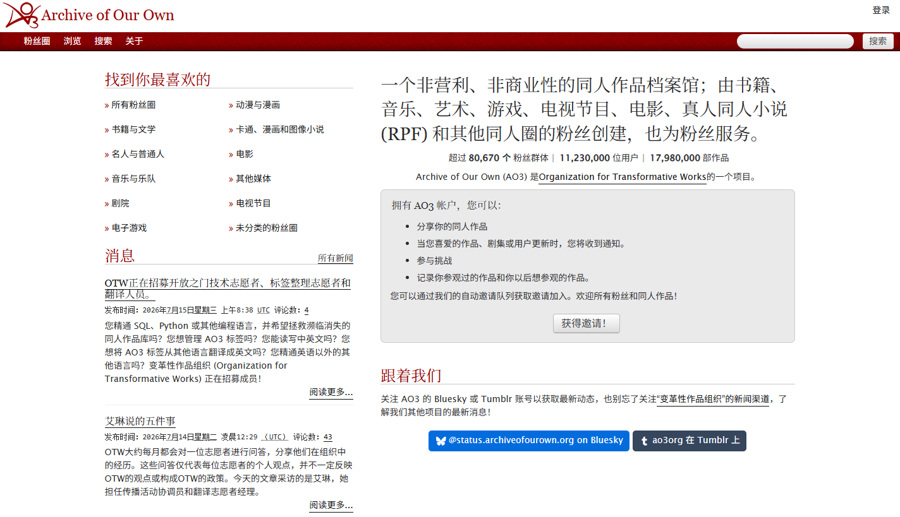
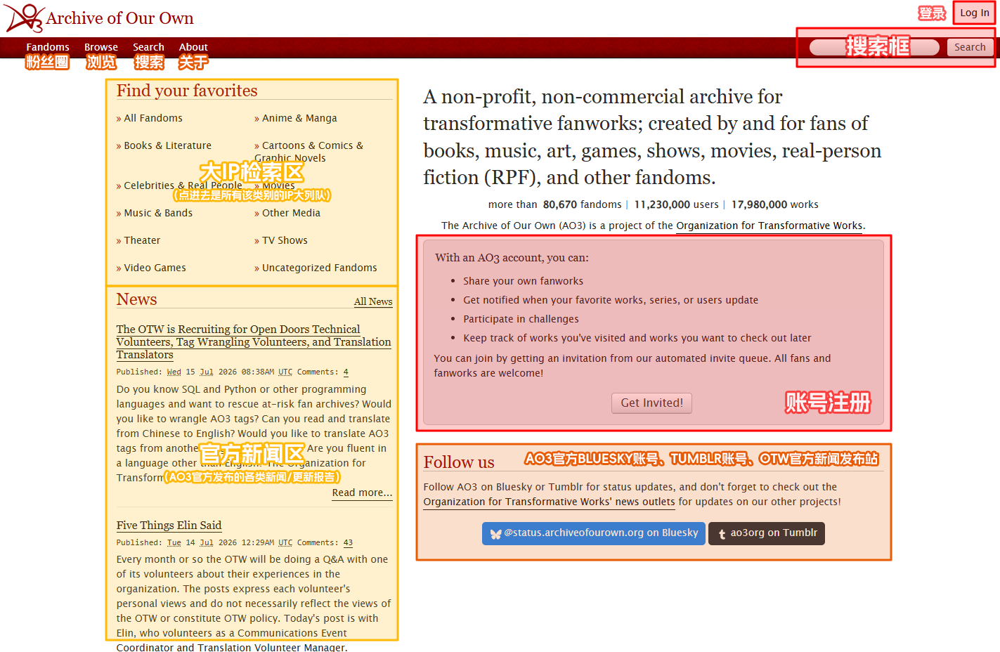
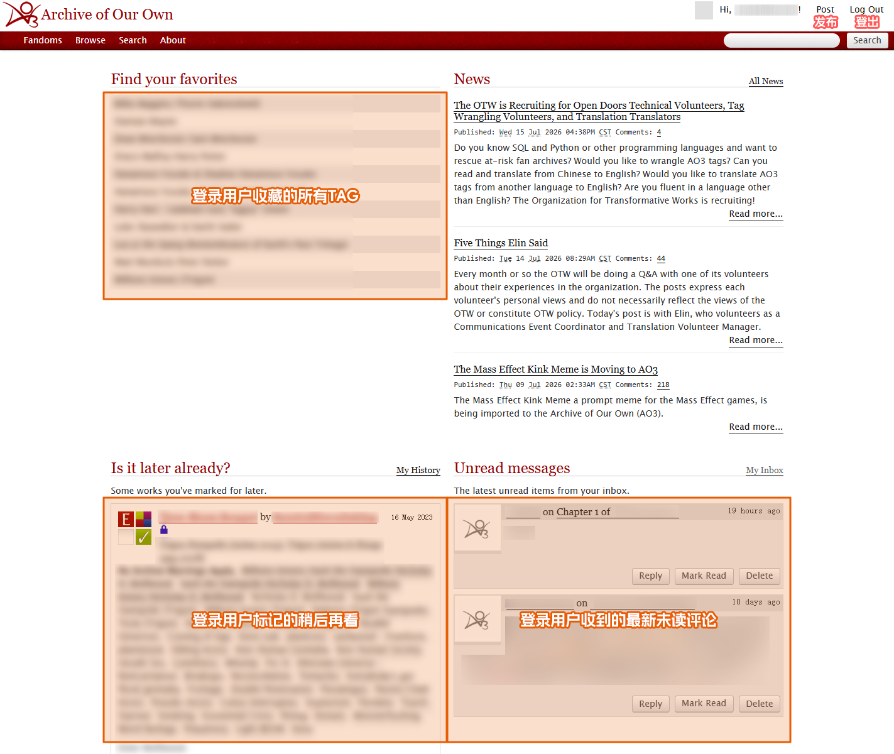
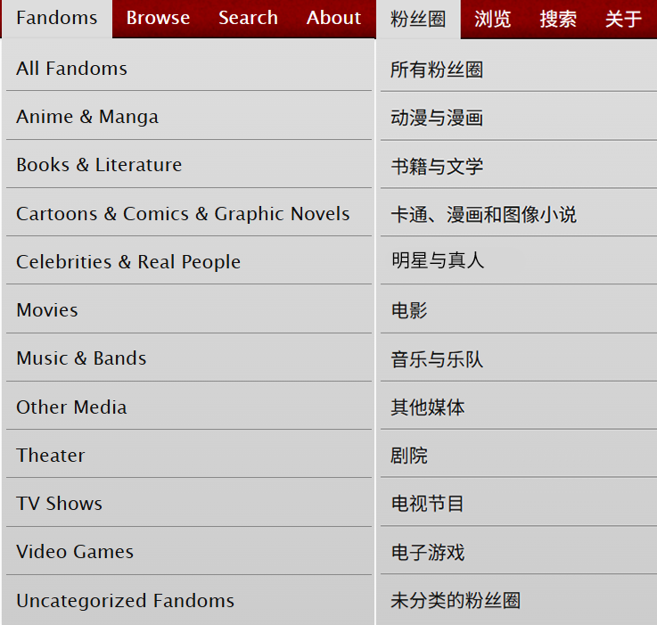
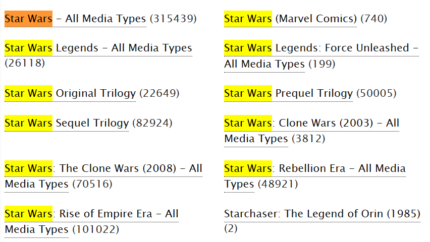
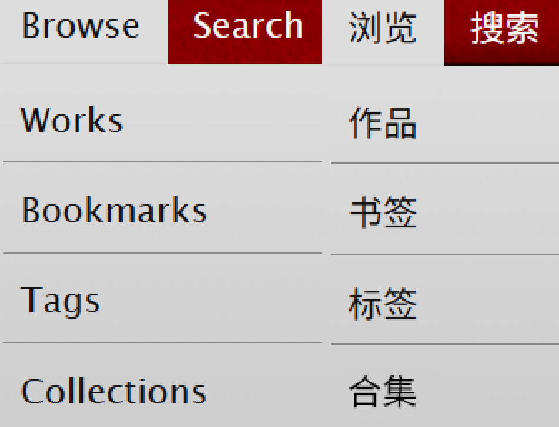
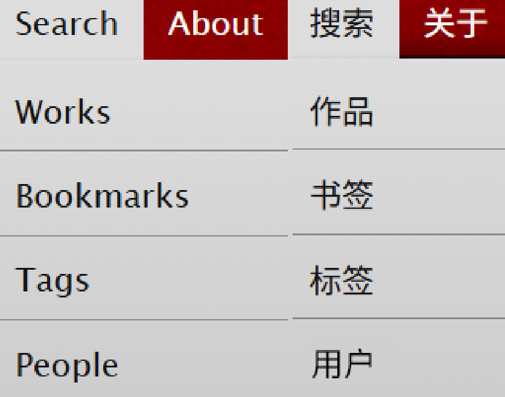
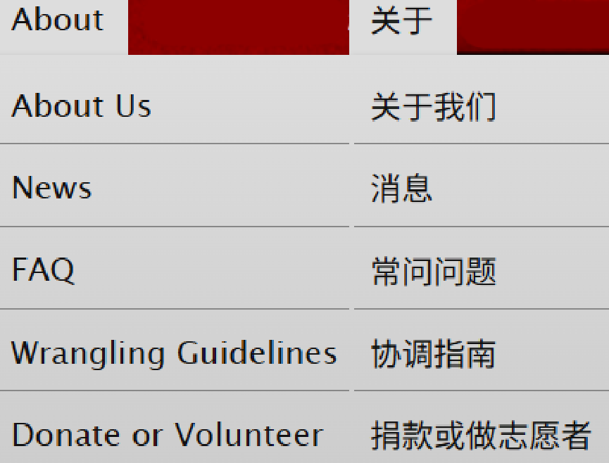

# AO3首页/主界面


<mark style="color:$primary;">**本节内容涉及的各项功能的详细介绍于页尾附录列出。**</mark>


## 主界面总览

进入AO3时，我们最先看到它的主界面。

<mark style="color:red;">**未登录的游客**</mark>看到的界面是：

<figure><figcaption></figcaption></figure>

网页机翻后的大致内容如下：

<figure><figcaption></figcaption></figure>

其中各部分内容的具体含义为：

<figure><figcaption></figcaption></figure>

<mark style="color:red;">**登录用户**</mark>的首页则会展示更多信息，比如**收藏标签**、**稍后再看**或者**评论通知**：

<figure><figcaption></figcaption></figure>

当没有这些信息时（未收藏任何标签、未标记任何稍后再看、无未读评论等），登录用户的主界面显示与未登录游客基本相同。

## 左上角目录

AO3主界面的左上角有四个可展开的目录，分别为**Fandom**（粉丝圈/同人圈），**Browse**（浏览），**Search**（搜索）和**About**（关于）。

<figure><figcaption></figcaption></figure>

<strong>Fandom（粉丝圈/同人圈）</strong>

这个栏目的内容与游客主界面左上侧的**Find Your Favorites**模块相同，用于快速检索某个同人圈（或者更为直接的说法：某个作品IP）的标签。其分类大致如下：

<figure><figcaption></figcaption></figure>

比如，若用户想要查找「星球大战」这个同人圈的标签，应当点击该栏目的「电影」选项，然后通过`Ctrl+F`搜索「Star Wars」。得到的结果可以直接点击跳转至包含该tag的全部作品页面。

<figure><figcaption></figcaption></figure>

<strong>Browse（浏览）</strong>

这个栏目包含作品、书签、标签与合集四个选项。

**请注意：这里的选项均指的是全站范围。**

也即，点击「作品」将默认以最新发表为序显示全站所有作品。若用户想要筛选某些特定作品，需要使用Search功能或右上角搜索框。

<figure><figcaption></figcaption></figure>

<strong>Search（搜索）</strong>

本栏目包含作品、书签、标签和用户四个选项。通过点击对应选项，可以在全站进行针对性的检索。

<figure><figcaption></figcaption></figure>

**具体方法篇幅较长，请参照：**[**基本搜索方法**](../du-zhe-zhi-nan/ji-ben-sou-suo-fang-fa-search/)

<strong>About（关于）</strong>

本栏目包含五个选项。

1. **About Us：**&#x5173;于AO3的建造者和组织者OTW[^1]的科普
2. **News：**&#x5173;于OTW和AO3的新消息，如网站更新、举办活动、志愿者招募等
3. **FAQ：**&#x41;O3百科全书，基本所有关于网站使用的问题都可以查到答案
4. **Wrangling Guidelines：**&#x7ED9;整理标签的志愿者用的参考手册
5. **Donate or Volunteer：**&#x6350;款常年开放，志愿者招募有时限

<figure><figcaption></figcaption></figure>

***

## 附录

本节提到的各类功能罗列如下：

* **左上搜索功能：**&#x8BE6;见[基本搜索方法](../du-zhe-zhi-nan/ji-ben-sou-suo-fang-fa-search/)
* **右上搜索框：**&#x8BE6;见[※内嵌搜索运算符](../du-zhe-zhi-nan/nei-qian-sou-suo-yun-suan-fu.md)
* **发布作品：**&#x8BE6;见[发布百科](../chuang-zuo-zhe-zhi-nan/fa-bu-bai-ke/)
* **收藏标签：**&#x8BE6;见[如何收藏标签（Favorite Tags）](../du-zhe-zhi-nan-jin-jie-ban/ru-he-shou-cang-biao-qian-favorite-tags.md)
* **稍后再看：**&#x8BE6;见[稍后再看（Marked for Later）](../du-zhe-zhi-nan-jin-jie-ban/shao-hou-zai-kan-marked-for-later.md)
* **评论：**&#x8BE6;见[关于评论（Comments）](../hu-dong-yu-jiao-liu/dian-zan-yu-ping-lun/guan-yu-ping-lun-comments/)
* **书签：**&#x8BE6;见[书签/收藏（Bookmark）](../du-zhe-zhi-nan-jin-jie-ban/shu-qian-shou-cang-bookmark.md)
* **标签：**&#x8BE6;见[常用Tag百科](chang-yong-tag-bai-ke.md)
* **合集：**&#x8BE6;见[合集（Collection）](../du-zhe-zhi-nan-jin-jie-ban/he-ji-collection.md)

注：如果想让AO3记住密码自动登录，请勾选登录框里的`Remember me`选项。

[^1]: The Organization for Transformative Works（再创作组织）
