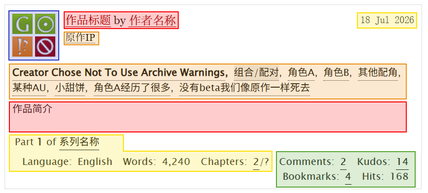
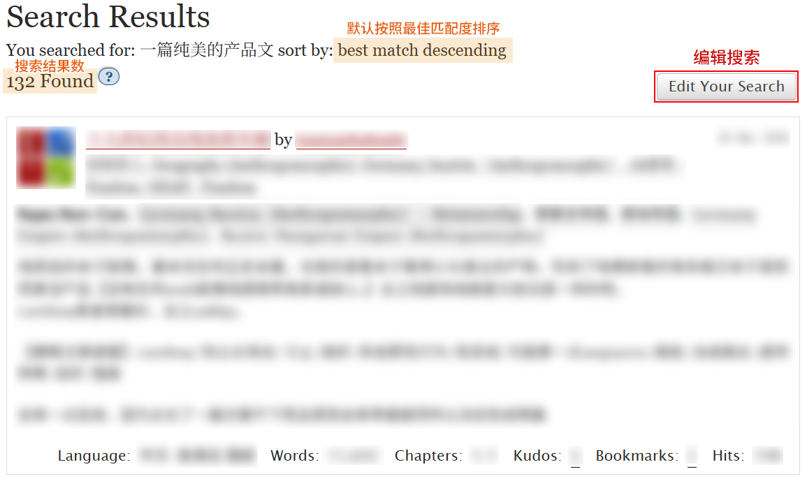
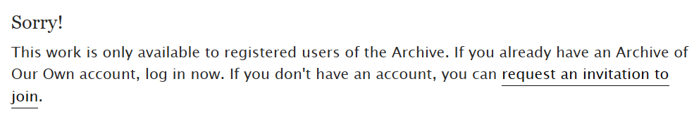
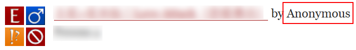
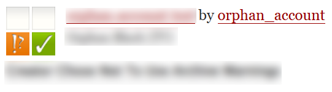
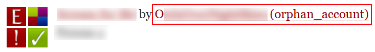
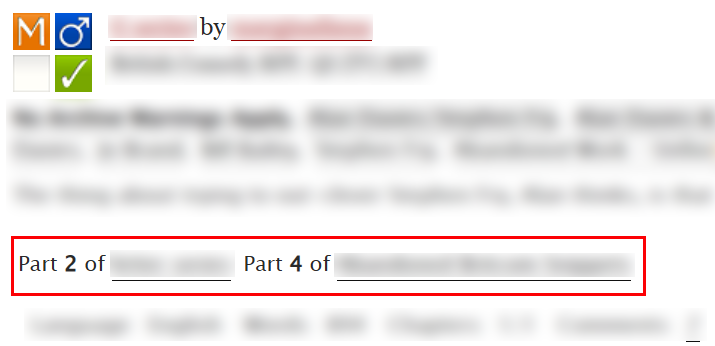
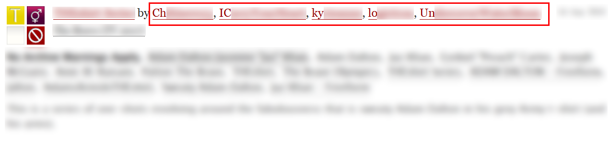
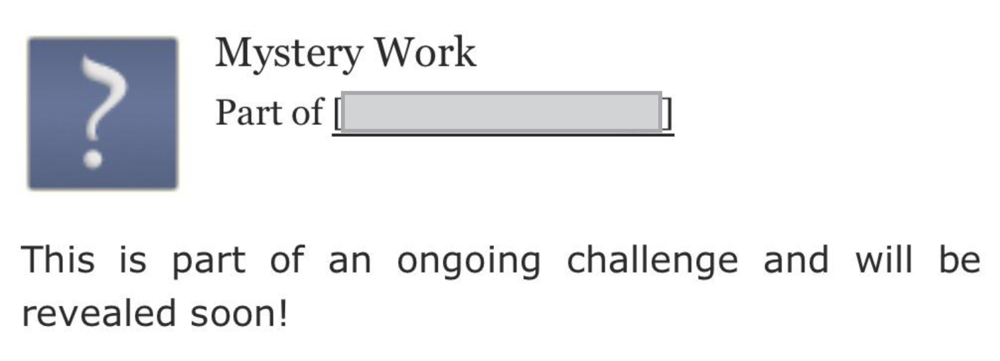

# 作品陈列界面

同人女冲进AO3宛如老鼠冲进粮仓，但面对陌生的全英交互界面，初来乍到者往往难以迅速辨识自己想要的信息。本节即是为了帮助新用户理解AO3作品的展示逻辑而设。

## 作品摘要

首先，这是所有作品在AO3的陈列形式：一&#x5F20;**「摘要卡」**。

<figure><figcaption></figcaption></figure>

这张「摘要卡」上基本包含了读者在决定是否阅读作品前需要获知的所有信息：

<mark style="background-color:$primary;">蓝色方框</mark>：<mark style="color:$primary;">**AO3文库符号**</mark>

* 这四个颜色符号标识对应着作品的**分级**、**性向**、**预警**和**完结情况**
* 具体含义见[AO3文库符号](ao3-wen-ku-fu-hao.md)

<mark style="background-color:$danger;">红色方框</mark>：<mark style="color:red;">**作品的标题**</mark>、<mark style="color:red;">**作者的名称**</mark>和<mark style="color:red;">**作品的简介**</mark>

* 均由作者自行设置或填写
* 作品可以没有简介，但必须有标题
* 点击「作品标题」即可直接进入作品的阅读界面
* 点击「作者名」会跳转至作者的个人主页（除非作者是匿名，或者作品被遗弃）

<mark style="background-color:$warning;">橙色方框</mark>：<mark style="color:$warning;">**标签**</mark>

* 标题之下是作品从属的「粉丝圈标签」，也就是原作
* 首位的加粗标签是「**预警标签**」
* 灰色底色标签是「<mark style="background-color:$info;">组合或配对标签</mark>」
* 其后是「角色标签」和「其他标签」
* 除原作外，其他标签均为非必填项，可以没有
* 关于标签的更多解释请见[常用Tag百科](chang-yong-tag-bai-ke.md)

<mark style="background-color:yellow;">黄色方框</mark>：<mark style="color:yellow;">**基础信息**</mark>

* 右上角显示作品的发布或更新时间；作者可以自行将其更改至过去的任意日期
* 若作品是某个系列中的一篇，将会显示：Part **?** of 系列名称
* 最下方一行分别是作品的语言、字数和章节数（已发布数量/总数量）；若章节总数显示为「?」，说明作者未设置固定的章节总数

<mark style="background-color:$success;">绿色方框</mark>：<mark style="color:$success;">**互动量信息**</mark>

* Comments：评论
* Kudos：点赞
* Bookmarks：收藏
* Hits：点击量
* 点击数字可以跳转至对应的区域
* 除点击量为固定显示外，其他几项如果没有则不显示

&#x20;

## 搜索结果（Search Results）

如果不进行设置，AO3的搜索结果默认按照最符合检索关键词的顺序排列。然而，AO3基于英语打造的搜索架构对于单字成词的中文来说比较“笨”。要想完美锁定目标，可以使用`Edit Your Search`（编辑搜索）按钮进一步框定你的搜索范围。

具体方法请参考：[编辑搜索](../du-zhe-zhi-nan/ji-ben-sou-suo-fang-fa-search/bian-ji-sou-suo-edit-your-search.md)

<figure><figcaption></figcaption></figure>

## 一些特殊情况

### 蓝锁=仅登录用户可见

登录用户有时会看到某些作品的作者名后有一个小小的蓝锁标志。这意味着这篇作品被设置为「仅登录用户可见」。如果你没有登录AO3，这篇作品将无法被搜索到；即使通过链接直接跳转，也会显示此作品仅供登录用户查看。

<figure><figcaption>
仅登录可见的标志
</figcaption></figure>

<figure><figcaption>
未登录用户查看仅登录可见作品时的报错
</figcaption></figure>

### 匿名作品

如果一篇作品的作者显示为「Anonymous」，且作者名没有超链接、无法点击跳转，说明这篇作品被加入了匿名合集，作者的身份不公开。作者在该作品下的评论也会以匿名的形式发送。如果该作品尚未被遗弃，作者仍可以自由编辑它，也可以随时将作品移出匿名合集而解除匿名。

<figure><figcaption></figcaption></figure>

### 被遗弃作品

如果一篇作品的作者显示为「orphan\_sccount」或作者名后带有「(orphan\_account)」字样，且点击作者名会跳转至错误404界面，说明这篇作品已经被遗弃。作者遗弃作品时可以选择去除或保留自己的署名。如果一篇作品在匿名合集内被遗弃，作者名会显示为「Anonymous」。作者遗弃作品后即不再拥有任何编辑权限，也无法删除作品或重新取回编辑权限。

<figure><figcaption>
作者去除署名的遗弃作品
</figcaption></figure>

<figure><figcaption>
作者保留署名的遗弃作品
</figcaption></figure>

### 加入多个系列的作品

一篇作品可以同时加入多个系列，此时它加入的所有系列将并列显示。

<figure><figcaption></figcaption></figure>

### 多作者的作品

一篇作品可以有多个署名的协作者，每个作者都对作品享有同样的编辑权限。作者的名称将按照字母顺序排列。

<figure><figcaption>
一篇有5个作者的作品
</figcaption></figure>

### 赠予作品

在AO3，作者可以以赠予某人的形式发布作品。A赠予B的作品会显示为\[Work] by \[A] for \[B]。

<figure><figcaption></figcaption></figure>

### 神秘作品=作者隐藏作品

当一篇作品以Mystery Work的形式展示时，说明它被作者加入了一个不公开的合集，相当于传统意义上的「仅自己可见」功能。这篇作品尚未被删除，但假如作者不选择公开，它将保持隐藏状态。

<figure><figcaption></figcaption></figure>
