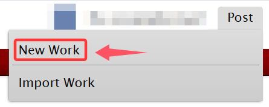

# 发布百科

对于用惯社媒发布平台的人来说，AO3的作品发布界面显得过于复杂；然而只要初步了解那些单词的含义，你完全可以丝滑地进行作品发布。

为了你的产品——点开神圣的`Post`按钮吧！

<figure><figcaption></figcaption></figure>

然后点击`New Work`，来到发布新作品的页面。

<figure><figcaption></figcaption></figure>

Import Work和From Draft选项之后再介绍。

<figure><figcaption></figcaption></figure>


<mark style="color:red;">**注意：填写在发布页的内容不会自动保存，一刷新就会消失，请务必自己留有备份！**</mark>

