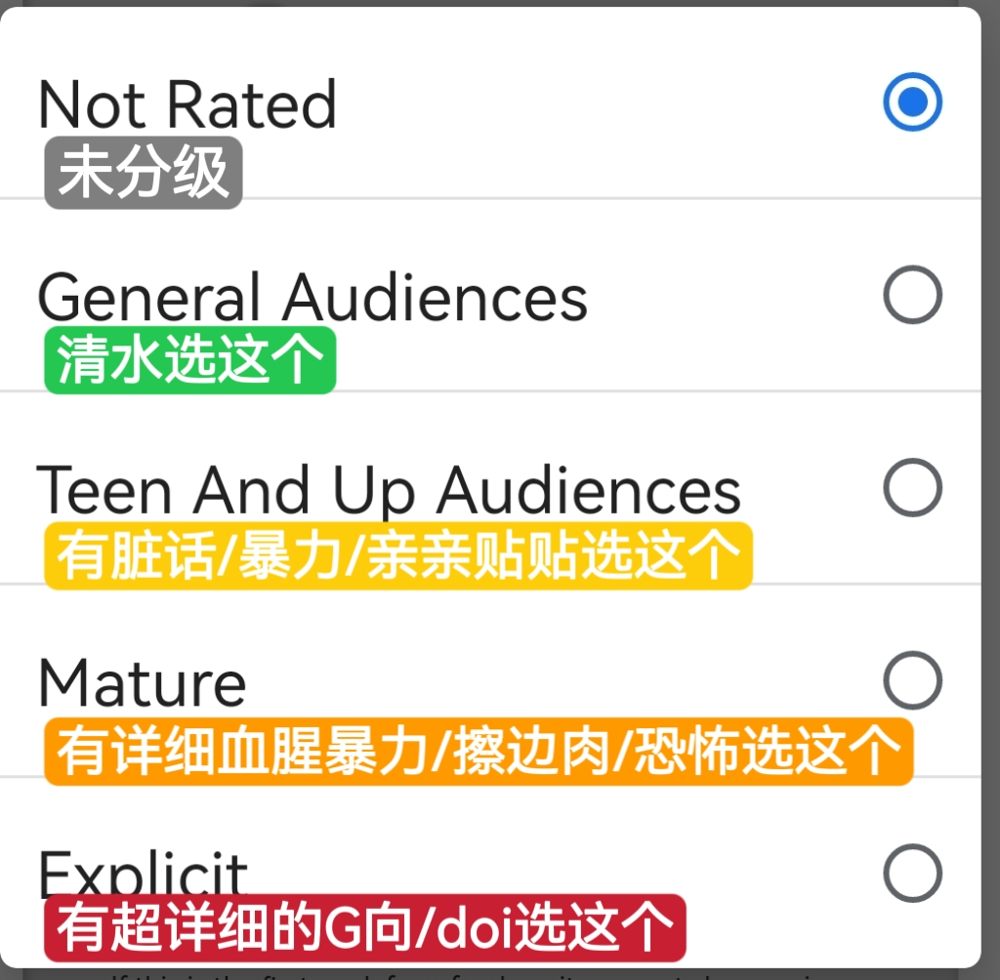
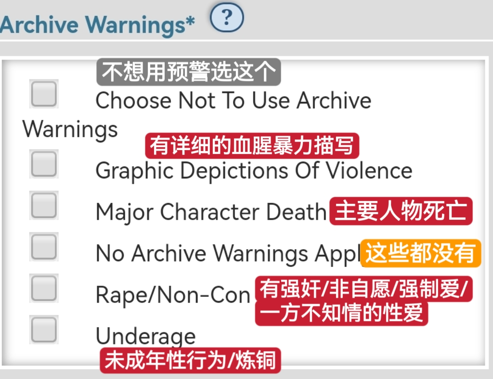
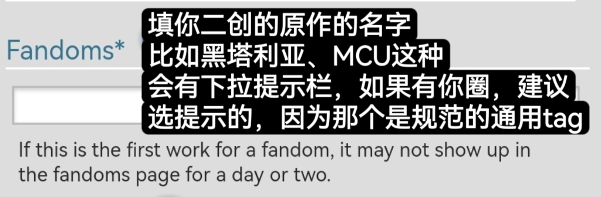
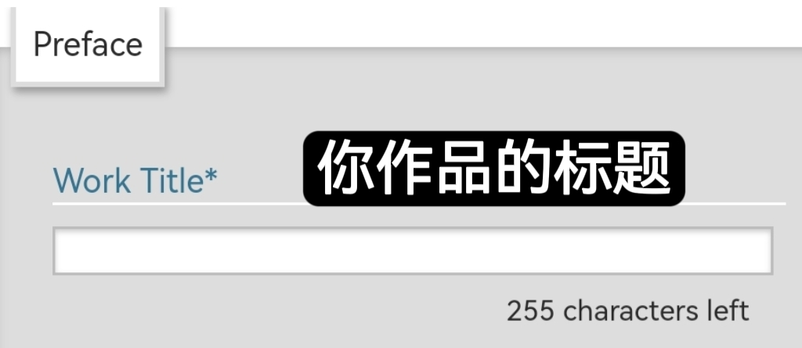
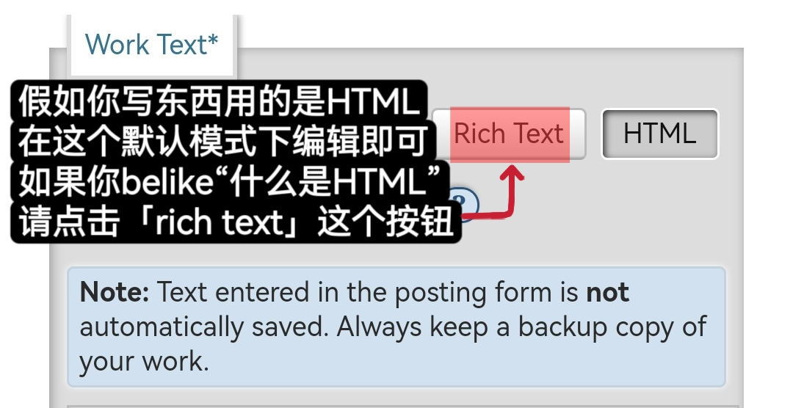
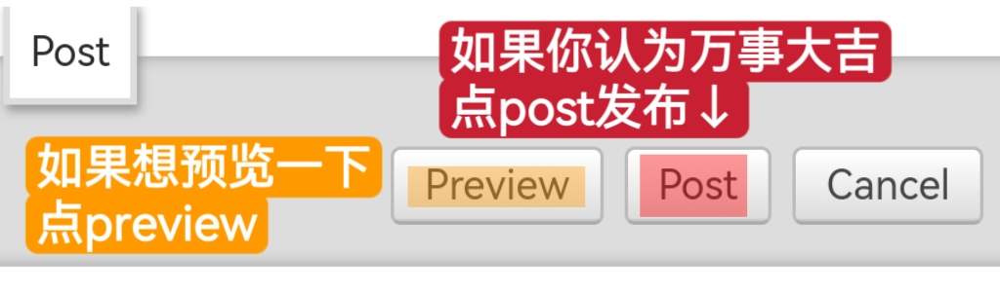

# 必填项


<mark style="color:red;">**注意：填写在这里的内容不会自动保存，一刷新就会消失，请务必自己留有备份！**</mark>


按照自上而下的顺序：

1. 首先是**Ratings**，分级。

<figure><figcaption></figcaption></figure>

2. 然后是**Archive Warnings**，警告。

<figure><figcaption></figcaption></figure>

3. 第三是**Fandom**，也就是你二创的原作是什么。

<figure><figcaption></figcaption></figure>

4. 第四是**Work Title**，作品标题。

<figure><figcaption></figcaption></figure>

5. 第五项是**Choose a Language**，选择作品语言。

<figure><figcaption></figcaption></figure>

6. 最后就是填写**Work Text**正文内容了！正文成功发布要求最少有十个字符。如果你已经在其他写文软件里对你的文章做了排版，请点击`Rich Text`，然后直接复制黏贴（用剪贴板复制黏贴的话，排版大概率会丢失）。

<figure><figcaption></figcaption></figure>

如果你认为填完这些就够了，那么点击`Post`。

<figure><figcaption></figcaption></figure>

如果你还想让自己的作品能更精准地被同好搜索到，下一页请！
