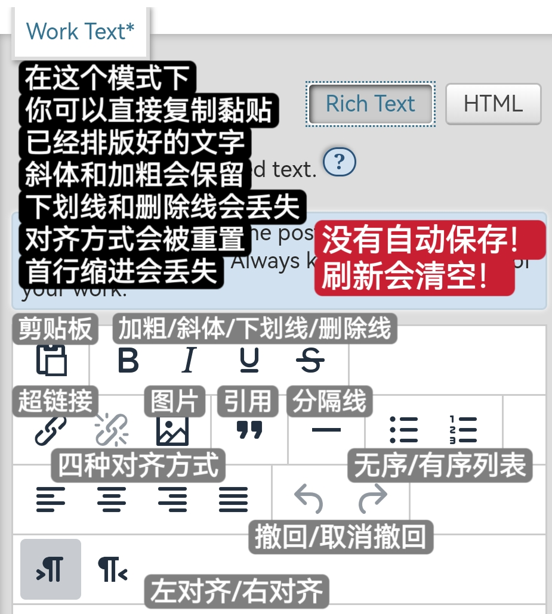
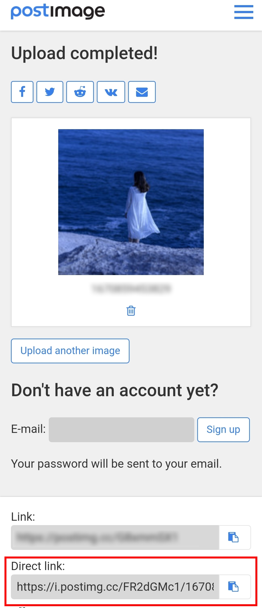
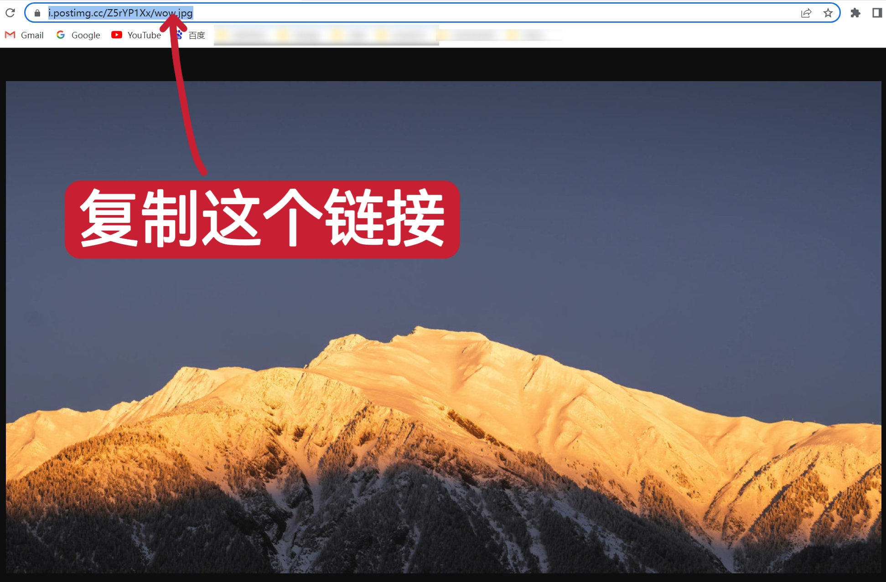

# 插入图片/超链接

本节讲解如何在富文本格式下插入图片与超链接。

富文本模式下正文界面是这样的：

<figure><figcaption></figcaption></figure>

## 插入图片

**首先，我们需要将图片上传至互联网**[**图床**](../../ao3-da-zi-dian.md#image-hosting-tu-chuang)**上。**

目前国内的大部分互联网图床都不怎么支持R18图片，被屏蔽删除的可能性很大，使用图床的时候记得查看图床的使用条款。

在这里用国外的图床[Postimage](https://postimages.org/zh-cn/)举例。

<figure><figcaption></figcaption></figure>

点击选择图片，在文件中选择你要上传的图片；上传完成后，滑到下方多个链接处，点击右侧按钮复制图片的**Direct link**。这就是你上传的图片的直达网址。

<figure><figcaption></figcaption></figure>

如果没有跳转至含有链接的界面，而是直接展示了图片上传完成的样子：

<figure><figcaption></figcaption></figure>

请右键（手机长按）图片后选择「在新页面中打开图片」，并复制新打开的页面的网址。

<figure><figcaption></figcaption></figure>

<figure><figcaption></figcaption></figure>

然后，回到AO3发布文章的界面，点击图片图标；在弹出的界面中，Source填入你复制的图片网址，Image description选填，最后点击`Save`。

<figure><figcaption></figcaption></figure>

如果图片大小不合适可以拖动四角的蓝色方块进行调整。

<figure><figcaption></figcaption></figure>

## 插入超链接

复制好你想插入的链接，在编辑正文处点击插入超链接的图标。

弹出的界面中，第一行URL填入你复制的链接，第二行Text to display填入你想展示的文字，第三行Title是鼠标悬停在超链接上时会看到的文字。最后点击`Save`即可。

<figure><figcaption></figcaption></figure>

效果如图：

<figure><figcaption></figcaption></figure>

<figure><figcaption></figcaption></figure>
