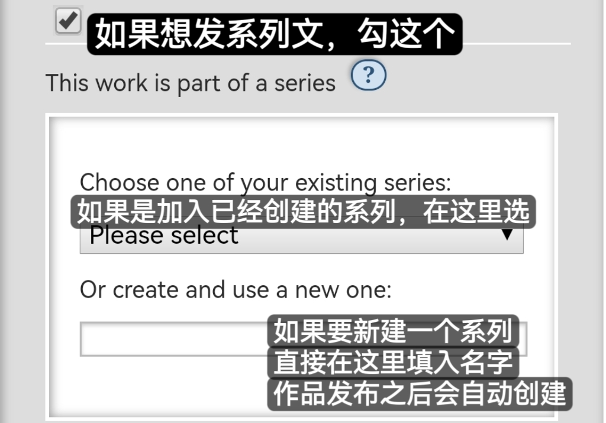

# 关于系列（Series）

系列文的效果如图：

<figure><figcaption></figcaption></figure>

### 如何把文章加入系列

进入文章发布/编辑界面，找到关联设置中的「This work is part of a series」并勾选，然后如图填写。

<figure><figcaption></figcaption></figure>

你可以在个人主页的Series页面中查看你所有的系列：

<figure><figcaption></figcaption></figure>

### 如何更改系列文章排序

1. 点击系列左下角的`Edit`按钮。

<figure><figcaption></figcaption></figure>

2. 点击`Reorder Series`。

<figure><figcaption></figcaption></figure>

3. 你可以直接长按拖动作品进行排序，也可以在作品名称前的空格内填入数字实现排序。
4. 完成后点击`Update Positions`更新排序。
