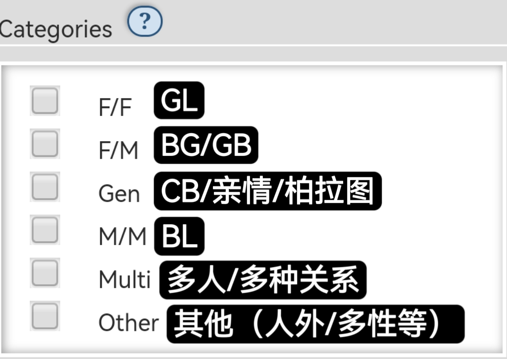
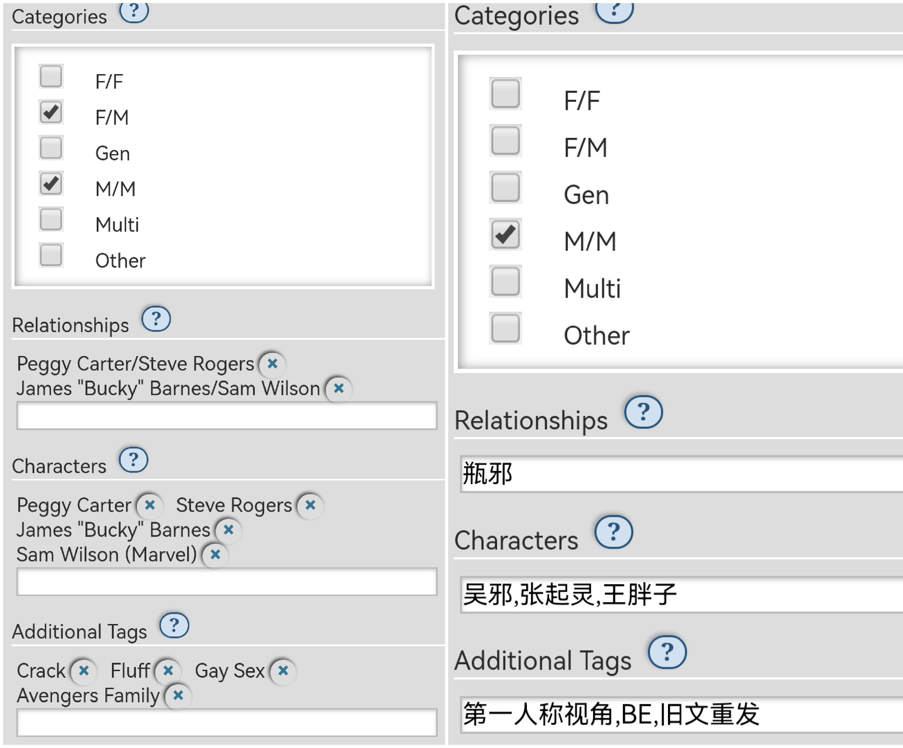
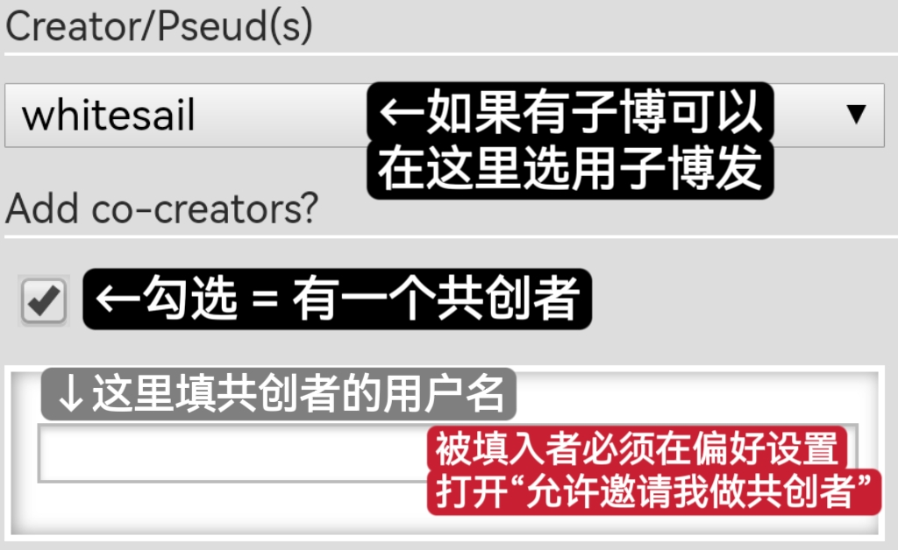
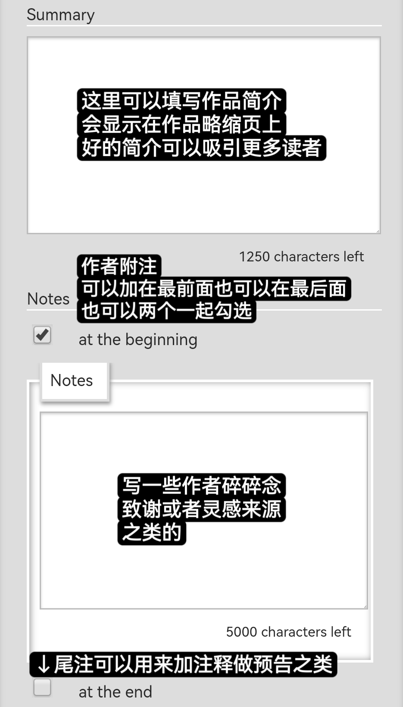
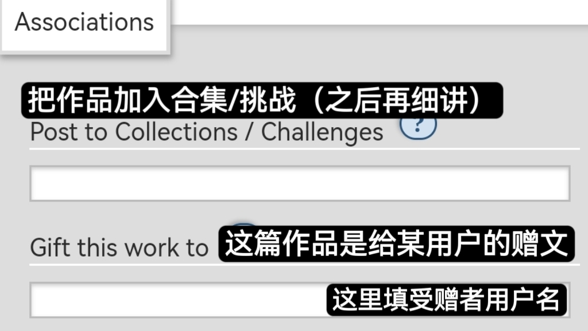
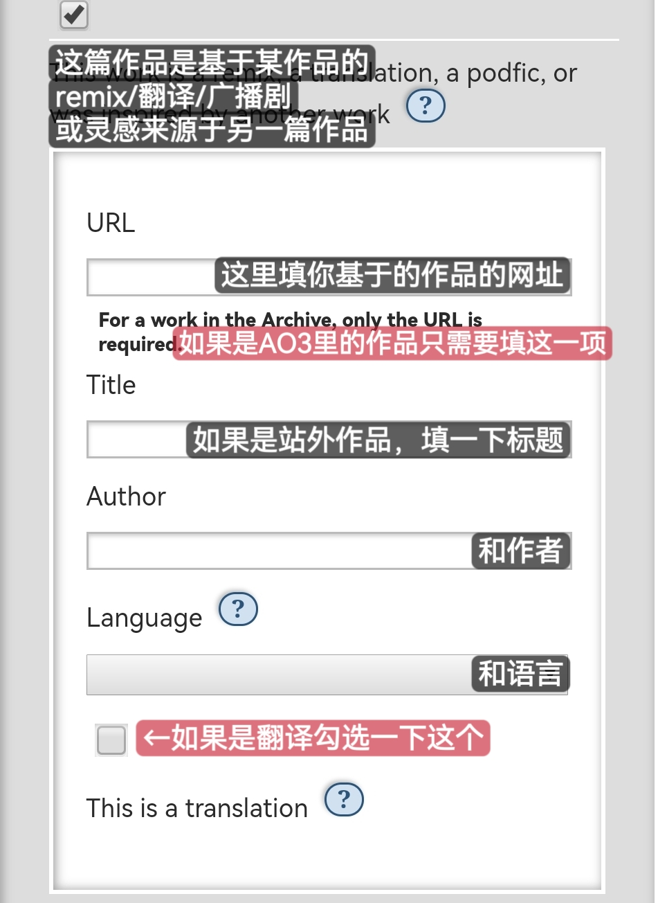
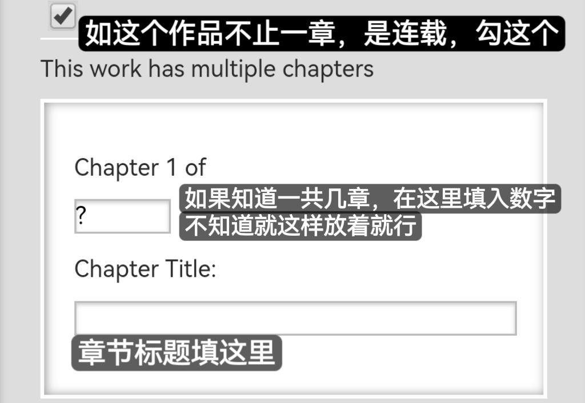
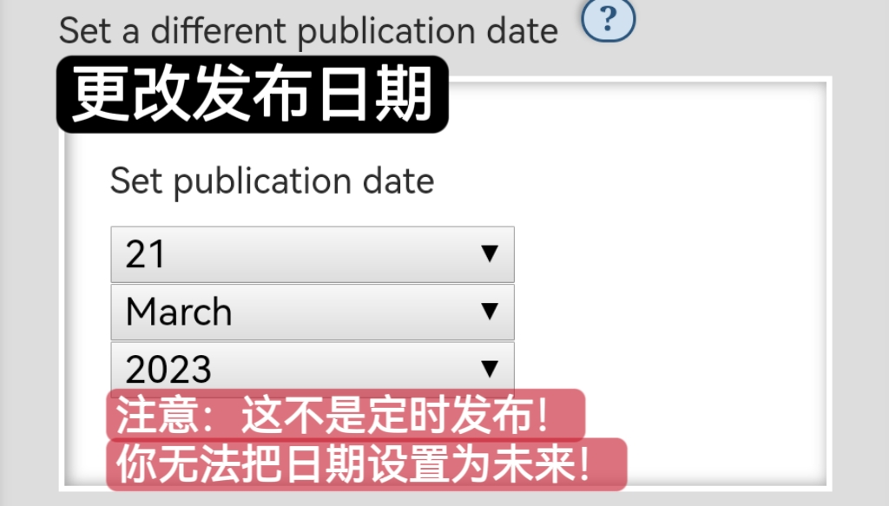
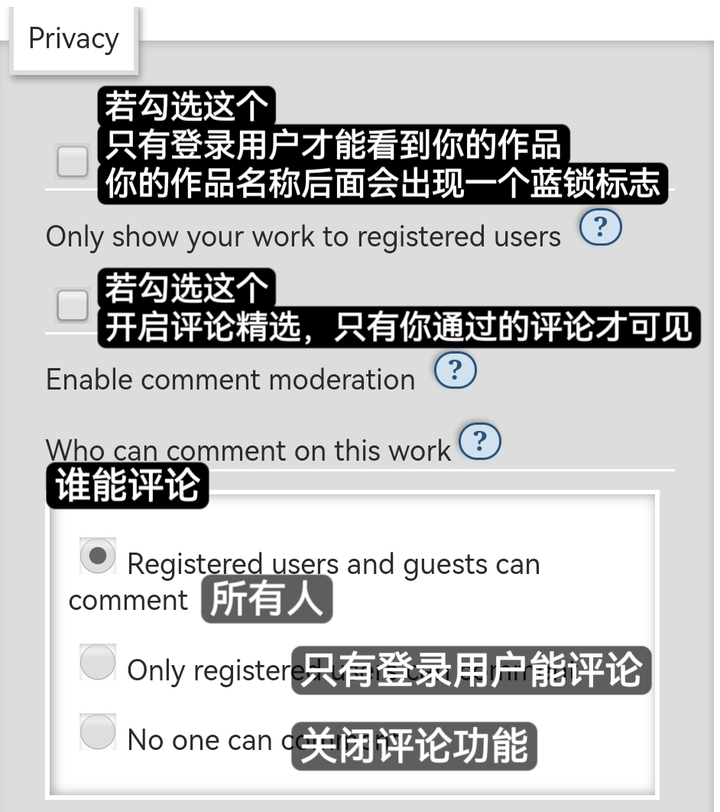

# 进阶项


<mark style="color:red;">**注意：填写在这里的内容不会自动保存，一刷新就会消失，请务必自己留有备份！**</mark>


按自上而下的顺序：

[标签设置](jin-jie-xiang.md#biao-qian-she-zhi-tags)

[前言设置](jin-jie-xiang.md#qian-yan-she-zhi-preface)

[关联设置](jin-jie-xiang.md#guan-lian-she-zhi-associations)

[隐私设置](jin-jie-xiang.md#yin-si-she-zhi-privacy)

## 标签设置（Tags）

1. **Categories：**&#x7C7B;别，作品配对属性。

2. **Relationships：**&#x914D;对，你产品名称；可以直接填写中文的配对名（会被关联到通用tag之下），也可以按照角色A/角色B的格式填写。
3. **Characters：**&#x89D2;色，出场人物姓名；尽量填写正规的全名。
4. **Additional Tags：**&#x5176;他标签，做补充用；可以直接填写中文。

_**注意：标签之间要用英文逗号或回车分隔。**_

下图是英文和中文填写的例子。

<figure><figcaption></figcaption></figure>

## 前言设置（Preface）

5. **Creator/Pseud(s)：**&#x66F4;改发布账号；默认是你的默认账号，可以改成别的子博。
6. **Add co-creators?：**&#x6DFB;加共创者；指定其他用户为作品的共创者，只能邀请一个。

7. **Summary：**&#x7B80;介；除了tag之外另一个能让读者一眼决定是否感兴趣的地方。
8. **Notes：**&#x4F5C;者备注；可以用来碎碎念、致谢、做解释等等，有加在作品之前或之后两个选项，可以多选。

## 关联设置（Associations）

9. **Post to Collections / Challenges：**&#x628A;作品加入某个合集/挑战；这一项的主要作用是[匿名发文](ni-ming-fa-wen.md)或[参加活动](../he-ji-yu-tiao-zhan-sai.md)。
10. **Gift this work to：**&#x628A;这篇作品赠送给某人；有时基于某二创作品的三创会在这里填写原作者的名字作为[credit](../../ao3-da-zi-dian.md#credit-yuan-zuo-zhe-shi)。

11. **This work is a remix, a translation, a podfic, or was inspired by another work：**&#x672C;作品是remix、翻译、广播剧或灵感来自另一篇作品。

**如果原文也在AO3，发翻译文时请勾选这个，是对原作者的尊重，也更方便两篇文关联！**

如果你三创的基础也在AO3，只需要填写网址即可。注意使用原站网址，不要使用镜像。

12. **This work is part of a series：**&#x672C;作品属于一个系列。

系列和合集不同，你的文无法加入别人的系列（除非是共创者）。

如果你已经创建过系列并想将本作品加入该系列，直接在Choose one of your existing series的下拉列表中选择。如果你想要新建一个系列，直接在Or create and use a new one里填写你新系列的名字。

13. **This work has multiple chapters：**&#x672C;作品有多个章节。

如果你已经预定了作品的总章节数，可以在问号处填写总数；若不清楚，则不用填写。

如果章节有单独的标题，在Chapter Title处填写。

14. **Set a different publication date：**&#x66F4;改发布日期。

_**注意：并不是定时发布！日期无法超过你选用时区的当天！**_

这个功能有两个应用方法，一是往早了调，比如有些往AO3搬运作品的创作者会希望自己的发表时间和其它网站发表的时间保持一致；二是往晚了调，比如你1月22号的草稿24号才发表，为了符合实际可以把发布日期调整至24号（已发布的作品也可以调整时间，达成手动排序的功能）。这里设定的发布日期会影响你的作品在按日期排序的页面上出现在什么位置。

15. **Select Work Skin：**&#x9009;择[作品皮肤](../zuo-pin-pi-fu-work-skin.md)；高级功能，后面再讲。

## 隐私设置（Privacy）

16. **Only show your work to registered users：**&#x4EC5;允许注册用户查看你的作品。
17. **Enable comment moderation：**&#x5F00;启评论精选。
18. **Who can comment on this work：**&#x8BC4;论权限；控制谁能评论你的作品。

蓝锁标志：

