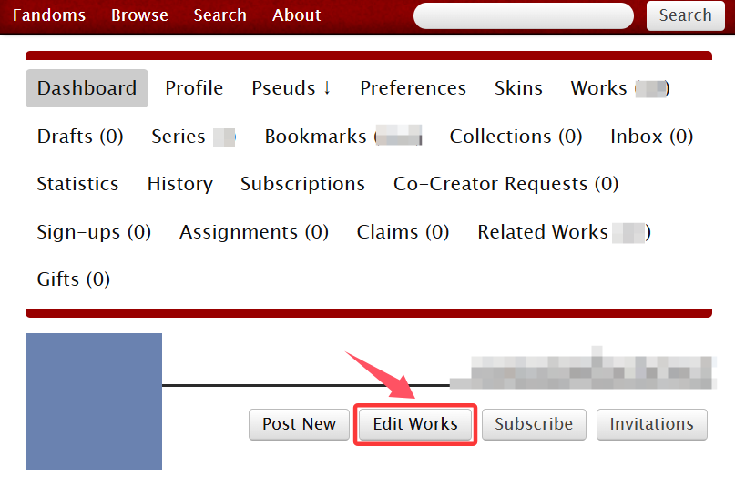
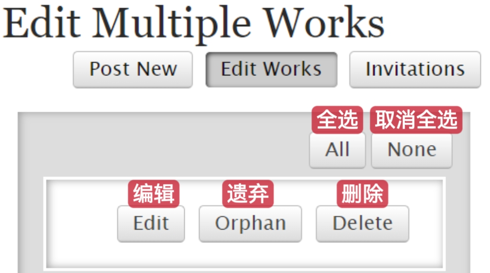

# 批量编辑作品

如果你想批量地编辑、遗弃或删除你的作品，在你的个人主页点击`Edit Works`；或者进入Profile页面，点击`Edit My Works`。

<figure><figcaption></figcaption></figure>

在出现的页面勾选你想更改的作品。

可以进行的操作如图所示：

<figure><figcaption></figcaption></figure>

**编辑功能：**&#x652F;持批量修改「分级、警告、圈子、类别、配对、角色、其他标签、创作者、共创者、加入集合、语言、作品皮肤、可见性（是否向游客展示你的作品）、评论精选和评论权限」。你在这个编辑页面进行的一切改动会覆盖掉你所选择的所有作品原先的上述内容。

在编辑完成之后点击`Update All Works`即可更新选中作品。

**遗弃功能：**&#x6279;量遗弃你的作品，具体功能和操作见[遗弃作品](yi-qi-zuo-pin-orphan-work.md)。

**删除功能：**&#x6279;量删除你的作品，具体功能和操作见[删除作品](shan-chu-zuo-pin-delet-work.md)。
