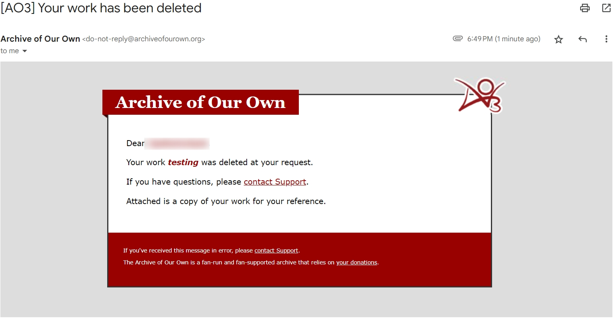

# 删除作品（Delet Work）

如果你想要删除你的作品，只需进入编辑作品的界面，点击`Delete Work`，然后在弹出的消息框内选择`OK`即可。

<figure><figcaption></figcaption></figure>

你的绑定邮箱会收到一封邮件，提醒你你的作品已经被删除；这个邮件的附件是被删除作品的txt和html格式文件，相当于AO3自动向你发送了被删除作品的备份。

<figure><figcaption></figcaption></figure>
