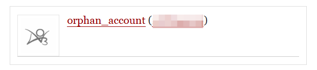
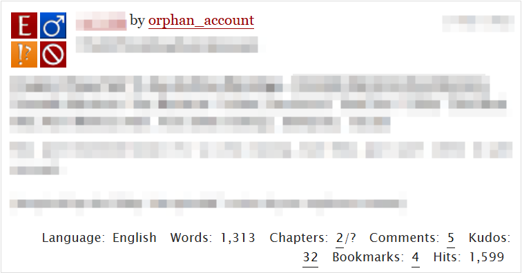
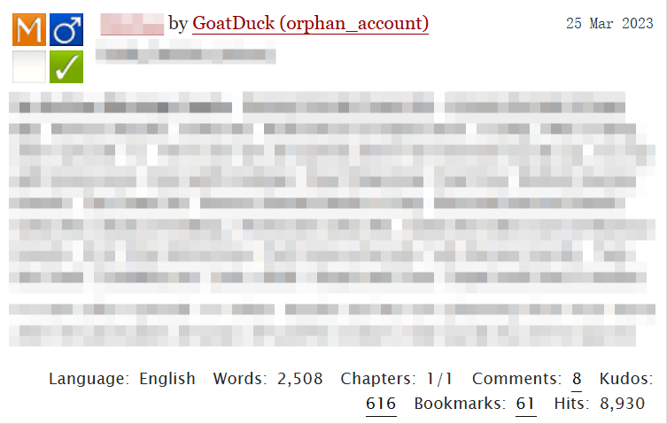
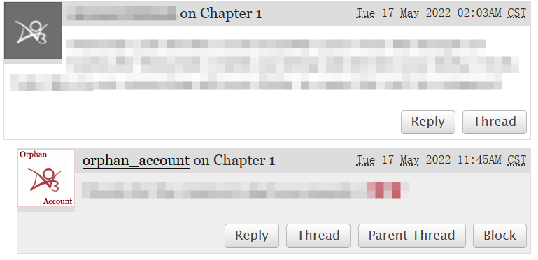
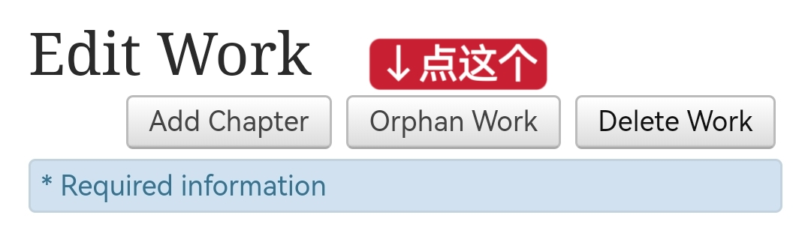
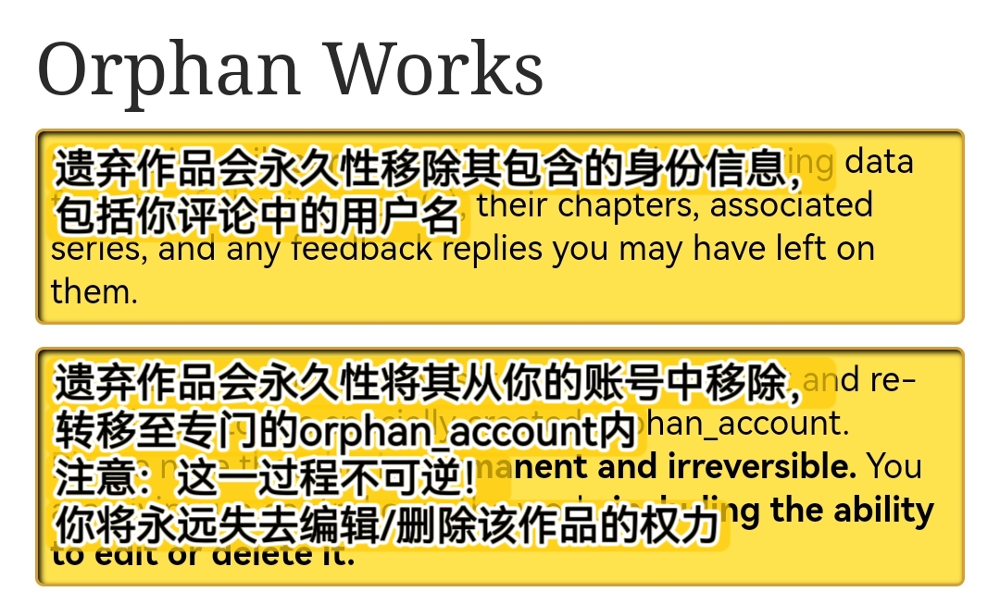
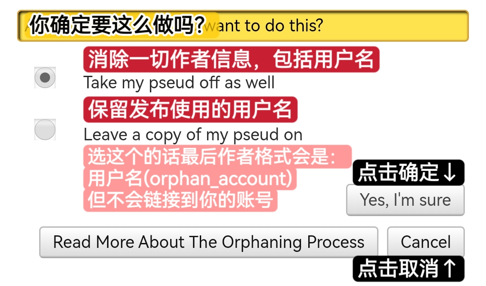

# 遗弃作品（Orphan Work）


<mark style="color:red;">**注意：这个功能一旦使用就无法撤销，请慎重考虑！**</mark>


## 功能

在使用遗弃作品功能后，作品将会从你的账号名下移除，转移到专门的orphan\_account之下。遗弃作品意味着你放弃对这个作品的一切关联和权力，你将：

* 无法再编辑或删除这篇作品
* 不再被显示为这篇作品的创作者
* **无法撤销这个选择**

orphan\_account长这样：

<figure><figcaption></figcaption></figure>

或这样：

<figure><figcaption></figcaption></figure>

你是无法点入这种账号的主页查看的。

被遗弃的作品，作者ID会变成这样：

<figure><figcaption>
未保留用户名的遗弃作品
</figcaption></figure>

<figure><figcaption>
保留用户名的遗弃作品
</figcaption></figure>

作者的评论会变成这样：

<figure><figcaption></figcaption></figure>

## 做法

1. 进入作品编辑界面，点击`Orphan Work`。

<figure><figcaption></figcaption></figure>

2. 选择是否要保留用户名，然后点击`Yes, I'm sure`。

<figure><figcaption></figcaption></figure>

<figure><figcaption></figcaption></figure>
