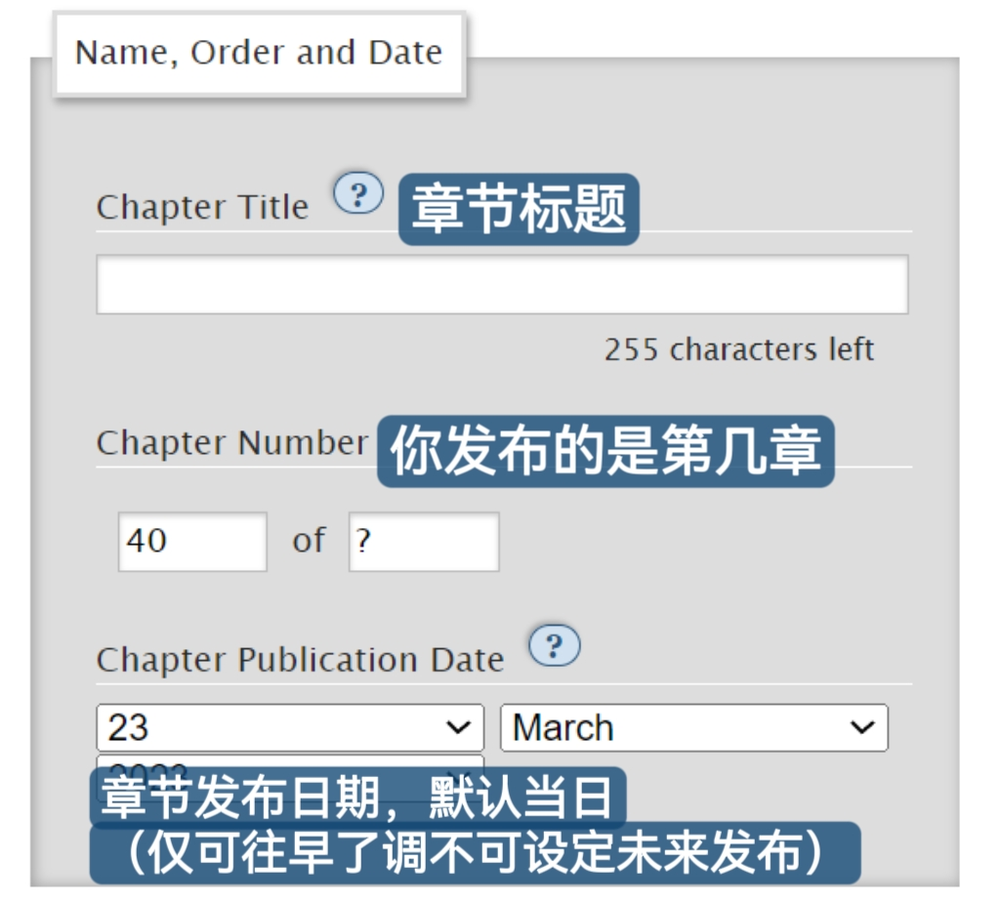
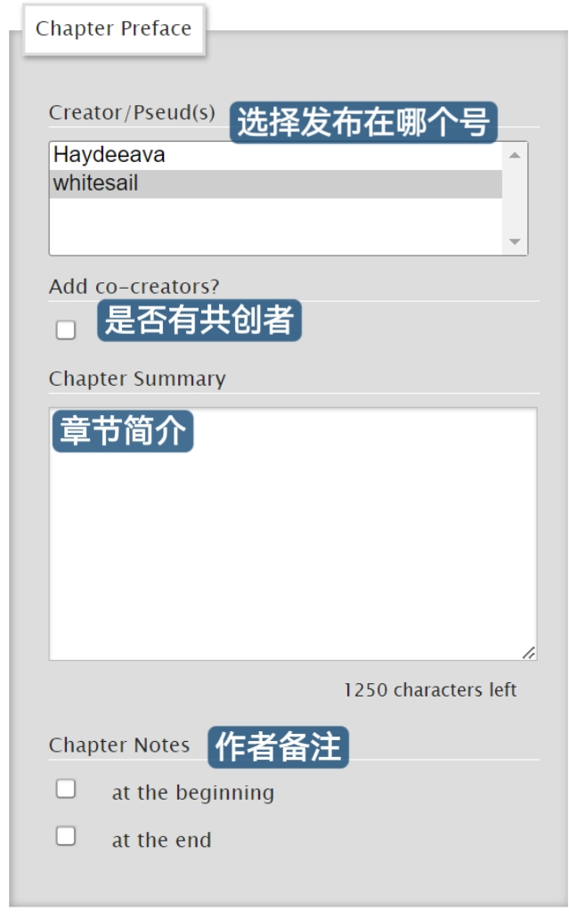

# 增加章节（Add Chapter）

为一篇未完结的文章增加章节。

1. 点击文章略缩图中的`Add Chapter`按钮。

<figure><figcaption></figcaption></figure>

2. 填写章节相关信息。

<figure><figcaption></figcaption></figure>

<figure><figcaption></figcaption></figure>

再往下就是正文了，与正常发文步骤一样。

最后点击`Post`发布或点击`Preview`预览。
