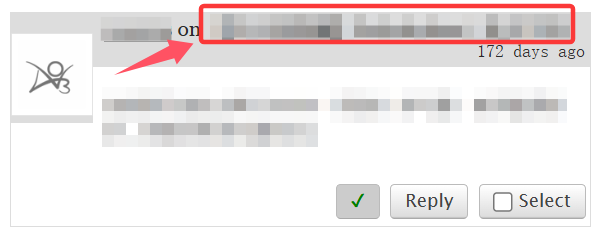

# 查看评论

如果一部作品有人评论，在它的略缩图上会显示「Comments：数字」的字样，点击数字即可查看所有评论。

<figure><figcaption></figcaption></figure>

如果你已经在作品页面之内，可以点击页面上方的`Comments`按钮展开评论区。若按钮是`Hide Comments`，说明评论区已展开。

<figure><figcaption></figcaption></figure>

当你在消息箱内查看一条评论时，点击评论者的名字会让你进入ta的主页；如果无法点击说明是游客评论，用户名是游客自由填写的。

点击作品名称会让你看见这条评论和它下面的回复；`Thread`按钮同理。

<figure><figcaption></figcaption></figure>

会跳转到这个页面：

<figure><figcaption></figcaption></figure>

点击`Parent Thread`，则会显示此评论的上一条评论。
