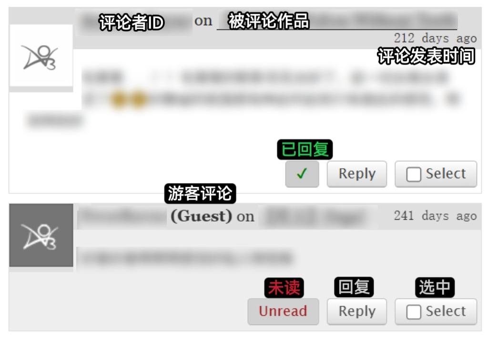
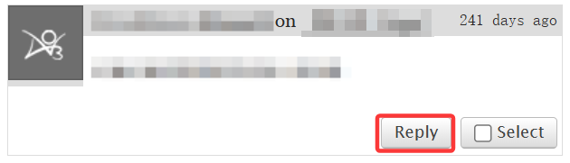
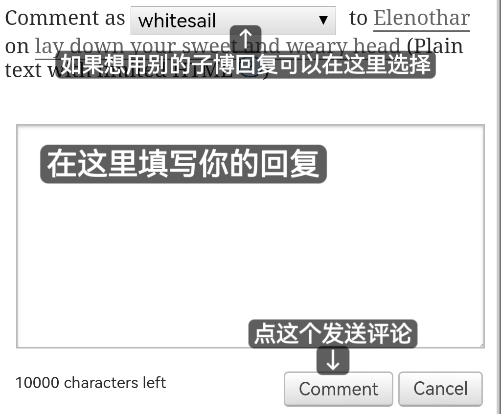
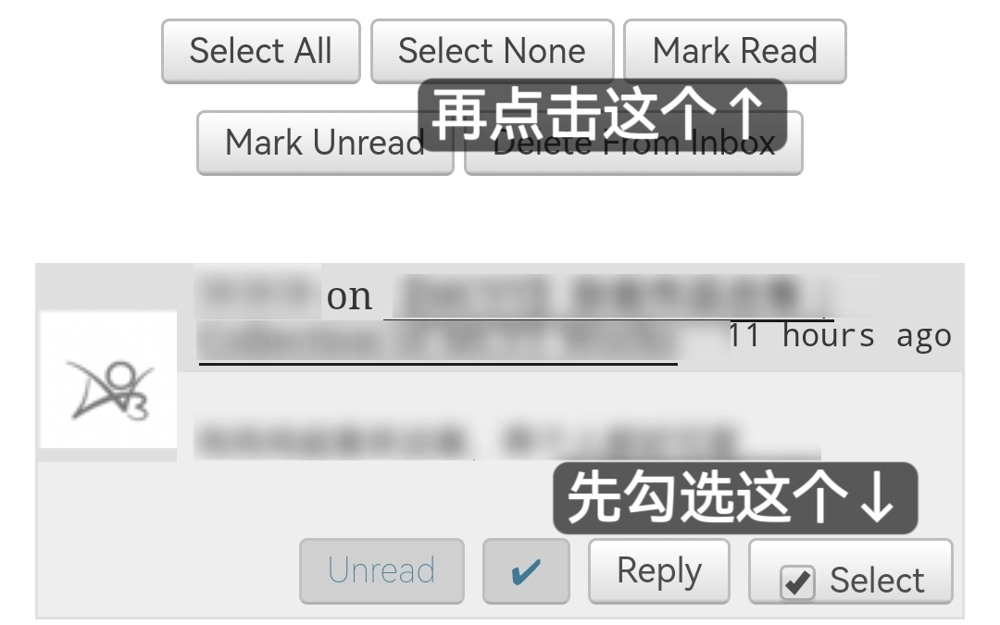

# 回复评论

如果你没有在偏好设置中关闭评论提醒，你的站内消息箱将显示未读消息数字。

<figure><figcaption>
你有一条未读消息
</figcaption></figure>

未读消息会以灰色底展示并标注为<mark style="color:red;">`Unread`</mark>。已读消息会以白色底展示。已回复的评论会标注绿色对钩<mark style="color:green;">`√`</mark>。

游客评论会在ID后显&#x793A;**(Guest)**。PS.游客ID是游客自行填写的。

<figure><figcaption></figcaption></figure>

## 回复评论

**第一步：**&#x70B9;击`Reply`按钮。

<figure><figcaption></figcaption></figure>

**第二步：**&#x5728;弹出的输入框内输入你的回复，然后点击`Comment`发送评论。

<figure><figcaption></figcaption></figure>

回复完评论后，原消息会自动切换为已读已回复状态。

## 标注已读

假如你不想回复一条评论，但又想把它标注为已读：勾选评论右下角的`Select`，然后点击页面上方的`Mark Read`。

<figure><figcaption></figcaption></figure>

`Select All`是全选，`Select None`是取消全选，`Mark Unread`是标记为未读，`Delete From Inbox`是从消息记录中删除。
