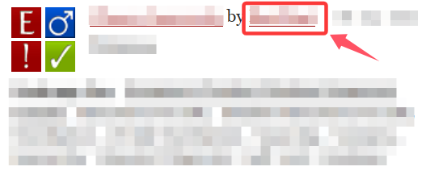
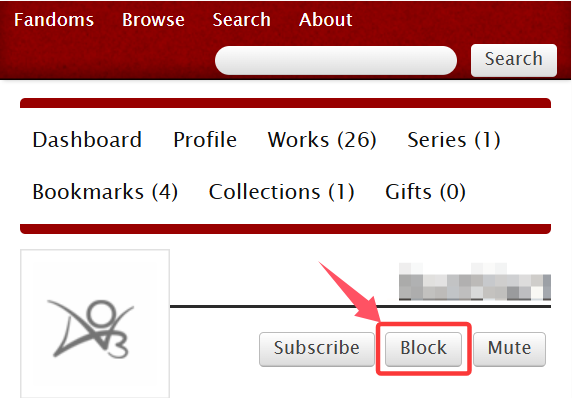
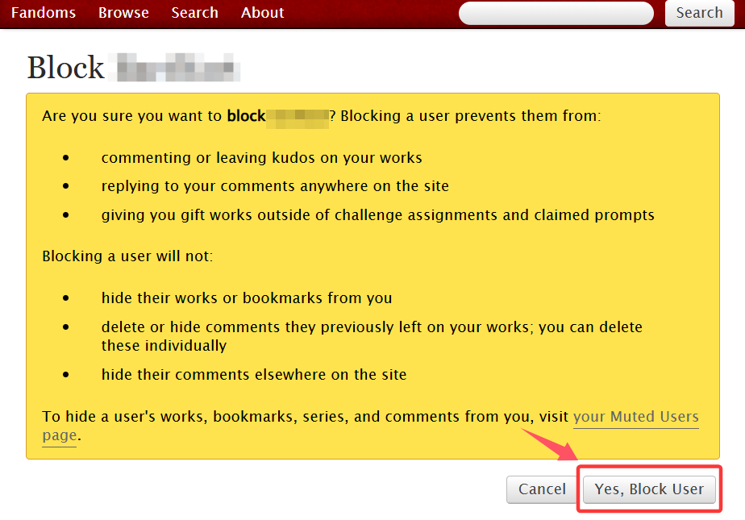
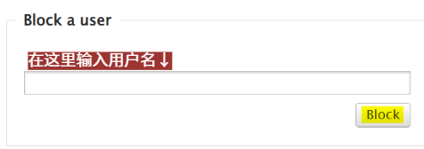

# 拉黑/屏蔽功能

## 用户黑名单

### 功能

* 目前AO3最多可以拉黑2000名用户
* 除了你自己和管理员，没有人能看到你的黑名单
* 你拉黑的用户无法在你的作品下评论，也无法回复你在其他地方的评论
* 你拉黑的用户将无法编辑以前留给你的评论
* 被拉黑用户更改名称后，黑名单效果不会消失
* 如果将某作品的协作者拉黑，该用户仍然可以在那篇作品上评论，但无法回复你的评论

**但请注意：拉黑≠屏蔽，拉黑只是让这个用户无法和你互动，但是你还是能看到对方的作品和评论。**

### 拉黑方法

**方法一：**&#x76F4;接在对方主页内拉黑。

当你遇到一个想要屏蔽的用户时，点击用户名进入ta的个人主页。

<figure><figcaption></figcaption></figure>

在该用户的名字下方有三个按钮，点击中间的`Block`按钮。

<figure><figcaption></figcaption></figure>

进入确认界面，点击`Yes, Block User`。

<figure><figcaption></figcaption></figure>

**方法二：**&#x5728;黑名单用户页面拉黑。

去往你的偏好设置页面，点击`Blocked Users`（黑名单用户）按钮。

<figure><figcaption></figcaption></figure>

然后在输入框内输入你想拉黑的用户的名称，并点击`Block`按钮。之后的确认流程与上文相同。

<figure><figcaption></figcaption></figure>

## 屏蔽用户

### 功能

让这名用户在你眼中彻底隐身，你将无法看到：

* 该用户创作（或共同创作）的作品
* 该用户创作的书签
* 其他用户创作的该用户作品或系列的书签
* 该用户留下的评论

这会导致搜索结果数量与实际有所差别。

### 屏蔽方法

