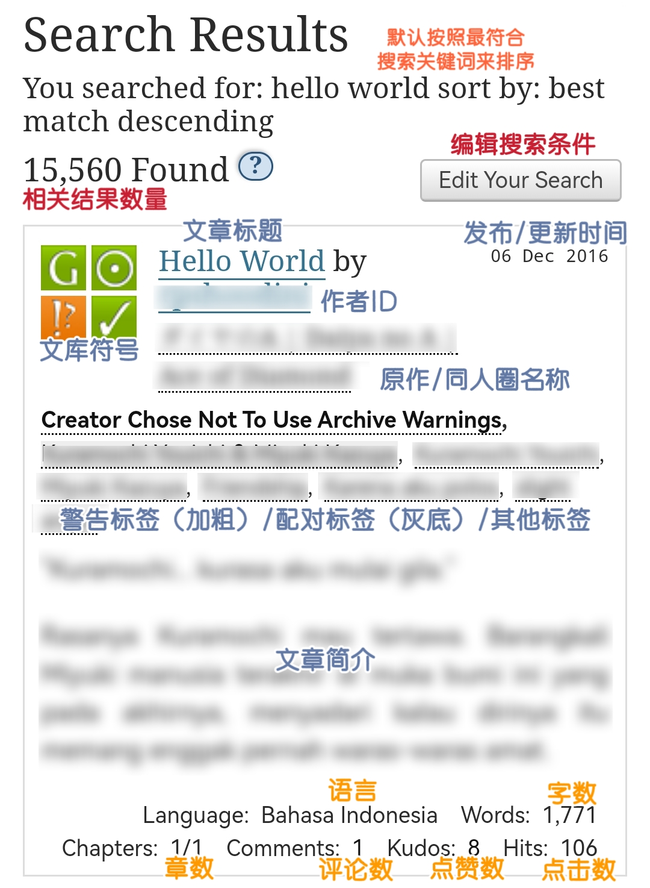
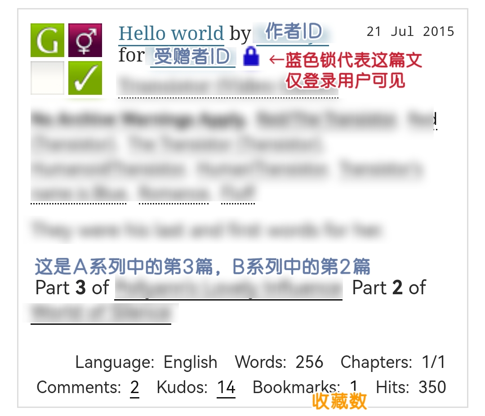

# AO3各界面信息略解



## 首页

在打开AO3的时候，我们最先看到它的主界面。

**未登录的用户**看到的界面是这样的↓

<figure><figcaption>
未登录用户
</figcaption></figure>

**登录用户**看到的是这样的↓

<figure><figcaption>
登录用户
</figcaption></figure>

关于收藏Tag，请参见→[如何收藏标签](../ru-he-chi-fan-jin-jie-ban/ru-he-shou-cang-biao-qian.md)

关于搜索框的使用，请参见→[※搜索框里的大学问](sou-suo-kuang-li-de-da-xue-wen.md)

PS. 如果想让AO3记住密码自动登录，勾选登录框里的“Remember me”选项。



## 同人圈（Fandom）

<figure><figcaption>
同人圈
</figcaption></figure>



## 浏览（Browse）

<figure><figcaption>
浏览
</figcaption></figure>



## 搜索（Search）

搜索的具体细则请查询→[如何全站查找](sou-suo-ji-ben-fa-search/)

<figure><figcaption>
搜索
</figcaption></figure>



## 关于（About）

<figure><figcaption>
关于
</figcaption></figure>



## 搜索结果页（Search Results）

关于编辑搜索条件请参见→[编辑搜索](sou-suo-ji-ben-fa-search/bian-ji-sou-suo-edit-your-search.md)

关于文库符号解释请参见→[AO3文库符号解释](ao3-wen-ku-fu-hao-jie-shi.md)

<figure><figcaption></figcaption></figure>

<figure><figcaption>
搜索结果
</figcaption></figure>


