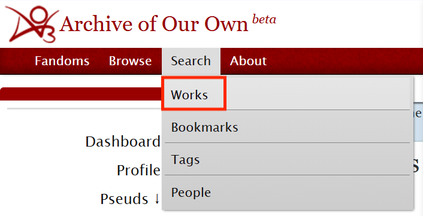

# 如何筛选混合同人



**第一步：**&#x4ECE;导航栏的Search项目进入Works页面。

<figure><figcaption></figcaption></figure>

**第二步：**&#x627E;到Crossovers这一项，勾选`Only crossovers`

<figure><figcaption></figcaption></figure>

再往下找到Fandom这一项，填写你想梦幻联动的两个圈子。（PS. 标签之后的那个×按钮不是报错的意思，是点击即可删除标签。）

<figure><figcaption></figcaption></figure>

如果需要定义排序顺序，可以在最后的Sort by选择。

**第三步：**&#x70B9;击最后的`Search`按钮获得所有梦幻联动。



**第一步：**&#x5148;搜索并进入Harry Potter的Fandom标签，点开`Filter`。

<figure><figcaption></figcaption></figure>

**第二步：**&#x5728;Include→Fandom里面找到SPN的标签并勾选。

<figure><figcaption></figcaption></figure>

在More Options→Crossover中选择`Show only crossovers`（只显示混合同人）。

<figure><figcaption></figcaption></figure>

根据自己的喜好定义排序或语言。

**第三步：**&#x70B9;击`Sort and Filter`，完成搜索。



