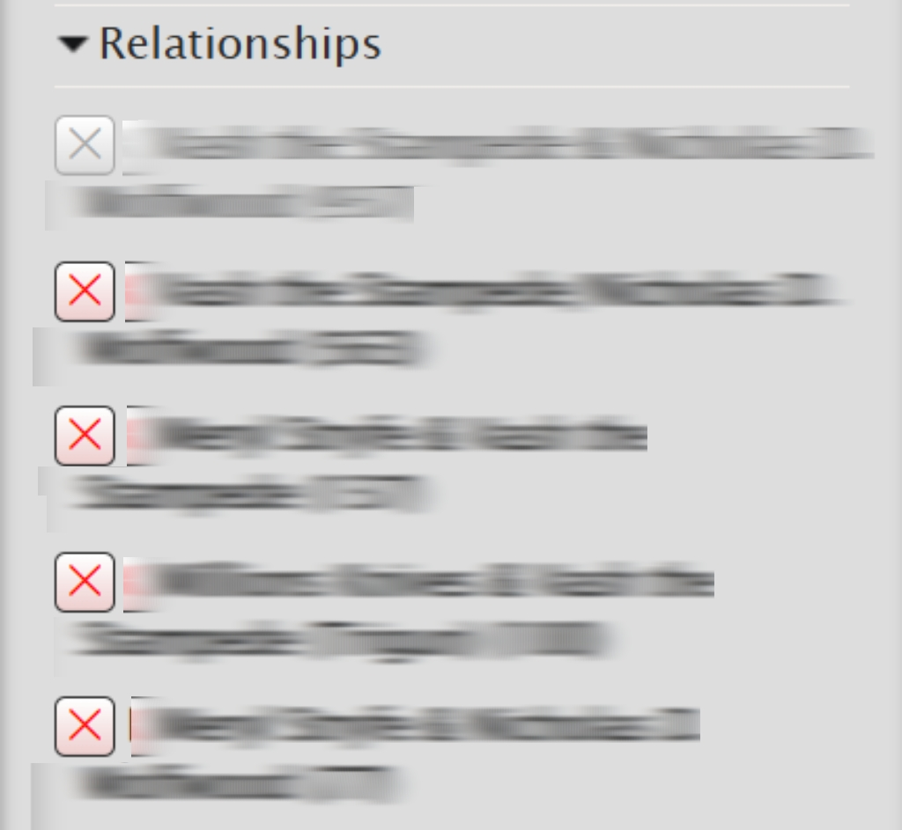
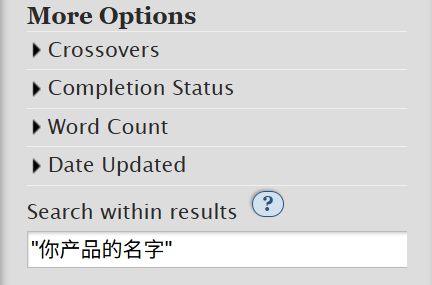
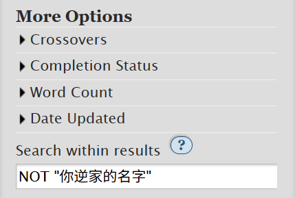

# 筛选功能（Filter）


使用这个功能的前提是你在某个**通用标签**的页面内！非通用标签（如图）无法进行筛选！

.png>)

如何查找通用标签请参照「[如何查找标签](ru-he-cha-zhao-biao-qian-tags.md)」。


在你点进通用标签后，你看到页面上方有一个`Filters`按钮（对于电脑版的话是右侧`Sort and Filter`），点开之后是一个灰色的长条。如果说[如何查找作品](ru-he-cha-zhao-zuo-pin-works.md)是帮我们精准定位我们想看的作品，`Filter`则可以帮我们实现去除不想看的作品。

接下来从「唤之即来」和「挥之即去」两方面讲解Filter的使用。



_——也就是进一步定位你想看什么。_

1. **排序依据**

第一项：**Sort by**。

默认按照**更新时间**排序；如果想要从最热门的作品开始，那就改为`Kudos`那一项，意味着按点赞数从高到低排列。

<figure><figcaption></figcaption></figure>

2. **想要包括的内容**

第二项：**Include**。

其中的每一小项之下会列出该项最热门的十个标签，标签后面括号内的数字代表搜索结果里有多少作品带有此标签。小项包含分级（Ratings）、警告（Warnings）、类别（Categories）、圈子（Fandoms）、角色（Characters）、配对（Relationships）和其他标签（Additional Tags）几个部分。除了分级是单选以外，其他项都可以多选。

[Ratings](../../ao3-da-zi-dian.md#rating-fen-ji)、[Warnings](../../ao3-da-zi-dian.md#warning-jing-gao)和[Categories](../../ao3-da-zi-dian.md#categories-fen-lei)都已经在[其他部分](ru-he-cha-zhao-zuo-pin-works.md)有详细介绍，在此不做赘述。

Fandoms这一栏除原作外其他的标签来自于各种联动。如果你有特殊想查找的混合同人，可以在这里勾选其他Fandom标签。（更多方法参见→[如何筛选混合同人](ru-he-shai-xuan-hun-he-tong-ren.md)）

<figure><figcaption></figcaption></figure>

Characters和Relationships同理：勾选你想看的项目。


请注意：Include意味着「包括」而非「仅含」。

举例：当我在「角色A/角色B」的通用标签中筛选时，勾选Relationship中的「角色A/角色B」并不会实现洁癖人狂喜，而是与原本返回的结果一模一样。


关于Additional Tags的筛选，理解其含义是必要的。更多信息请参照→[其他标签](../../ao3-da-zi-dian.md#additional-tags-qi-ta-biao-qian)

`Other tags to include`这一项就是如果你有任何其他想要包含却未在此列出的tag，可以手动添加。

3. **更多选项**

第四项：**More Options**。

这里列出了混合同人、完结状态、字数、更新日期。筛选方式参见[如何查找作品](shai-xuan-gong-neng-filter.md#ru-he-cha-zhao-zuo-pin-works)。

4. **语言**

只看中文作品：点开底部的**Language**栏，拉到最后，选择「中文-普通话 国语」。

> 如果想要了解如何去除任何不想看到的内容，继续阅读→[挥之即去](shai-xuan-gong-neng-filter.md#hui-zhi-ji-qu)



_——也就是手动屏蔽你不想看的。_

Filter的第三项是与**Include**内容完全一样但功能完全相反的**Exclude**，意味着排除而非包括。

简而言之，把你不想看到的标签统统点叉。

**那如果Relationships标签太多了，不想一个个点，也不想你产品做背景板，怎么办？**

滑动到最底部，在`Search within results`中填入：「<mark style="color:orange;">otp: true</mark>」（注意：是英文冒号，且需要空格！）

 (1) (2).png>)

这个原理是使用内置的搜索操作，使筛选出来的作品只打这一对CP的标签，排除了所有A/B是背景板或A/B但有其他配对的作品。

**那不想搜到逆家怎么办？**

还是在这个输入框，输入「<mark style="color:orange;">"你产品名"</mark>」（注意：使用英文**半角**双引号，就是打出来只占半个字符大小的那种，不会打请百度）。这样搜索结果就只有你产品AB，不会有BA了。原理是英文双引号定义精确搜索，双引号内的词语不会被分割也不会调换顺序。

另一个方法是输入「<mark style="color:orange;">NOT "你逆家名"</mark>」，意思是去除你的逆家内容。

不过这种方法只对中文作品有用，因为绝大多数英文配对标签的前后都仅由首字母顺序决定。因此，英文同人左右位大多只能从作品的简介、备注或[其他标签](../../ao3-da-zi-dian.md#additional-tags-qi-ta-biao-qian)里确定。

【注】方法来自AO3超话教程，感谢！



这一部分也都来自于微博AO3超话教程。

**在乙游Fandom标签中排除乙女腐**

第一步：在Include→Character中勾选<mark style="color:green;">你推的角色名</mark>。

第二步：在Exclude→Categories中叉除<mark style="color:red;">M/M</mark>的标签。

第三步：在Search within results中填写「<mark style="color:orange;">NOT "乙女腐"</mark>」。

这三步基本就能排除绝大部分的乙女腐内容。

PS. 乙女文的统一配对标签格式是「角色名/Reader」



完成选择之后就可以点击长条最上面或最下面的`Sort and Filter`进行筛选了。

如果想要清空自己的选择，恢复默认状态，请点击长条右下角的小字<mark style="color:red;">Clear Filters</mark>。

<figure><figcaption></figcaption></figure>
