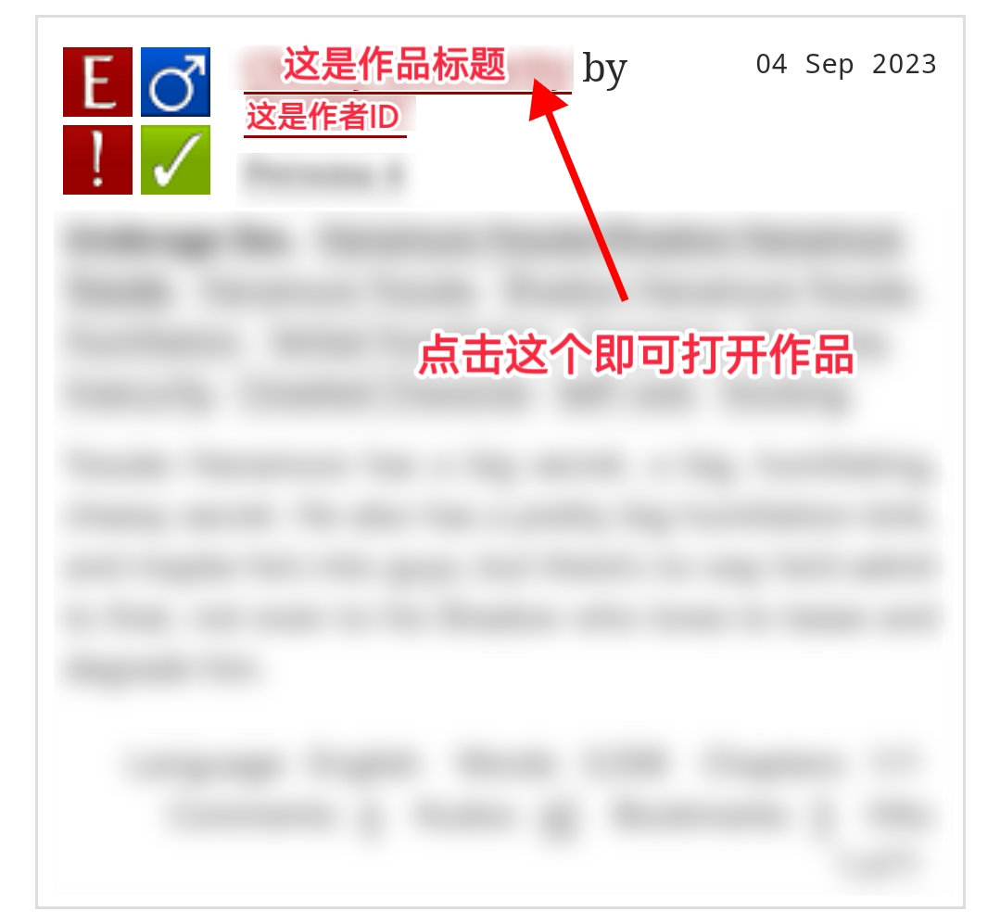
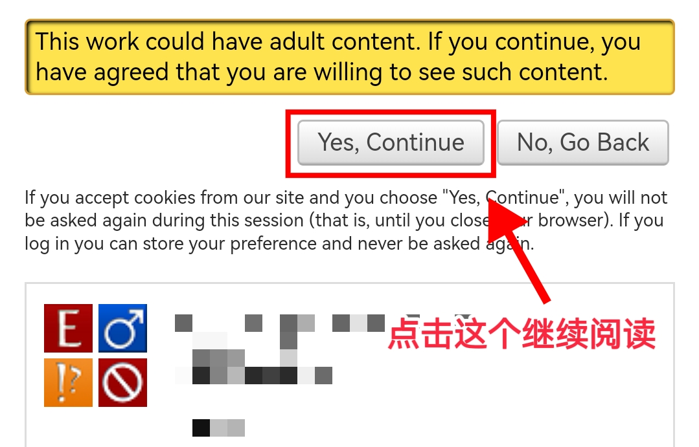

# 如何点开作品

当你找到你想阅读的作品之后，点击它的<mark style="color:red;">**标题**</mark>——一般而言是显示在最前面的那个含超链接的部分。

<figure><figcaption></figcaption></figure>

如果该作品是G级或T级，你可以立刻进入作品页面进行阅读。

但假如该作品是未分级、M级或E级，未登录或登录了但未进行偏好设置的用户就会发现自己来到了有一个黄色消息框的界面。


关于分级的解释请参见：[AO3文库符号解释](ao3-wen-ku-fu-hao-jie-shi.md)


<figure><figcaption></figcaption></figure>

此时正确的做法是点击`Proceed`按&#x94AE;**，**&#x7136;后你就可以正常看文了。

<figure><figcaption></figcaption></figure>
