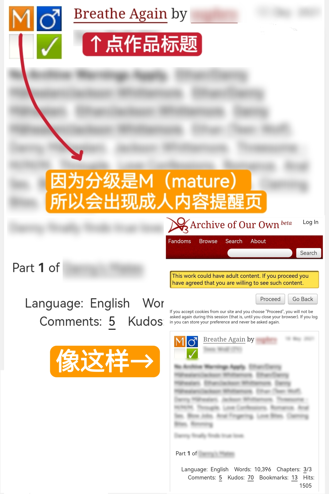

# 如何点开作品

当你找到一个心水的作品之后，点击它的标题。

如果该作品是G级或T级，那么你就可以顺畅地进入作品页面进行阅读了。

但假如分级是未分级、M或E，未登录或登录了但未进行偏好设置的用户就会发现自己来到了有一个黄色消息框的界面。

此时正确的做法是**点击「Proceed」按钮，**&#x7136;后你就可以正常看文了。

<figure><figcaption></figcaption></figure>
