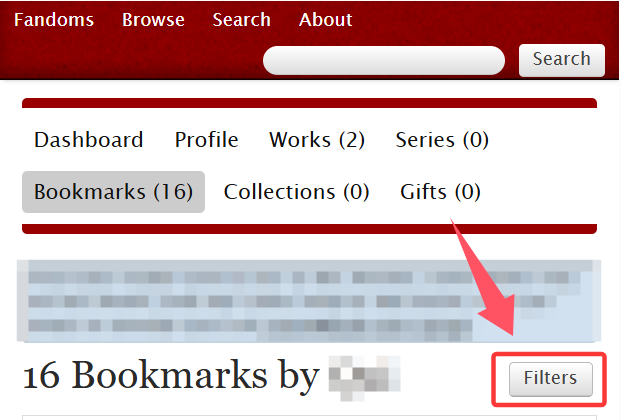

# 如何利用他人的书签

使用[书签（Bookmarks）](../ru-he-chi-fan-jin-jie-ban/shu-qian-shou-cang-bookmark.md)功能需要登录；除了简单的收藏，它还可以添加标签与备注，以达成分类的目的。

游客虽然无法直接使用此功能，但仍可以利用别人的书签找到自己喜欢的作品。

1. 你需要找到一名使用过书签功能的用户。你可以选择相信某位创作者的品味，或者寻找与你口味类似的同好。
2. 点入用户主页，打开ta的书签列表。

<figure><figcaption></figcaption></figure>

3. 用`Filter`进行筛选（对于网页端，是右侧的`Sort and Filter`按钮）。

<figure><figcaption></figcaption></figure>

这里的筛选功能与标签页的类似，相同的地方都可以按照[筛选功能](ji-ben-sou-suo-fang-fa-search/shai-xuan-gong-neng-filter.md)中的讲解进行筛选。

不同之处在于：

**（1）Bookmarker's tags：书签创建者的标签**

<figure><figcaption></figcaption></figure>

这是书签创建者在创建书签时自行添加的标签，大多标注了被收藏作品的配对、字数、是否完结、阅读次数等。部分创建者会使用这个系统来帮助自己分类和记录信息。

<figure><figcaption></figcaption></figure>

因此，你可以使用Bookmarker's tag这一栏进行更详细的检索。

**（2）Rec：特别推荐**

在筛选条的底部，我们可以看到两个勾选框。

<figure><figcaption></figcaption></figure>

第一个`Recs only`意为「只看特别推荐」，勾选可以筛出书签创建者觉得特别值得推荐的作品。这些作品书签的右上角左侧小方块会显示爱心图案。

<figure><figcaption></figcaption></figure>

第二个`Only bookmarks with notes`意为「只看有备注的书签」，可以筛选出书签创建者填写了备注的书签。
