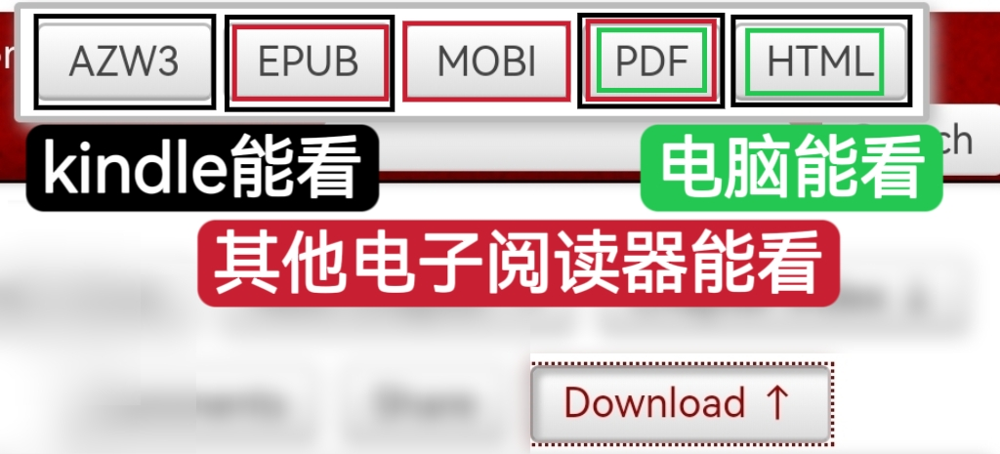

# 如何下载作品

AO3所有的作品都是允许免费下载的。只需点击作品页面上的Download按钮即可展开下载选项列表，如图所示。

其中亚马逊Kindle支持AZW3、EPUB、PDF和HTML格式，其他电子阅读器支持EPUB、MOBI和PDF格式，电脑上则可以使用PDF或HTML格式。

<figure><figcaption></figcaption></figure>

一些媒体文件，比如音乐或视频等，在下载的过程中会丢失；文章中的图片如果过大也有丢失的可能性。
