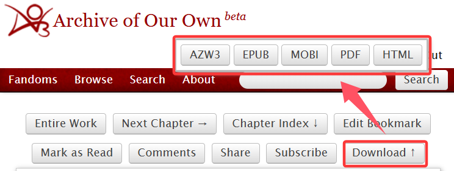

# 如何下载作品

AO3所有的作品都是允许免费下载的。只需点击作品页面上的`Download`按钮即可展开下载选项列表，如图所示。点击相应的按钮之后即可下载对应格式的全文内容[^1]。

其中Kindle电子书支持图中的全部格式，EPUB、MOBI和PDF格式基本通用于所有电子阅读器，而电脑上常用的是PDF或HTML格式。

<figure><figcaption></figcaption></figure>

一些媒体文件，比如音乐或视频等，在下载的过程中会丢失；文章中的图片如果过大也有丢失的可能性。

[^1]: 记得刚开始用AO3的时候不知道是全文下载，都是每一章点一次download，还认认真真标了章节序号，但是因为那些文都没来得及看所以很久没有意识到其实每次下载的都是全文……
