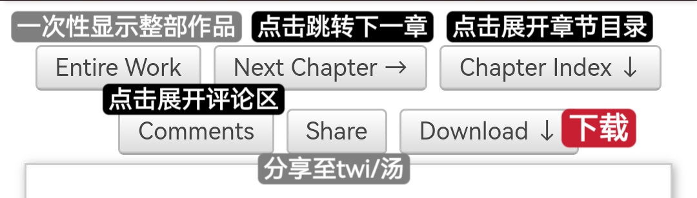
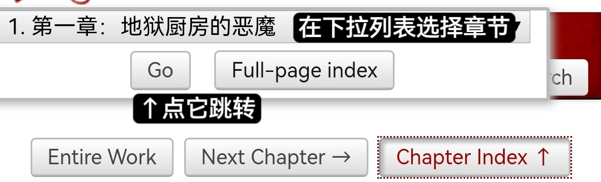
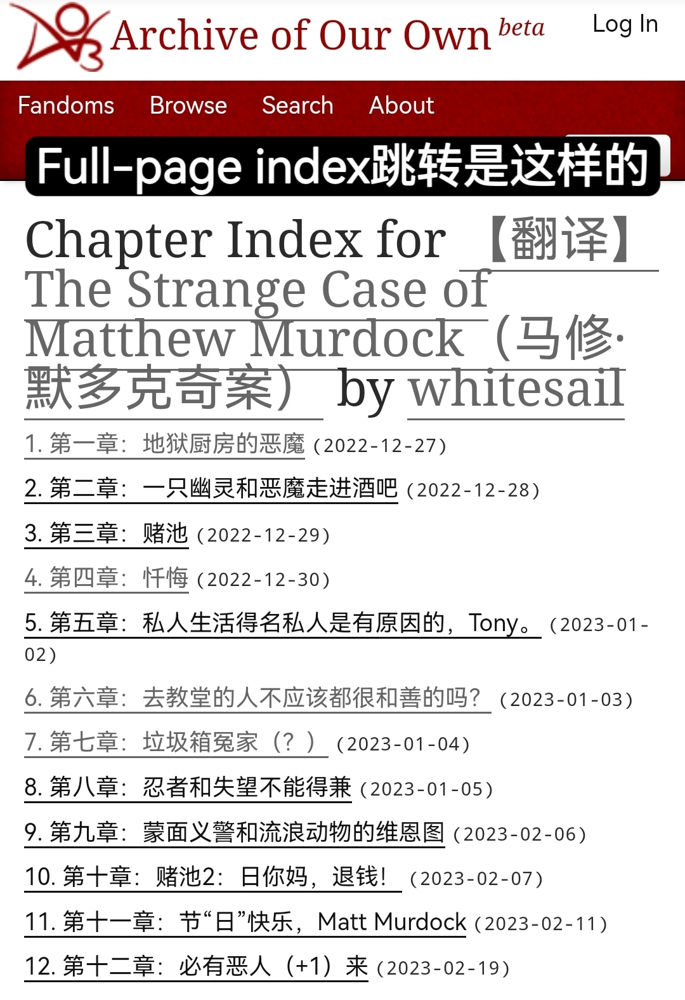

# 如何阅读作品

在点开一篇作品后，可以看到页面顶部有许多按钮。它们的含义如图所示：

<figure><figcaption></figcaption></figure>

## 如何迅速跳转章节？

使用Chapter Index功能，如图。


有的镜像网站会出现没有Chapter Index的bug，如果遇到这种情况，只能更换镜像网站。


<figure><figcaption></figcaption></figure>

