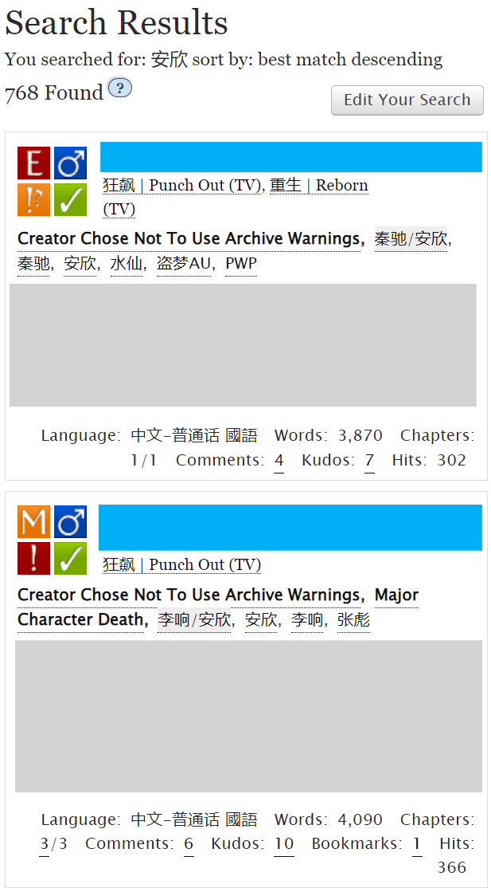

# 如何查找标签（Tags）


**小贴士：**

1. 标签之后的×按钮不是报错，是点击可以删除这个标签的意思。

.png>)

2. 想要更改一个已经打上的标签，对它双击即可。



**适用于：**&#x4F60;想查找特定的Tag，比如某个配对/某个人物/某个圈子

**注意：**&#x53EA;有通用标签（Common tag）有筛选和收藏功能。


> 比如，我想查找瑞克和莫蒂的圈子标签，怎么搜？
>
> 比如，我想查找邪恶莫蒂的角色标签，怎么搜？
>
> 比如，我想查找和邪恶莫蒂有关的一切配对的标签，怎么搜？

**第一步：**&#x70B9;击搜索中的Tag（作品）栏。

<figure><figcaption></figcaption></figure>

**第二步：**&#x5728;Tag name中输入你想查找的Tag名称。

<figure><figcaption></figcaption></figure>

※标签搜索语法

1. **「\*」符号代表任意字符：**&#x5047;如你输入「book\*」，返回的结果会包括「book」「books」和「booking」
2. **空格的作用与「AND」相同：**&#x8F93;入「Harry Potter」会获得「Harry Potter」和「Harry James Potter」，但不会有「Harry」这个单独的词
3. **「||」代表「或者（不互斥）」**：输入「Harry || Potter」会找到「Harry」「Harry Potter」和「Potter」
4. **「"」用于精确搜索：**&#x82F1;文双引号中的词语不会分开且顺序不变，如输入"Harry Lockhart"只会返回"Harry Lockhart"而不是Harry Potter/Gilderoy Lockhart
5. **「NOT」代表筛除：**&#x8F93;入「Harry NOT Lockhart」会返回「Harry Potter」，但会筛除包含「Lockhart」的标签，比如「Gilderoy Lockhart/Harry Potter」

**第三步**：选择你想查找的Tag类型。

<figure><figcaption>
Tag类型
</figcaption></figure>

**第四步**：选择你是否想查找官方认证的通用Tag。一般比较热门的圈子都有规范的通用Tag，勾选Canonical能更快速地定位大Tag，但小圈子冷圈子勾选Canonical之后可能就搜不出来东西了。

搜索结果中，通用Tag会黑体加粗。

<figure><figcaption>
Tag是否规范
</figcaption></figure>

**第五步**：点击Search Tags，在底下出现的结果中选择你想看的那个就好啦。

<figure><figcaption></figcaption></figure>

> 答：在Tag name栏输入「Rick and Morty」，Type选择「Fandom」，勾选「Canonical」，点击Search Tags。
>
> 答：在Tag name栏输入「Evil Morty」，Type选择「Character」，勾选「Canonical」，点击Search Tags。
>
> 答：在Tag name栏输入「Evil Morty」，Type选择「Relationship」，勾选「Canonical」，点击[Search Tags](#user-content-fn-1)[^1]。

当然也有一种比较偷懒的土方子，那就是直接在搜索框里输入你想搜的关键词，比如输入「安欣」，得到↓

那么你直接点击作品tag中的配对tag或者人物tag就可以了。


**注意：**&#x5047;如你点开的Tag界面是这样↓

.png>)

说明这个标签尚未没标记为通用标签，无法[收藏](../../ru-he-chi-fan-jin-jie-ban/ru-he-shou-cang-biao-qian.md)也无法进行[筛选](shai-xuan-gong-neng-filter.md)操作。


[^1]: 搜出来Bill Cipher\&Evil Morty的Tag了啊啊啊笑好崩溃！真的很好奇写完这个就去看
