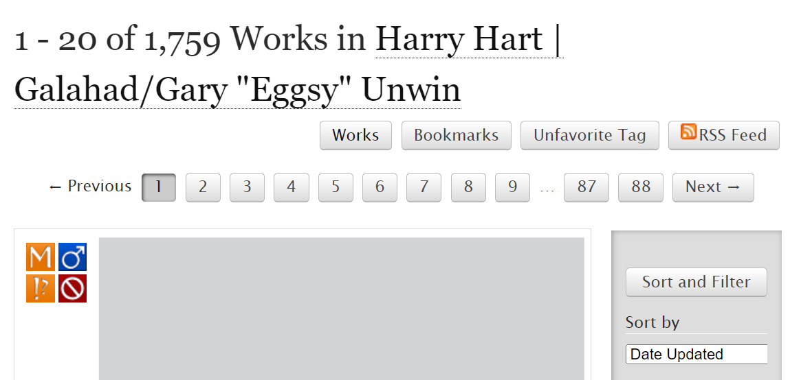

# 筛选功能（Filter）


使用这个功能的前提是你在某个**通用标签**的页面内！非通用标签（如图）无法进行筛选！

.png>)

如何查找通用标签请参照「[如何查找标签](ru-he-cha-zhao-biao-qian-tags.md)」。


在你点进通用标签后，你看到页面上方有一个「Filters」按钮（对于电脑版的话是右侧「Sort and Filter」栏），点开之后是一个灰色的长条。如果说[如何查找作品](ru-he-cha-zhao-zuo-pin-works.md)是帮我们精准定位我们想看的作品，Filter则可以帮我们实现去除不想看的作品。

接下来从「唤之即来」和「挥之即去」两方面讲解Filter的使用。



_——也就是进一步定位你想看什么。_

首先，长条的第一项是排序依据，默认按照更新时间排序；一般我们会改为「Kudos」那一项，意味着按点赞数从高到低排列。

<figure><figcaption></figcaption></figure>

第二项叫做「Include」，是「包括」的意思。Filter会在每一项之下列出该项目最热门的十个标签，标签后面括号内的数字代表搜索结果里有多少作品带有此标签。

「Include」里面包含分级、警告、类别、圈子、角色、配对和其他标签几个部分。除了分级是单选以外，其他项都可以多选。

[Ratings](../../ao3-da-zi-dian.md#rating-fen-ji)、[Warnings](../../ao3-da-zi-dian.md#warning-jing-gao)和[Categories](../../ao3-da-zi-dian.md#categories-fen-lei)都已经在[其他部分](ru-he-cha-zhao-zuo-pin-works.md)有详细介绍，在此不做赘述。

Fandoms这一栏有可能出现多于一个的标签，除原作外其他的标签来自于各种联动。如果你有特殊想查找的混合同人，可以在这里勾选其他Fandom标签。（更多方法参见→[如何筛选混合同人](ru-he-shai-xuan-hun-he-tong-ren.md)）

<figure><figcaption></figcaption></figure>

Characters（角色）和Relationships（配对）的勾选原则也是同理：如果有特殊想看的，勾选。


不过请注意：「Include」的工作原理是，假设A、B、C为三个不同的通用标签，进入A标签时，搜索结果内存在AB、AC、ABC这三种tag搭配。勾选A之后，结果还是AB、AC、ABC；但假如勾选了B，结果会变成AB、ABC。

举例：当我在Harry Hart/Eggsy的通用标签中筛选时（如图），勾选配对中的Harry/Eggsy并不会实现洁癖人狂喜，而是与原本的结果一模一样。



关于Additional Tags（其他标签）的筛选，理解其含义是必要的。更多信息请参照→[其他标签](../../ao3-da-zi-dian.md#additional-tags-qi-ta-biao-qian)

Other tags to include这一项就是如果你有任何其他想要包含却未在此列出的tag，可以自行添加。

往下滑动长条，跳过「Exclude」，看到「More Options」这一项。这里列出了混合同人、完结状态、字数、更新日期。筛选方式参见[如何查找作品](shai-xuan-gong-neng-filter.md#ru-he-cha-zhao-zuo-pin-works)。

如果想只看中文作品，把最后的Language栏点开，拉到最后，选择「中文-普通话 国语」。



_——也就是手动屏蔽你不想看的。_

在「Include」之下，长条的第三项就是「Exclude」。它的内容和Include完全一样，只不过在这里是排除而非勾选。

简而言之，把你不想看到的标签统统点×。

.png>)

**那如果Relationships标签太多了，不想一个个点，也不想你产品做背景板，怎么办？**

滑动到长条最底部，在「Search within results」中填入：「otp: true」（注意：是英文冒号，且需要空格！）

 (1) (2).png>)

这个原理是使用内置的搜索操作，使筛选出来的作品只打这一对CP的标签，排除了所有A/B是背景板或A/B但有其他配对的作品。

**那不想搜到逆家怎么办？**

.png>)

还是在这个输入框，输入「"你产品名"」（注意：使用英文**半角**双引号，就是打出来只占半个字符大小的那种，不会打请百度）。这样搜索结果就只有「哈蛋」，不会有「蛋哈」了。原理是英文双引号定义精确搜索，双引号内的词语不会被分割也不会调换顺序。

另一个方法是输入「NOT "你逆家名"」，意思是去除你逆家。

.png>)

不过这种方法只对中文作品有用。由于配对标签名称全部由首字母顺序决定，因此判断英文同人左右位的方法只有从作品的简介、备注或[其他标签](../../ao3-da-zi-dian.md#additional-tags-qi-ta-biao-qian)里确定。

【注】方法来自AO3超话教程，感谢。



这一部分也都来自于微博AO3超话教程。

**在乙游Fandom标签中排除乙女腐**

第一步：在「Include」→「Character」中勾选你推的角色名。

第二步：在「Exclude」→「Categories」中叉除「M/M」的标签。

第三步：在「Search within results」中填写「NOT "乙女腐"」。

这三步基本就能排除绝大部分的乙女腐内容。

PS. 乙女文的统一配对标签格式是「角色名/Reader」



完成选择之后就可以点击长条最上面或最下面的「Sort and Filter」进行筛选了。

如果想要清空自己的选择，恢复默认状态，点击长条右下角的小字「Clear Filters」。

<figure><figcaption></figcaption></figure>
