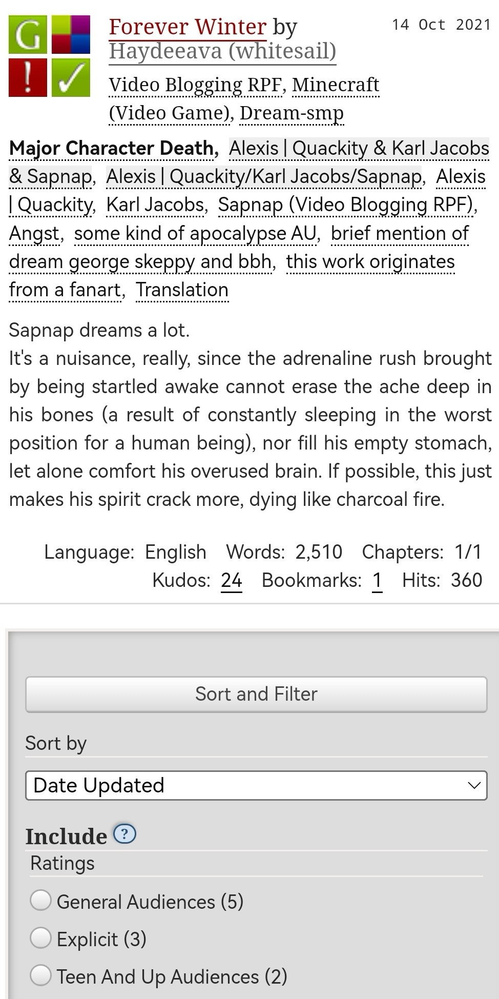
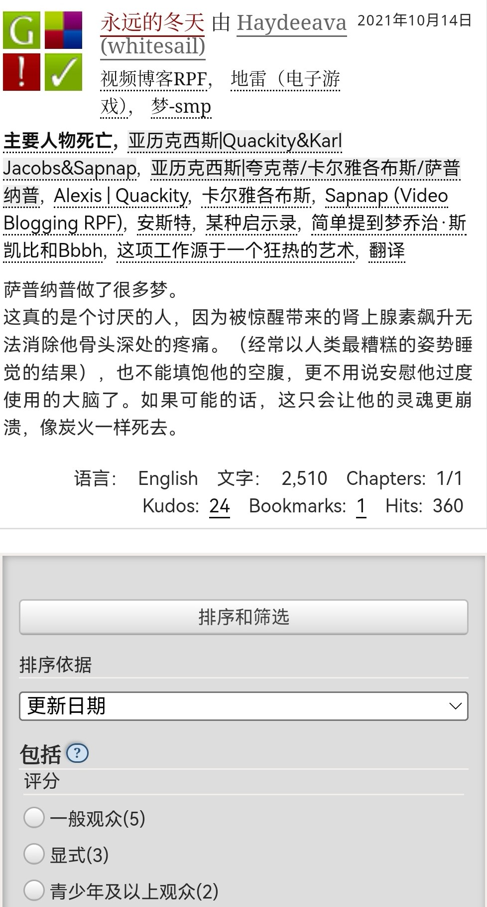
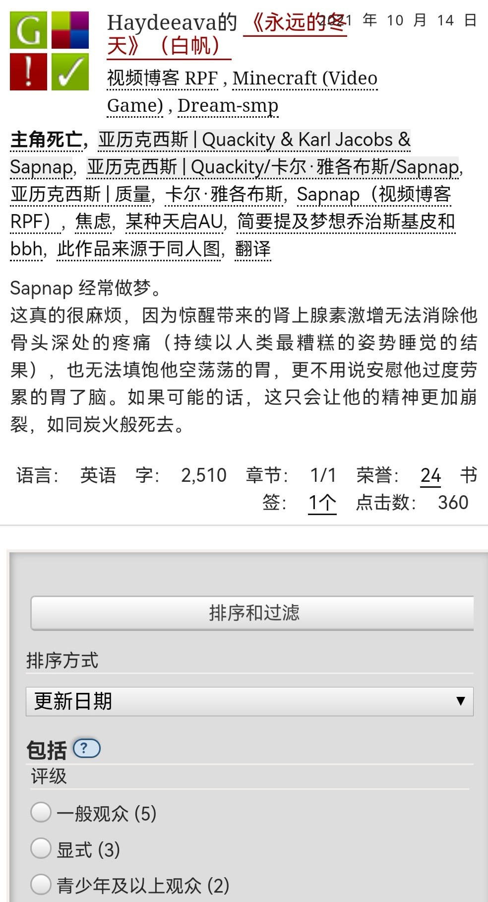

# 网页翻译中文

### 自带网页翻译功能的浏览器

给大家鉴定一下网络热门浏览器翻译功能。



（用的我自己AO3截图，如果雷到人非常抱歉，仅做展示例证用，其他的文更邪门真不敢放）

<figure><figcaption></figcaption></figure>



<figure><figcaption></figcaption></figure>




安卓系统的谷歌浏览器（Google Chrome）翻译功能似乎要上梯子才能用。


<figure><figcaption></figcaption></figure>



<figure><figcaption></figcaption></figure>



<figure><figcaption></figcaption></figure>



QQ浏览器和夸克浏览器的翻译一模一样啊我说:0

<figure><figcaption></figcaption></figure>



鉴定结果就是谷歌浏览器确实是好用啊……

推荐程度Chrome>Edge>夸克=QQ>华为自带浏览器

### 各路翻译软件



节选自《马修·默多克奇案》第九章[^1]

Natasha and Clint both instantly aim their weapons upward, searching for the source of the voice while Steve adjusts the shield on his arm slightly and Sam moves his hand a bit closer towards his sidearm. Tony, on the other hand, is trying to stop himself from having a heart attack while he aims his gauntlet vaguely upward (it would be a lot easier if he had the full suit on and could use the thermal vision). Maybe he picked the wrong line of work for someone with a heart condition, but it’s probably a bit too late to change that.

**人工翻译（by me）**：

Natasha和Clint都立刻把武器对准了声音的方向，搜寻着它的来源；Steve稍微调整了一下胳膊上的盾牌，Sam把手往随身的武器边挪了挪。而Tony，与此同时，正一边努力防止自己心脏病发一边大致把掌心炮瞄向上方（如果他穿着带热成像的全套战甲的话这会容易很多）。或许作为一个心脏有问题的人，他的职业选择稍有失当，但现在反悔大概有点迟了。



娜塔莎和克林特立即将武器向上瞄准，寻找声音的来源，史蒂夫稍微调整了一下手臂上的盾牌，山姆的手向他的随身武器靠近了一点。另一方面，托尼正在努力阻止自己心脏病发作，同时他模糊地将他的护手向上瞄准(如果他穿上全套服装，可以使用热视觉，这将会容易得多)。也许他选错了一个有心脏病的人的工作，但现在改变可能有点晚了。



娜塔莎和克林特都立刻将武器对准了上方，寻找声音的来源，而史蒂夫则稍微调整了一下手臂上的盾牌，山姆将手移近了一点。 另一方面，托尼试图阻止自己心脏病发作，同时他模糊地将手套向上瞄准（如果他穿上全套西装并使用热视觉会容易得多）。 也许他为心脏病患者选择了错误的工作，但现在改变这一点可能为时已晚。



Natasha 和 Clint 都立即将武器对准上方，寻找声音的来源，而 Steve 稍微调整了手臂上的护盾，Sam 将手移近了他的手枪。 另一方面，Tony 正试图阻止自己心脏病发作，同时他将手套模糊地向上瞄准（如果他穿着全套防护服并且可以使用热视觉会容易得多）。 也许他为患有心脏病的人选择了错误的工作，但现在改变这一点可能为时已晚。



娜塔莎和克林特都立即将他们的武器向上瞄准，寻找声音的来源，而史蒂夫则稍稍调整了他手臂上的盾牌，山姆则将他的手向他的副手枪靠近了一些。 另一方面，托尼正试图阻止自己的心脏病发作，同时他隐约地将他的护手向上瞄准（如果他穿上全套衣服并能使用热成像，那就容易多了）。 也许他为有心脏病的人选择了错误的工作，但现在要改变这一点可能有点太晚了。



娜塔莎和克林特立即把武器对准上方，寻找声音的来源，而史蒂夫则轻轻调整手臂上的盾牌，山姆则把手往自己的手臂靠近一点。另一方面，托尼正试图阻止自己心脏病发作，同时他的手套模糊地向上瞄准(如果他穿上全套衣服，并且可以使用热视觉，那就会容易得多)。也许他选错了心脏病患者的工作，但现在改变可能太晚了。



娜塔莎和克林特立即将武器对准上方，寻找声音的来源，史蒂夫轻轻调整手臂上的盾牌，山姆将手向他的侧臂靠近一点。而另一方面，托尼则试图阻止自己的心脏病发作，同时他模糊地将护手向上（如果他穿上全套衣服并能使用热视觉，这会容易得多）。也许他为患有心脏病的人选择了错误的工作，但现在改变这一点可能有点太晚了。！



另外也有人推荐用华为屏幕识别，但是这个我就没试了，各位自行定夺。

然后本人曾经用彩云小译和deepl翻译过R18文学，感受是deepl的更人性化一些，不过存在次数有限制且不稳定的问题。因为R18文里涉及的俗语、俚语和模糊义项实在太多，翻译软件很难做到1:1对译，就算翻译出来了也很生硬甚至诡异，所以，学英语吧朋友们！学好英语就可以自由自在地看R18了！

[^1]: 原文地址：[https://archiveofourown.org/works/16544438/chapters/39822843](https://archiveofourown.org/works/16544438/chapters/39822843)
