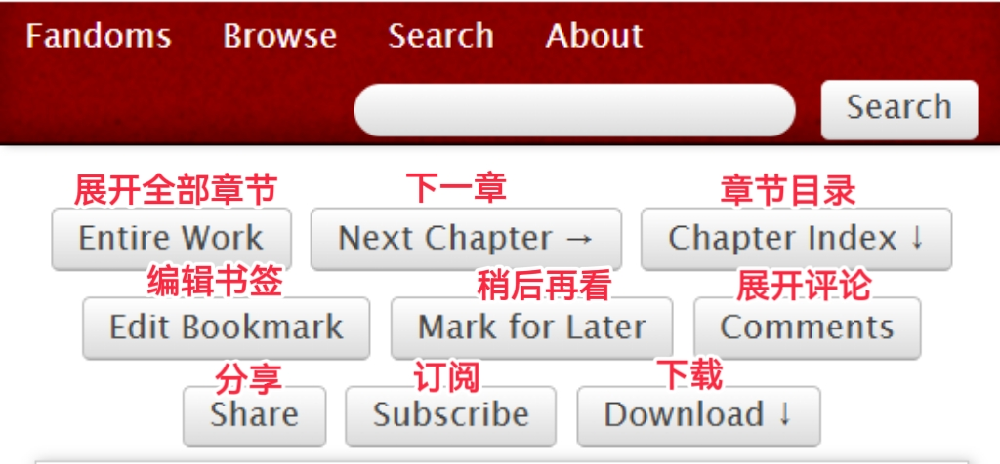
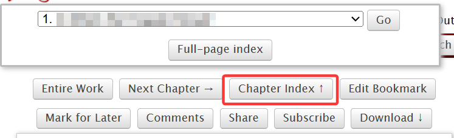
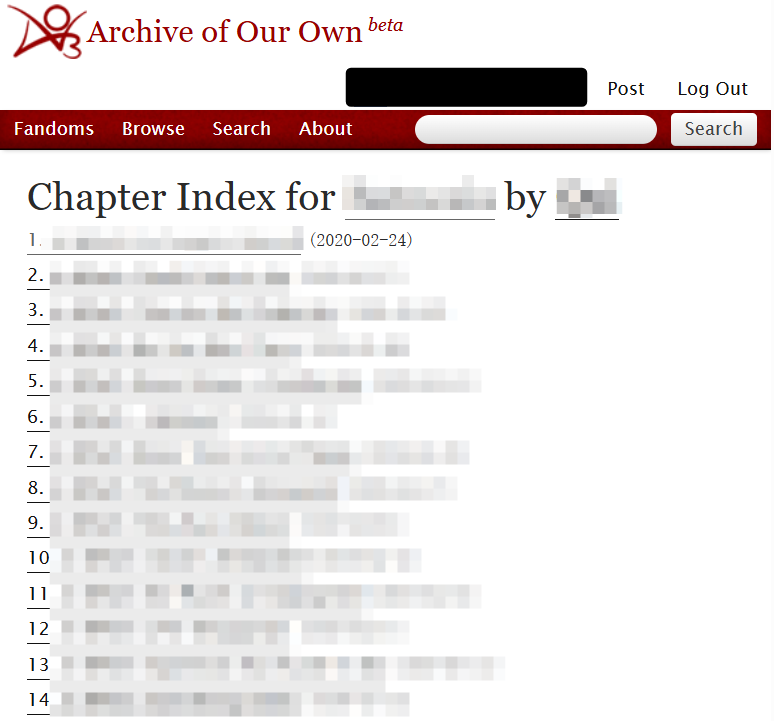

# 作品内按钮功能

在点开一篇作品后，可以看到页面顶部有许多按钮。它们的含义如图所示：

<figure><figcaption></figcaption></figure>

* 展开全部章节：将全部章节在同一个网页内显示（即连续滑动模式，不再需要点击按钮跳转章节）
* 下一章：点击跳转到下一章（如果存在上一章，在旁边还会有`Previous Chapter`的按钮）
* 章节目录：点击展开作品目录
* 编辑书签：如果你为作品添加过书签，点击按钮可以编辑它（登录用户功能，详见[书签](../ru-he-chi-fan-jin-jie-ban/shu-qian-shou-cang-bookmark.md)）
* 稍后再看：点击按钮将作品加入稍后再看列表（登录用户功能，详见[稍后再看](../ru-he-chi-fan-jin-jie-ban/shao-hou-zai-kan-marked-for-later.md)）
* 展开评论：点击之后会跳转到评论区
* 分享：分享到Twitter或Tumblr
* 订阅：订阅作品，作品更新时会收到邮件提示（登录用户功能，详见[订阅](../hu-dong-yu-jiao-liu/ding-yue-guan-zhu-gong-neng.md)）
* 下载：点击展开作品下载选项

## 使用目录快速跳转章节

使用`Chapter Index`功能。

如图，点击`Chapter Index`，若右侧的「↓」转变为「↑」，则表示展开章节目录成功。点击下拉列表右端的「<mark style="color:red;">∨</mark>」，选择你想阅读的章节，点击即可跳转。

<figure><figcaption></figcaption></figure>


有的镜像网站会出现没有Chapter Index的bug；如果遇到这种情况，只能更换镜像网站。


点击`Full Page Index`会跳转到整页目录，章节后括号内标注的时间是章节的发布时间。你也可以在这个页面点击章节名称跳转到相应章节。

<figure><figcaption>
整页目录
</figcaption></figure>
