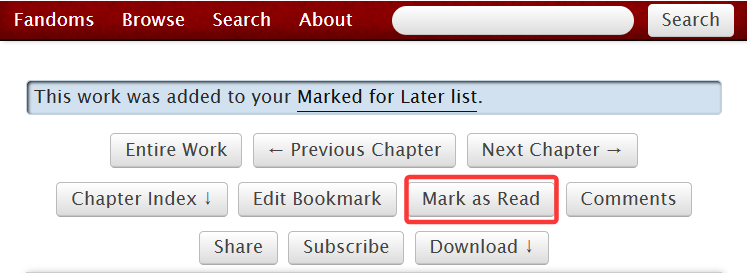
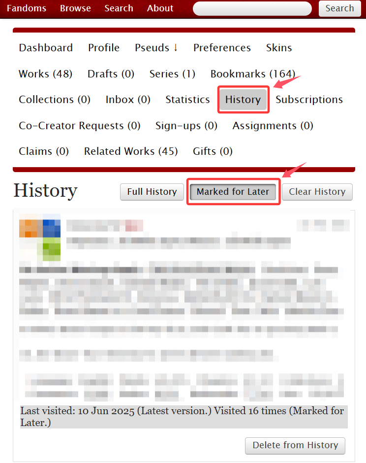

# 作品内按钮功能

在点开一篇作品后，可以看到页面顶部有许多按钮。它们的含义如图所示：

<figure><figcaption></figcaption></figure>

* 展开全部章节：将全部章节在同一个网页内显示（即连续滑动模式，不再需要点击按钮跳转章节）
* 下一章：点击跳转到下一章（如果存在上一章，在旁边还会有`Previous Chapter`的按钮）
* 章节目录：点击展开作品目录
* 编辑书签：如果你为作品添加过书签，点击按钮可以编辑它
* 稍后再看：点击按钮将作品加入稍后再看列表（保存在History界面中）
* 展开评论：点击之后会跳转到评论区
* 分享：分享到Twitter或Tumblr
* 订阅：订阅作品，作品更新时会收到邮件提示
* 下载：点击展开作品下载选项

## 使用目录快速跳转章节

使用`Chapter Index`功能。

如图，点击`Chapter Index`，若右侧的「↓」转变为「↑」，则表示展开章节目录成功。点击下拉列表右端的「<mark style="color:red;">∨</mark>」，选择你想阅读的章节，点击即可跳转。

<figure><figcaption></figcaption></figure>


有的镜像网站会出现没有Chapter Index的bug；如果遇到这种情况，只能更换镜像网站。


点击`Full Page Index`会跳转到整页目录，章节后括号内标注的时间是章节的发布时间。你也可以在这个页面点击章节名称跳转到相应章节。

<figure><figcaption>
整页目录
</figcaption></figure>

## 稍后再看（Mark for Later）

如果你不想立刻收藏一篇文章，但又想对它进行标记方便之后阅读，你可以使用`Mark for Later`功能。

<figure><figcaption></figcaption></figure>

点击按钮后会变成这样：

<figure><figcaption></figcaption></figure>

表示你已经成功将这部作品加入稍后再看，而原来的按钮会变成`Mark as Read`（标记看过）。

想要把此作品从稍后再看列表中删除，再次点击这个按钮标记看过即可。

想要进入稍后再看列表，你可以直接点击上方浅蓝色对话框中的<mark style="color:red;">Marked for Later list</mark>超链接。

或者进入**History**页面，选择`Marked for Later`。

<figure><figcaption></figcaption></figure>

这里会显示你最后一次打开作品的时间、作品的版本和阅览总次数。

点击右下角的`Delete from History`的效果与点进作品中点击`Mark as Read`相同，可以将这条记录从稍后再看列表中删除。
