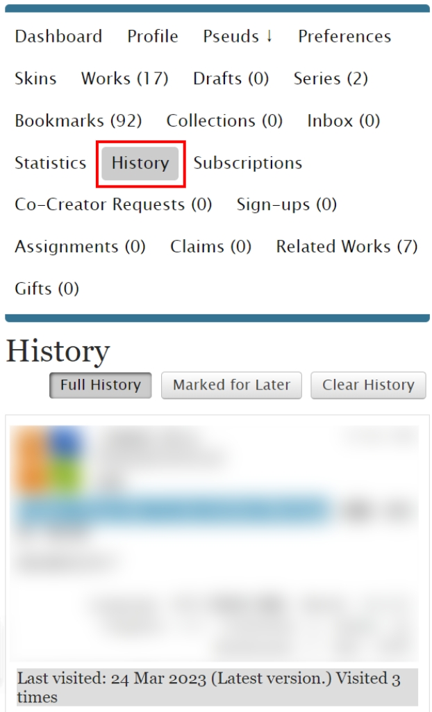
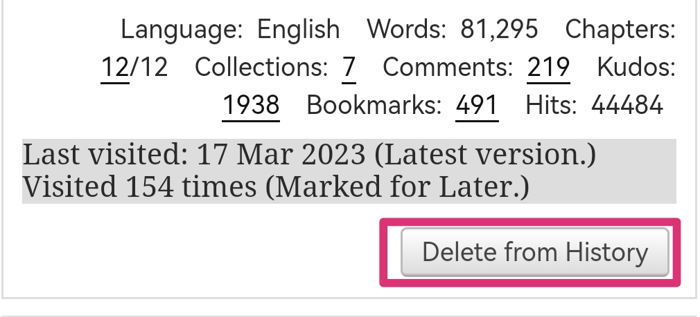
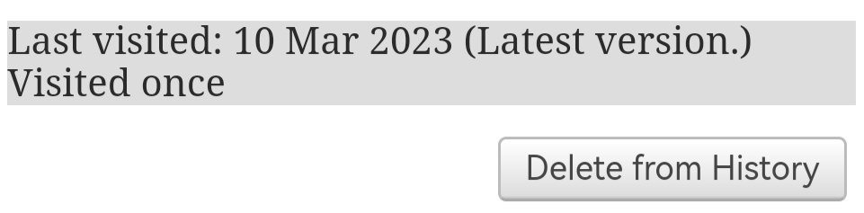
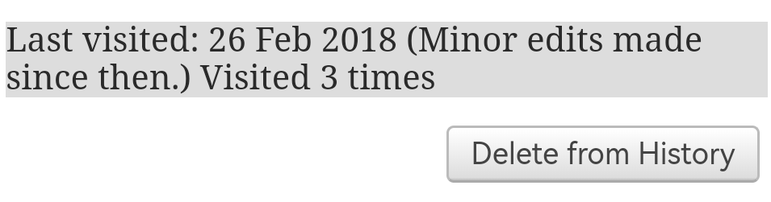
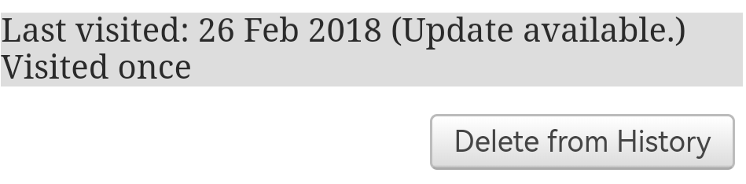
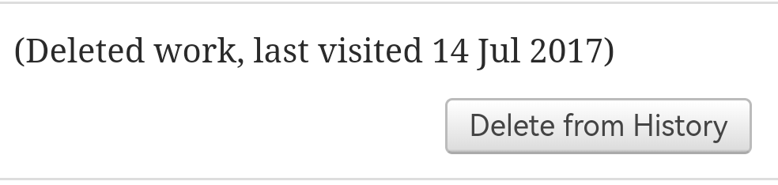

# 浏览历史（History）

想要查看浏览历史，请点开History页面。你点开过的每一篇作品都会在这里留下痕迹。

想要删除某条历史记录，请点击右下角的`Delete from History`按钮。

历史记录下面灰色底的长条记录了访问时间、访问版本和访问次数。比如上图表示的就是「最后一次访问是2023.3.17，作品处于最新版本，共访问了154次，且加入了[稍后再看](shao-hou-zai-kan-marked-for-later.md)」。

<figure><figcaption>
最后一次访问是2023.3.10，作品处于最新版本，共访问一次
</figcaption></figure>

<figure><figcaption>
最后一次访问是2018.2.26，自那次访问之后作者对作品做出了微小的调整，共访问三次
</figcaption></figure>

\

<figure><figcaption>
最后一次访问是2018.2.26，作品有更新，共访问一次
</figcaption></figure>

<figure><figcaption>
如果出现这样的占位符，则说明这篇作品已经被删除了
</figcaption></figure>
