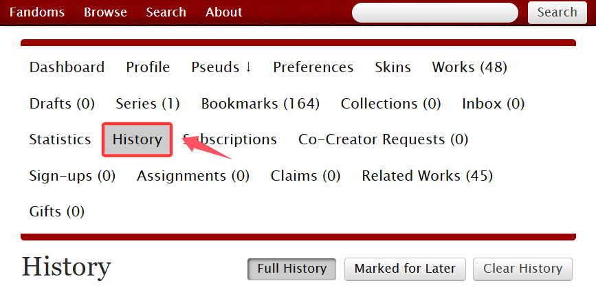
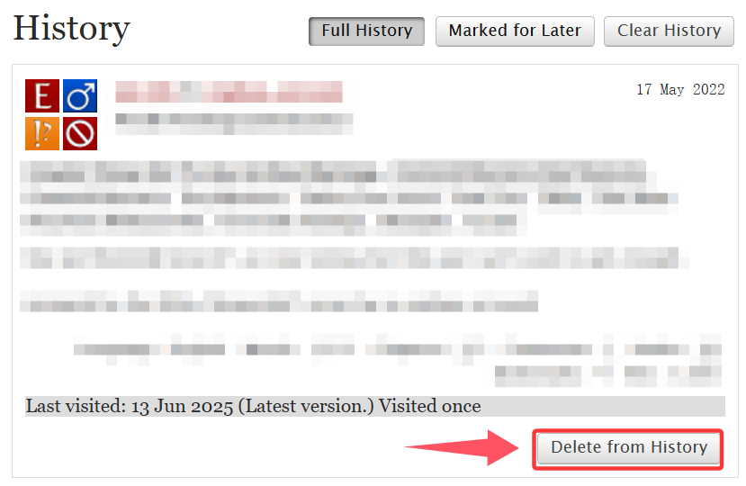

# 浏览历史（History）

想要查看浏览历史，请点开History页面。你点开过的每一篇作品都会在这里留下痕迹。

<figure><figcaption></figcaption></figure>

想要删除某条历史记录，请点击右下角的`Delete from History`按钮。

<figure><figcaption></figcaption></figure>

历史记录下面灰色底的长条记录了访问时间、访问版本和访问次数。例如：

<figure><figcaption>
最后访问于2023.3.10，作品为最新版本，共访问一次
</figcaption></figure>

<figure><figcaption>
最后访问于2018.2.26，自访问后作者有修改，共访问三次
</figcaption></figure>

<figure><figcaption>
最后访问于2018.2.26，作品有更新，共访问一次
</figcaption></figure>

<figure><figcaption>
这篇作品已经被删除了
</figcaption></figure>
