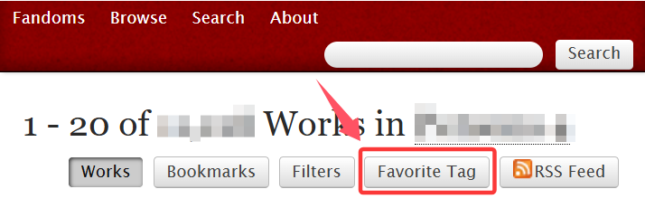
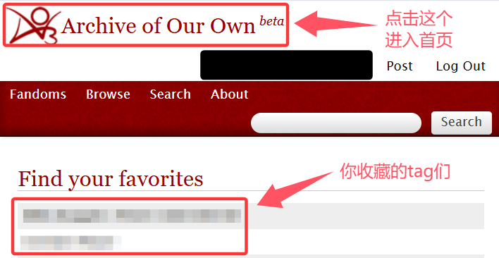
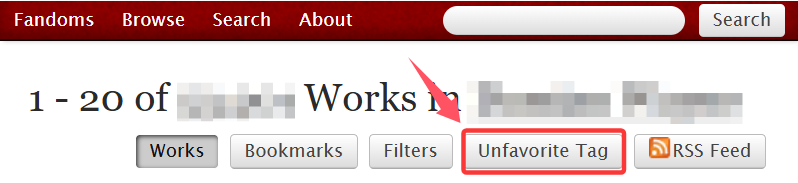

# 如何收藏标签


**注意：**&#x53EA;有**通用标签**可以收藏。如何查找通用标签见→[如何查找标签](../ru-he-chi-fan-chu-ji-ban/ji-ben-sou-suo-fang-fa-search/ru-he-cha-zhao-biao-qian-tags.md)


收藏标签可以使标签固定在你的AO3首页，避免了每次重新搜索的工作量。

进入你想要收藏的通用标签，点击右上角的`Favorite Tag`按钮。

<figure><figcaption></figcaption></figure>

就这么简单！现在你就可以在你的**网站首页（点击AO3网站LOGO进入的那个页面）**&#x770B;到这些收藏了的标签了。

<figure><figcaption>
你收藏的Tag们
</figcaption></figure>

要取消收藏，点进标签页面后点击位于原处的`Unfavorite Tag`。

<figure><figcaption></figcaption></figure>
