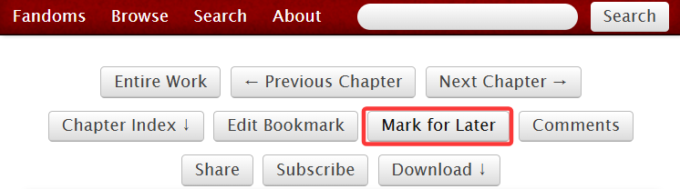

# 稍后再看（Marked for Later）

如果你不想立刻收藏一篇文章，但又想对它进行标记方便之后阅读，你可以使用`Mark for Later`功能。

打开作品后，可以在页面上端看到此按钮。

<figure><figcaption></figcaption></figure>

点击按钮后会变成这样：

<figure><figcaption></figcaption></figure>

表示你已经成功将这部作品加入稍后再看，而原来的按钮会变成`Mark as Read`（标记看过）。

想要进入稍后再看页，你可以直接点击上方浅蓝色对话框中的<mark style="color:red;">Marked for Later list</mark>超链接。

与此同时，所有被加入稍后再看的作品也可以在浏览历史页找到。首先进入**History**页面，然后点击`Marked for Later`按钮，进入稍后再看页。

<figure><figcaption></figcaption></figure>

这里会显示你最后一次打开作品的时间、作品的版本和阅览总次数。

如果想要取消一部作品的稍后再看，只需进入作品页面，点击`Mark as Read`按钮；或者也可以在稍后再看页直接点击记录右下角的`Delete from History`把该条目从历史记录中删除。
