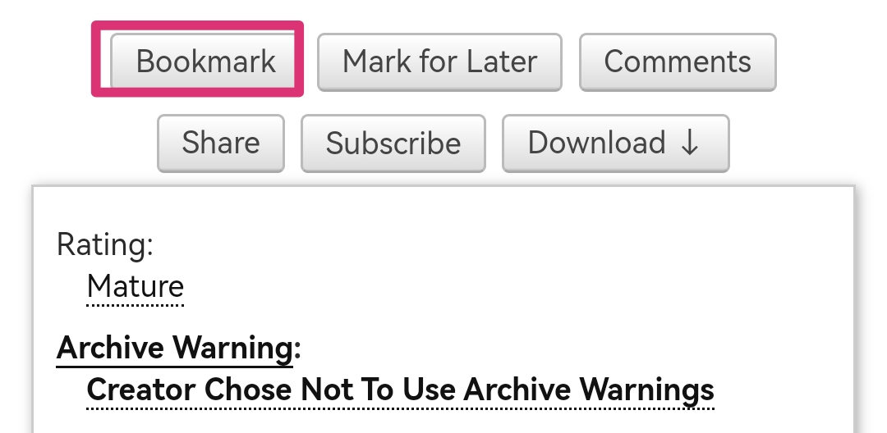
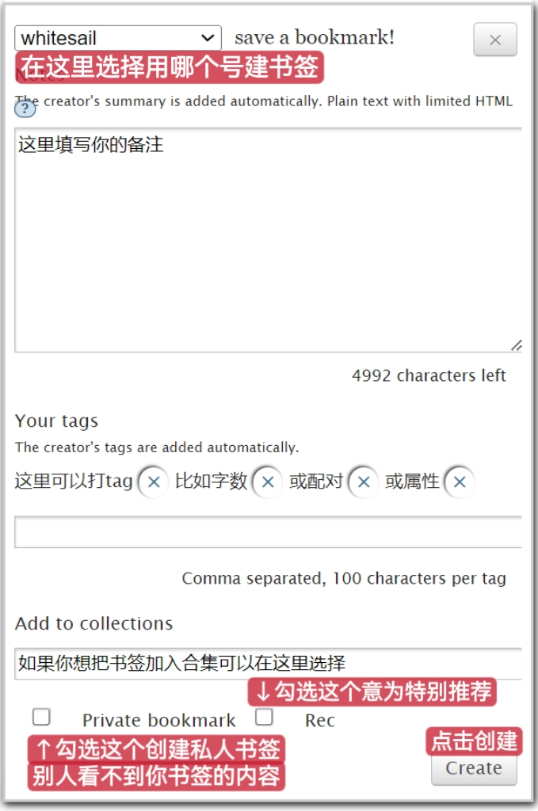
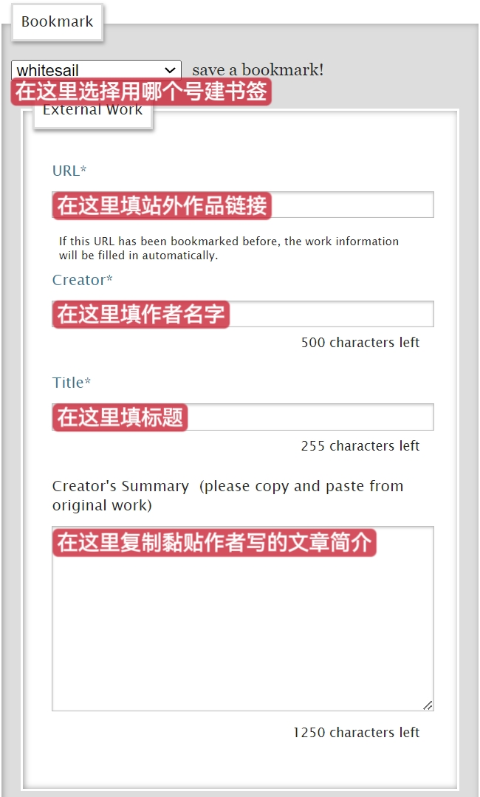
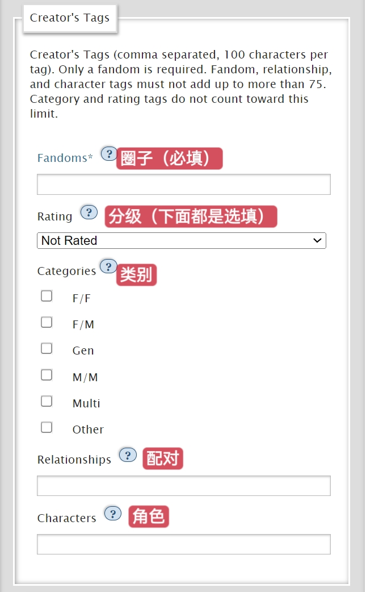

# 书签/收藏（Bookmark）

AO3没有查看kudos记录的功能，所以为了不丢失辛辛苦苦淘来的好饭，善用书签功能！它相当于一般平台的收藏功能，但自由性更大。

想要收藏一篇作品，只需要进入作品页面，然后点击上方的`Bookmark`按钮即可。

你可以对书签进行自定义，也可以什么都不填。

想要了解关于书签的更多信息请参照→[巧用他人书签](../ru-he-chi-fan-chu-ji-ban/qiao-yong-ta-ren-shu-qian.md)

你可以在Bookmarks页面查看你所有的收藏。

你也可以收藏站外作品，只需点击上图中的`Bookmark External Work`按钮，然后在新出现的页面内按要求填写即可。

【注】：由于创建书签有一定的延迟，有时数字的显示会有差别。

 (1).png>)
