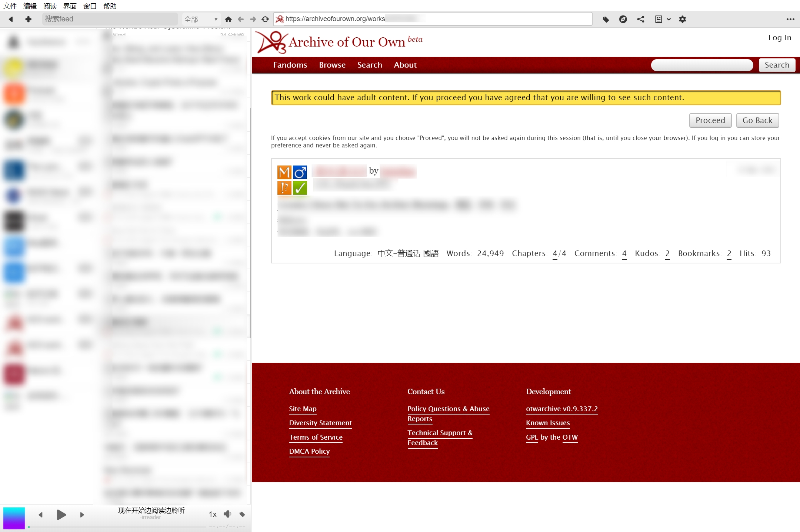

# RSS订阅

百度百科如此定义RSS订阅：

> RSS是一种信息聚合的技术，是某一站点和其他站点之间共享内容的一种简易信息发布与传递的方式，使得一个网站可以方便的调用其他提供RSS订阅服务的网站内容，从而形成非常高效的信息聚合，让网站发布的内容在更大的范围内传播。

简而言之：一个能把千家万户网站上的内容送到你眼前的信息传递系统。

RSS曾经红极一时，然而在各类公众号盛行、社交网络疯狂迭代的当今，RSS已经快要退出大众的视野。

扯远了，扯远了。咱们还是就讲AO3的RSS订阅。

## RSS订阅的作用是什么？

只要你能**翻墙**，一个RSS阅读器就能让你追踪任何**通用标签**的作品发布动态。在把通用标签加入你的RSS阅读器之后，你就能实时地接收到标签的更新信息，比如：

这就是我在电脑上使用irreader时的弹窗提示。

阅读界面是这样：

<figure><figcaption></figcaption></figure>

基本就是把游客浏览的网页集成到你的阅读器里，你也可以点击右上角的Log in登录阅读受限制的作品。

## 如何实现RSS订阅？

首先：下载一个RSS阅读器，注册账号。有手机上用的也有电脑上用的，知乎有不少相关的[帖子](https://www.zhihu.com/topic/19551894/hot)。具体步骤就不在这里讲了，搜一搜都能学会。

其次：在你想订阅的通用标签页面点击「RSS feed」按钮。

 (1) (1).png>)

第三：在打开的网页中，复制地址栏里的网址。

 (2).png>)

第四：找到你的RSS阅读器里「添加自定义源」的地方，用这个网址订阅即可。
