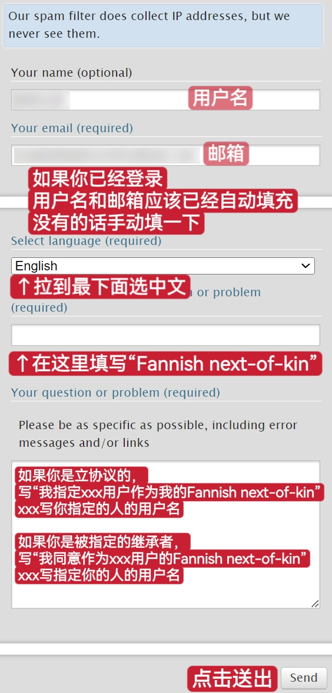

# 赛博账号遗嘱

我在AO3的ToS中翻到这个东西的时候也是出离震惊的……

众所周知，在现实中你可以亲自指定遗嘱中「近亲」的范围，规定由谁来继承你的遗产。

而这个「同好近亲协议」，通俗而言，就是你作为AO3的注册用户，可以指定另一名注册用户做你的「同好近亲」；根据AO3的流程签订官方协议之后，这个被指定的人就可以在你死亡或失去行动能力的情况下继承并管理你的AO3账号。

## 如何订立官方协议？

[AO3的ToS FAQ](https://archiveofourown.org/tos_faq)写道：「您和您选定的同好近亲需要向我们处理这一类申请的支持与反馈团队发送消息，说明您想要把对方设为您的同好近亲且获得了对方的同意。这不会被当做骚扰案件处理。为了档案记录，您需要提供您的用户名。当我们收到您和您指定者的消息后，我们会确认此同好近亲协议已生效。」

**第一步：**&#x53BB;往AO3的「[支持与反馈](https://archiveofourown.org/support)」页面。

**第二步：**&#x5982;图填写用户名、邮箱、语言、主题和内容，最后点击送出。

如果你和你指定的同好近亲都收到了邮件，那就说明协议成立了。

注意：这个协议不是双向的，被你指定为next-of-kin的人，其next-of-kin不一定是你。

## 如何取消协议？

双方都有权取消协议。按照订立协议的方法填写信息发送给支持与反馈团队即可，只需把内容改为“我取消和xxx用户的Fannish next-of-kin协议”。AO3收到信息后将给另一方发送邮件通知。

## 这个协议如何运作？

协议本身的内容只有协议相关方能看到。

协议的生效需要你的next-of-kin向支持与反馈团队发送消息，声明你已经死亡或失去行动能力。AO3会向你的邮箱发送邮件确认，如果你在十天之内没有反应，你的账号将被移交给你的fannish next-of-kin管理。

## 如果我没有托管人就死了怎么办？

那你的账号会永久原样保留。

## 如果出现了误会怎么办？

「如果你去世的谣传是夸大其词，请立刻联系我们的[支持与反馈](https://archiveofourown.org/support)团队。无论你是在亚马逊丛林里迷路了十二年还是有居心不良者想耍心眼子，我们都会尽己所能帮你尽快找回账号。」——AO3 ToS FAQ
