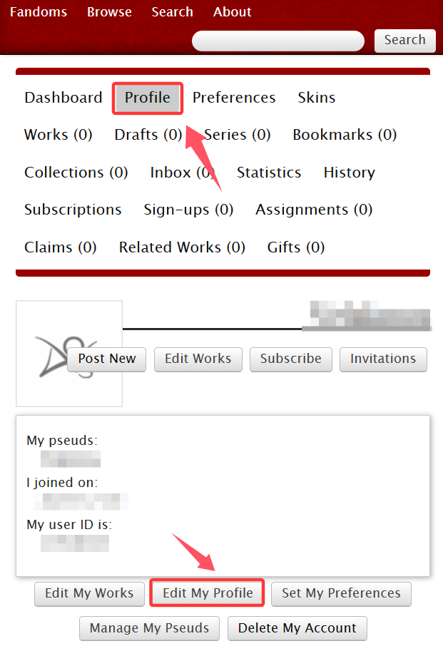
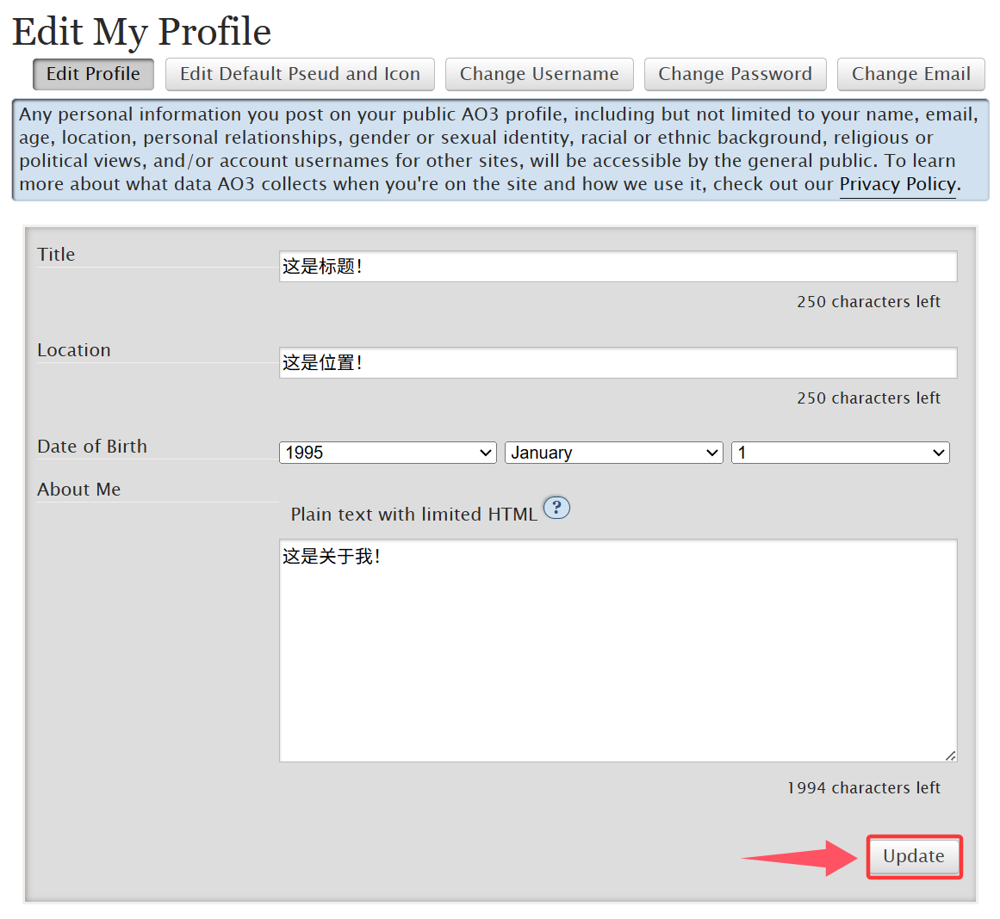
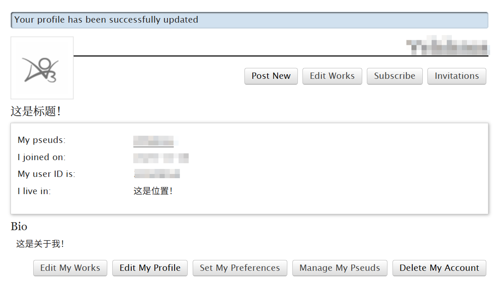

# 编辑个人资料（Profile）

**第一步**：在导航栏内找到`Profile`→`Edit My Profile`

<figure><figcaption></figcaption></figure>

**第二步**：填写你想更改的信息。

<figure><figcaption></figcaption></figure>

**最终效果**：

<figure><figcaption></figcaption></figure>
