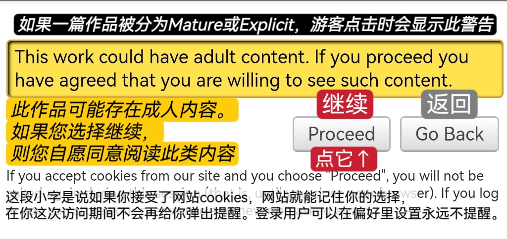
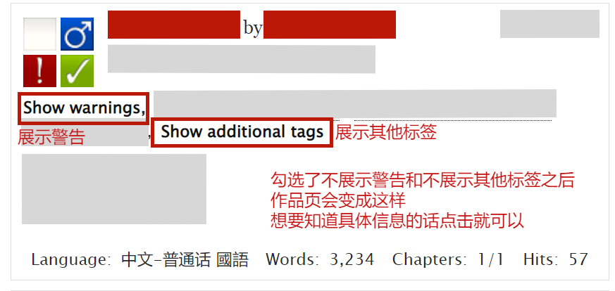

# 偏好设置（Preferences）

<figure><figcaption>
在我们个人主页顶部的导航栏找到偏好设置。
</figcaption></figure>

在我们个人主页顶部的导航栏找到偏好设置。

### 隐私（Privacy）

<figure><figcaption>
隐私设置
</figcaption></figure>

### 展示设置（Display）

<figure><figcaption>
展示设置
</figcaption></figure>

这里的第一项勾选的话以后就不会出现这个提醒了。

<figure><figcaption>
那个绊住很多人的功能
</figcaption></figure>

**勾选了隐藏警告和隐藏其他标签之后的作品页：**

<figure><figcaption>
隐藏警告与其他标签
</figcaption></figure>

### 你的站点皮肤（Your Site Skin）

更换站点皮肤的具体步骤请看→[网站快速换肤](wang-zhan-kuai-su-huan-fu-site-skin.md)

时区影响的是网站的时间显示格式，比如作品、评论上的时间，更改时区后所有时间显示都会改变。

<figure><figcaption>
站点皮肤设置
</figcaption></figure>

### 评论设置（Comments）

<figure><figcaption>
评论设置
</figcaption></figure>

### 合集、挑战赛和赠文（Collections, Challenges and Gifts）

<figure><figcaption>
合集、挑战赛和赠文
</figcaption></figure>

### **其他偏好（Misc）**

<figure><figcaption>
其他偏好
</figcaption></figure>
