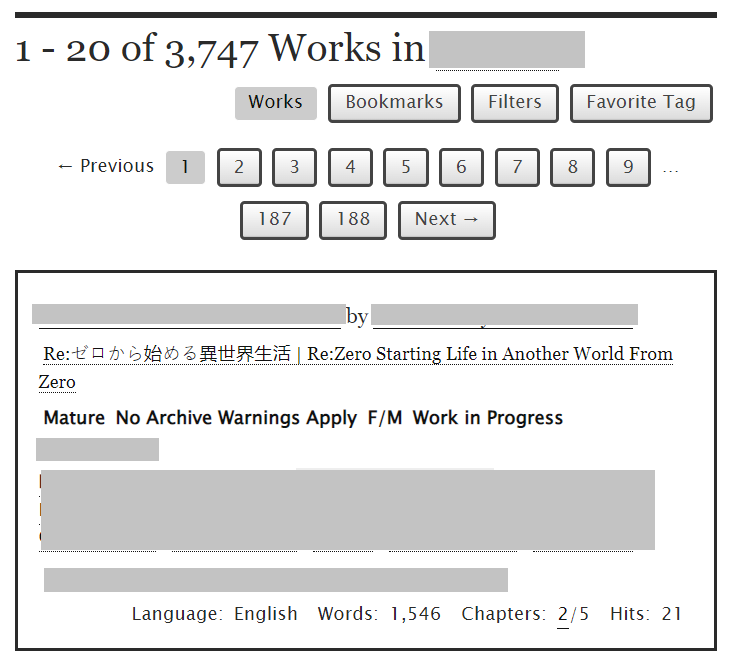
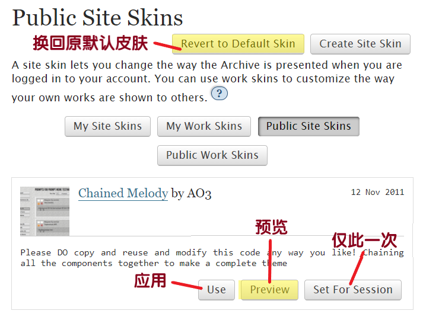

# 网站快速换肤（Site Skin）

### 一键换肤

把页面滑动到最底部，看到左侧我标黄的这一栏了吗？这就是一键切换网站皮肤的地方。

.png>)

第一个**Default**是默认红白皮肤，第二个**Low Vision Default**（低视力专用）长这样：

.png>)

第三个**Reversi**是反色夜间模式，第四个**Snow Blue**是浅蓝色主题。

### 更多皮肤

更多站点皮肤在[偏好设置](pian-hao-she-zhi-preferences.md)的Public Site Skin（公开站点皮肤）里选择。

* 在公开站点皮肤的界面中，遇到喜欢的皮肤可以点击皮肤的超链接标题查看内容
* 点击“预览”查看应用效果
* 点击“应用”更换为此皮肤
* 点击“仅此一次”，意思是这个皮肤只会在你这次登录和浏览时生效，换个设备或重新登录就会变回你原先设置的皮肤
