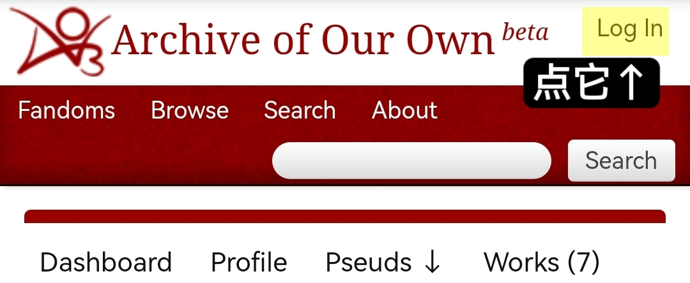
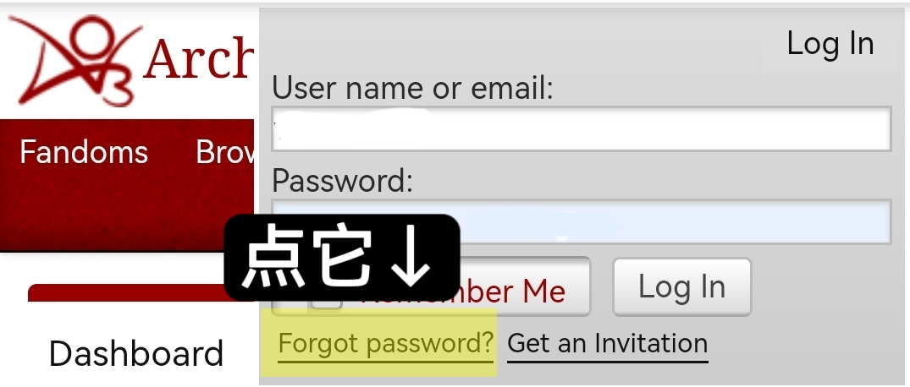
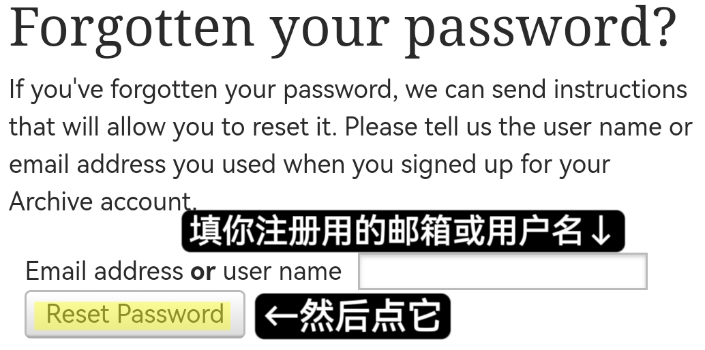
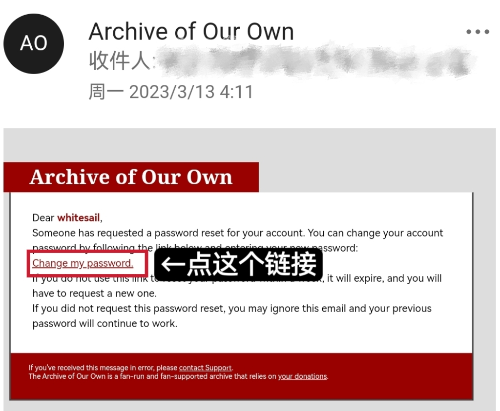
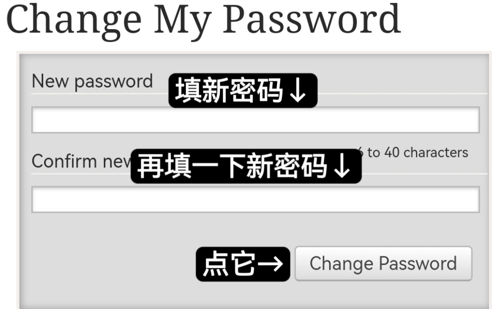

# 找回密码

如果你忘记了你的密码，可按下述步骤重置。

**第一步：**&#x70B9;击网站右上角的登录按钮。

<figure><figcaption></figcaption></figure>

**第二步：**&#x70B9;击左下角的<mark style="color:red;">Forgot password?</mark>。

<figure><figcaption></figcaption></figure>

**第三步：**&#x5728;输入框中填写你注册用的邮箱或用户名，并点击`Reset Password`。

<figure><figcaption></figcaption></figure>

**第四步：**&#x73B0;在你收到一封来自AO3的邮件。在其中找到<mark style="color:red;">Change my password</mark>并点击。

<figure><figcaption></figcaption></figure>

**第五步：**&#x586B;入两遍新密码，然后点击`Change Password`。

<figure><figcaption></figcaption></figure>
