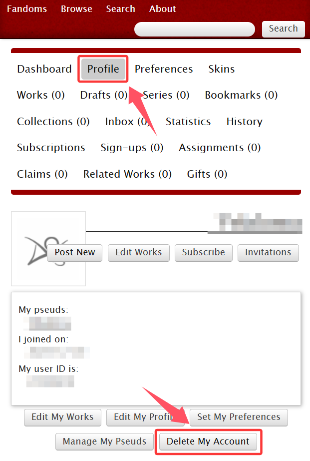

# 注销账号


**注意：**&#x5220;除账号后你名下所有的作品也都会删除，如果想注销账号但保留作品可以使用[遗弃作品](../chuang-zuo-zhe-zhi-nan/fa-bu-bai-ke/yi-qi-zuo-pin-orphan-work.md)功能。

你留过的评论不会消失，但用户名会变成「账号已注销」；你留过的kudos会变成游客kudos。



删除账号后，你的邮箱可以用来重新注册新账号。

删除账号适用于你想撇清一切曾经留过的评论和点赞与你这个账号的联系。如果是想和某个作品撇开干系可以使用[遗弃作品](../chuang-zuo-zhe-zhi-nan/fa-bu-bai-ke/yi-qi-zuo-pin-orphan-work.md)功能；如果你只是不喜欢你的用户名，你可以[更改用户名](geng-gai-yong-hu-ming-user-name.md)。


登录账号，打开**Profile**页面，点击`Delete My Account`。

<figure><figcaption></figcaption></figure>

此时AO3会弹窗提醒你此操作不可撤回，是否确认此操作；点击`OK`。

<figure><figcaption></figcaption></figure>
