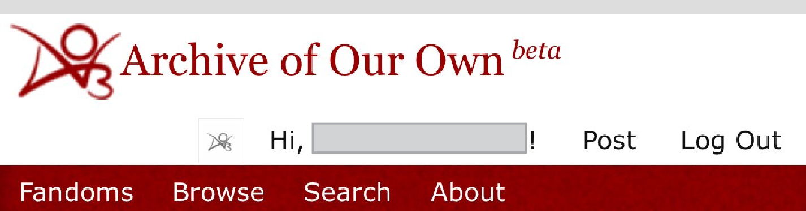
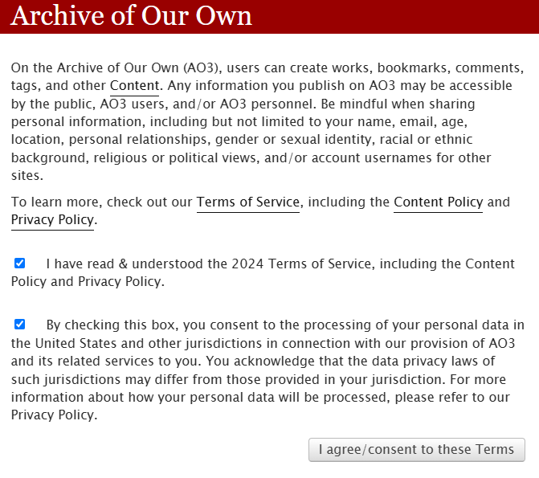
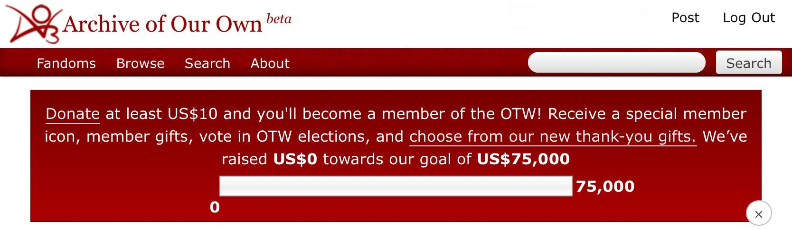

# 🎬 序言

在正式开始之前，难免要先进行一点科普。

> AO3作品库（英语：Archive of Our Own；缩写：AO3）是一个存放**原创及二创作品**的**非营利性开源储存网站**。该网站于2008年由再创作组织创建，并于2009年开始公测。AO3作品库在2019年获得雨果奖最佳相关作品奖。
>
> ——节选自维基百科“AO3作品库”词条[^1]

这就可以回答一些经常出现的问题，比如：

1. **AO3的APP怎么下载啊？**

答：AO3的本体是网站，没有任何官方APP；针对非官方的APP上架，AO3官方的回应[^2]是：“（制作一款手机应用）确实在我们的发展计划之中，但是还需要经历几次重大更新才能进行这一步。目前我们的资源还远远不够。最后，需要说明一项安全问题。如果某第三方应用或网站需要您的AO3登录信息，请您谨慎处理，并意识到您将自行承担提供信息的风险。”

**AO3不涉及任何盈利行为，无任何官方APP，充钱才可以使用的均为盗版，请注意甄别！**

2. **AO3怎么调中文版啊？**

答：AO3是英语使用者建立的英文主体网站，尚且处在持续的开发完善过程中，因此目前没有中文互动界面。唯一有内置中文翻译的页面是AO3的FAQ（常见问题答疑），是由中文志愿者协助翻译置入的。因此，在AO3的其他页面，用户通常只能使用翻译软件或网页内置翻译功能对页面进行汉化。

注意：部分镜像网站内置了中文翻译功能，但该功能与AO3官方毫无关系，乃镜像网站自行置入。

3. **AO3的官方网址是什么？**

答：[https://archiveofourown.org](https://archiveofourown.org)

该网址为固定的官方地址，从来没有更改过。除此之外的一切链接都是镜像网站。这些镜像网站中，部分是AO3官方承认的，如archiveofourown.com，archiveofourown.net，archiveofourown.gay，ao3.org，archive.transformativeworks.org，insecure.archiveofourown.org（但这些网址基本也都和原站一样无法直接访问了），更多是未经官方承认的代理镜像站点。在使用非官方镜像时，请务必注意信息和财产安全。

4. ~~**为什么AO3网站名右上角有个「beta」？是因为镜像吗？**~~

~~答：不是，是因为AO3现在还是在测试版，尚且没有升级到1.0版。关于AO3的未来规划蓝图请参见「~~[~~AO3 Roadmap~~](xiao-zhong-gong-neng/ao3-roadmap.md)~~」。~~

2026年4月3日，AO3结束长达17年的公测阶段，正式升级为“正式版”，移除了沿用多年的“Beta”标识。

成年快乐！🎉🎉

<figure><figcaption>
曾经的AO3 beta
</figcaption></figure>

5. **要进AO3的时候弹出的网页是什么？可以同意这些条款吗？**

答：在未登录状态下进入AO3网页时，游客可能遭遇如图网页。这是AO3官方的正规流程，并非什么有害植入！

<figure><figcaption></figcaption></figure>

这两个勾选框，第一条是同意AO3的服务条款，第二条是同意AO3处理你的个人信息——包括电子邮件（如果你要以游客身份发表评论或者成为注册用户的话）、IP地址、使用日志、Cookie等，总之就是普通网站为了给你提供互联网服务会收集和使用的那些信息。只要你不主动在AO3公开个人信息或者乱点（镜像网站才会有的）弹窗广告，你的隐私不会有任何危险。只有点击同意这两条条款才可以继续前进使用网站。

6. **AO3网站顶部为什么有个叫人捐款的横幅啊？是骗钱的吗？**

答：并非！这是AO3官方的正规募捐渠道。虽然**AO3的捐款通道是时刻开放的（你随时可以通过网站左上角的About→Donate or Volunteer进行捐款）**，但是每隔一段时间，AO3都会在站点上方放出一个带有捐款目标的横幅来鼓励用户捐款。令人津津乐道的是，无论AO3把这个目标设立得多高，同人创作者们都会在几天甚至几小时内达到并超过这个目标。

<figure><figcaption></figcaption></figure>

***

目前，部分中文用户进入AO3需要借助工具或镜像网站。

#### 【可用的镜像网站】

鉴于目前的复杂情况，此处信息已永久性移除。


<mark style="color:red;">**注意：镜像网站存在信息泄露/电信诈骗/网络攻击的风险，请根据自身情况谨慎选择使用。**</mark>


#### 【可用的工具】

鉴于目前的复杂情况，此处信息已永久性移除。


<mark style="color:red;">**注意：提高甄别能力，不要随便点击陌生人分享的链接或加入陌生人分享的群聊！不要随意泄露自己的身份信息！不要轻易通过未经认证的渠道付款！**</mark>


[^1]: 资料来源：[AO3作品库](https://zh.wikipedia.org/wiki/AO3%E4%BD%9C%E5%93%81%E5%BA%93)

[^2]: 资料来源：[AO3手机应用软件](https://archiveofourown.org/admin_posts/4049#main)
