# 🔮 账号注册

虽然不注册账号也一样可以无障碍阅读AO3上的公开作品，但请让我耽误您几分钟，我想为您介绍一下我们的救星，我们神圣的AO3账号……

## **注册账号的优点**

1. 可以阅读仅对站内用户展示的作品；
2. 拥有历史记录、书签收藏、订阅更新、制作合集、小工具、网站主题换肤、屏蔽用户等功能；
3. 评论无需填写邮箱，评论收发更方便；
4. 发布自己的文章；
5. 可以给AO3募捐并成为拥有投票选举权的会员；
6. 随着AO3的不断更新，更多功能即将推出……

## 注册账号的要求

要成功在AO3注册一个账号，你需要：

* 一个可以正常收取邮件的电子邮箱
* 达到法定的可以同意网站处理你私人信息的年龄（对于AO3服务器所在的地区而言是13岁，对于中国公民而言是14岁；当然，这是一个君子协议[^1]，AO3不会也无法核验你是否真的有14岁）
* 读过AO3的服务条款并愿意遵守它（同样也是君子协议[^2]）
* 获得AO3网站的邀请

以上是AO3官方对于注册用户的要求。对于部分中国用户而言，更重要的其实是：

* 登录AO3原网站的能力（即：你或许需要一个VPN）

## **如何获得邀请**


<mark style="color:red;">**注意：以下操作全程需要使用VPN（俗称挂梯子）登入AO3原网址。**</mark>


注册AO3账号的唯一方式就是获得网站的**Invitation（邀请）**。

获得邀请的途径有两种：让一名已经注册账号的AO3用户给你发送邀请码，或者去网站首页排队。

前者，被邀请即可立刻创建账户，无需等待；后者往往需要等待几天甚至数周（这是正常的！AO3每时每刻都有很多新用户等待注册）。

大部分用户均为排队注册，在这里我们也优先讲解这个方法。

### 方法一：通过邮件排队

1. 挂梯子打开原网址[https://archiveofourown.org](https://archiveofourown.org)后，点击首页的`Get Invited!`按钮。

<figure>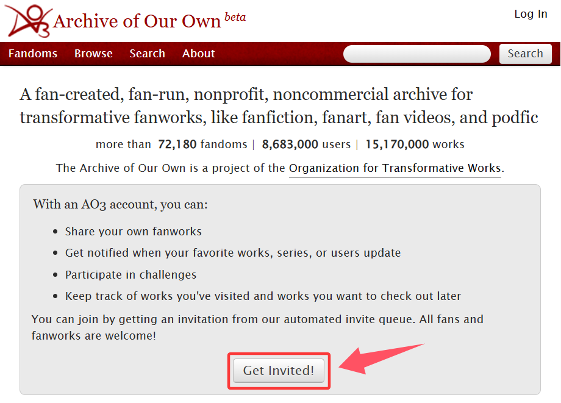<figcaption></figcaption></figure>

2. 在输入框内填写邮箱并点击`Add me to the list`按钮。（出于安全考虑，建议使用不会绑定个人身份的邮箱如Outlook或Gmail；此外，某些国内的邮箱可能无法稳定地接收AO3官方的邮件。）下面那行小字中，红线示意的部分指的是在你之前的排队人数。AO3将以6000条/12小时的速度发放邀请。

<figure><figcaption></figcaption></figure>

3.  界面顶部出现<mark style="background-color:$primary;">「You've been added to our queue!」</mark>的蓝色消息框的时候，证明你已经排上队了。

    消息框中，<mark style="color:red;">红线标示的是预计收到邮件的时间</mark>；黑线标示的是会给你发送邮件的邮箱。如果希望能正常收到邮件，避免邮件被拦截或进入垃圾箱，可以先把<mark style="color:blue;">do-not-reply@archiveofourown.org</mark>加入邮箱联系人或白名单。

<figure>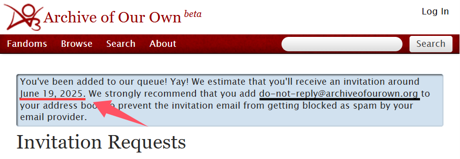<figcaption></figcaption></figure>

4. 在漫长的等待之后，你收到了第一封邮件！（如果没有，找找邮件垃圾箱。）找到邮件里的<mark style="color:red;">follow this link to sign up</mark>，**确认你的网络环境可以直连AO3**，然后点击此超链接。接下来，你就可以进入[创建账号](zhang-hao-zhu-ce.md#ru-he-chuang-jian-zhang-hao)步骤了。

<figure><figcaption></figcaption></figure>

### 方法二：通过邀请码直接注册

2019年之前注册的AO3账号均自带8条邀请码，2019年后AO3停止向新账号提供快捷邀请码。因此，使用邀请码注册的前提是有一个2019年之前注册的用户愿意向你提供邀请码。

请注意：每个已注册用户拥有的邀请码数量是有限的，被使用过的邀请码即作废；另外，被邀请者在使用邀请码创建账号后，用户名和邮箱将对邀请者可见。

通过发送邀请码注册的方法如下

#### **邀请方：**

点开**Dashboard（个人主页）**，在用户名下找到`Invitations`按钮并点击。

<figure>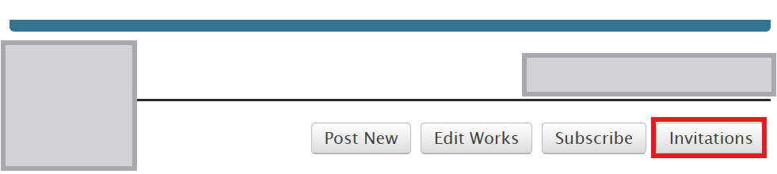<figcaption></figcaption></figure>

跳转至的界面如图所示：

<figure>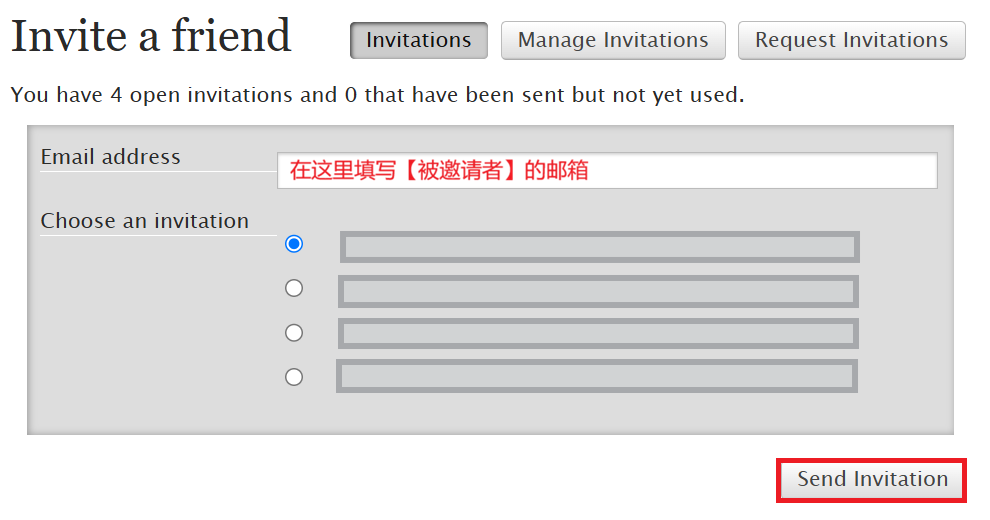<figcaption></figcaption></figure>

将被邀请者想要用于注册的邮箱填入输入框中，选择一条邀请码，然后点击`Send Invitation`按钮即可发送邀请。

之后邀请者将跳转至这个界面，表示邀请成功送出：

<figure>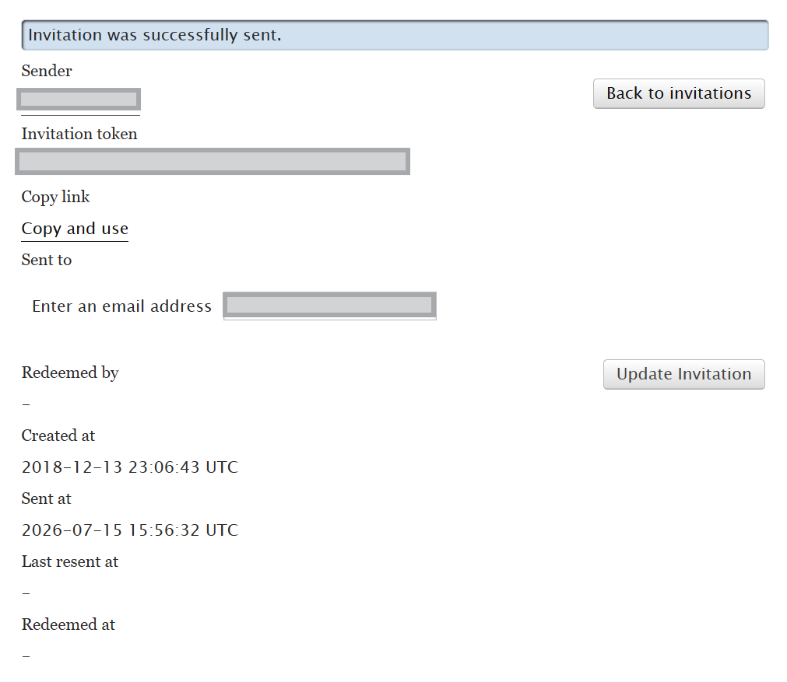<figcaption>
上半部分：发送者、邀请码、受邀者邮箱；下半部分：受邀者ID、邀请码创建日期、发送日期等
</figcaption></figure>

#### 被邀请方：

被邀请者将收到一封邮件：

<figure>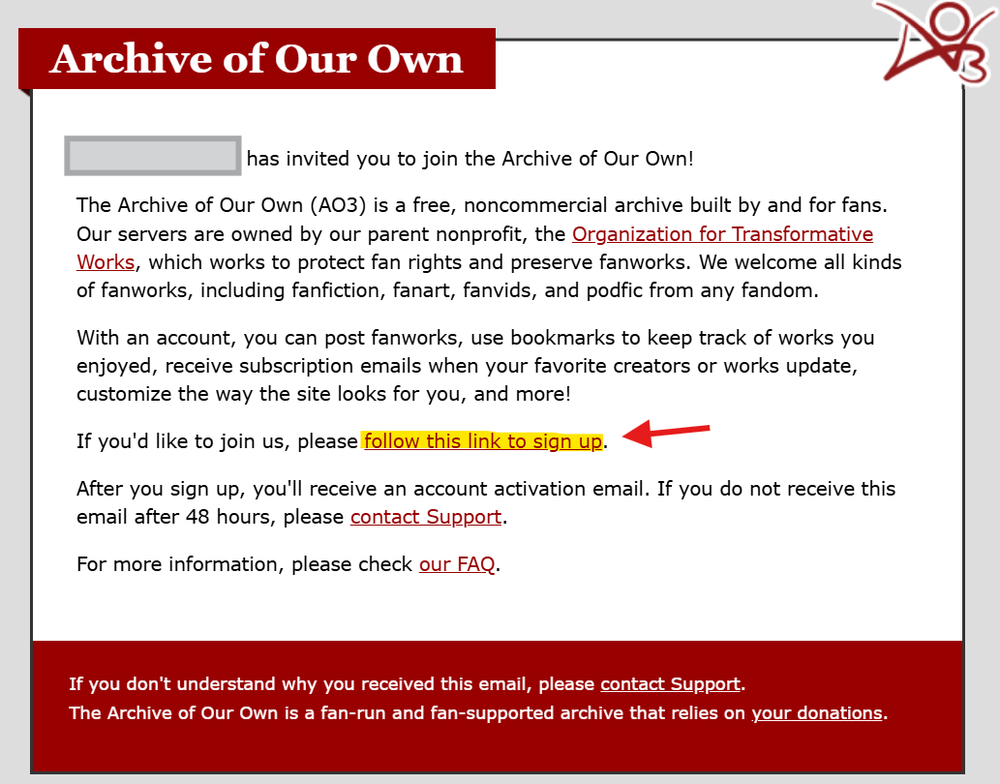<figcaption></figcaption></figure>

找到如图的<mark style="color:red;">follow this link to sign up</mark>并点击。**（注意：由于该链接直接跳转至AO3原网站，请受邀者务必确认自己的网络环境支持直连AO3。）**

接下来的操作请参见「[如何创建账号](zhang-hao-zhu-ce.md#ru-he-chuang-jian-zhang-hao)」。

#### 其他更加直接的邀请码发送方法：

**【方法A】**

点开**Dashboard（个人主页）**，在用户名下找到`Invitations`按钮并点击。

跳转至**Invite a friend**界面后，点击`Manage Invitations`和`Unsent`。

然后，**复制**「_copy and use_」这个超链接的网址（复制！不是点开！）。

* 在Windows系统电脑上：右键该链接，然后选择「复制链接地址」
* 在MacOS系统电脑上：同时按下control键并点击链接，然后选择「复制链接」
* 在手机上：长按链接，然后选择「复制链接」

<figure>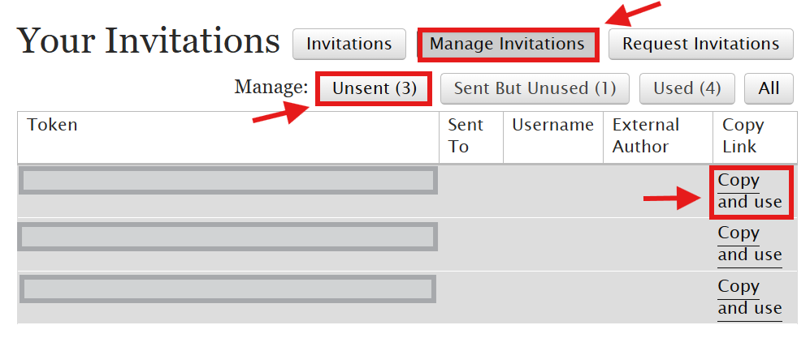<figcaption></figcaption></figure>

把复制得到的链接发给受邀者，对方点开链接即可按照「[如何创建账号](zhang-hao-zhu-ce.md#ru-he-chuang-jian-zhang-hao)」操作。

**【方法B】**

直接将邀请码字符全部复制并发送给被邀请者。

被邀请者需要在浏览器的地址栏输入「<mark style="color:$primary;">https://archiveofourown.org/signup/####</mark>」，并将「<mark style="color:$primary;">####</mark>」替换为邀请码字符串；替换完成后的链接会直接导向注册页面。**（同样地，需要受邀者的网络环境能够直连AO3。）**

接下来的操作参见「[如何创建账号](zhang-hao-zhu-ce.md#ru-he-chuang-jian-zhang-hao)」。

#### **如何查看自己的邀请码状态？**

在**Invite a friend**界面选择`Manage Invitations`，即可查看所有邀请码的状态。

<figure>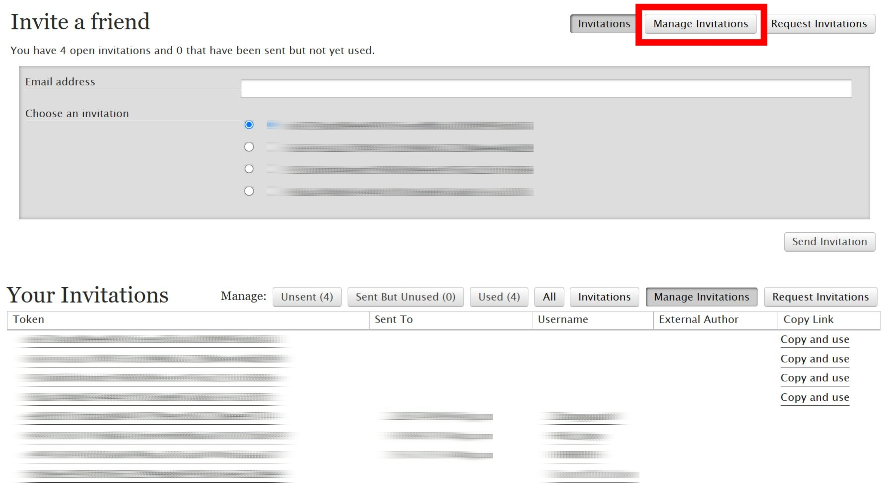<figcaption></figcaption></figure>

`Unsent`是未送出的，`Sent But Unused`是送出但未被认领的，`Used`就是已使用并作废的。

## 如何创建账号


<mark style="color:red;">**注意：以下操作全程需要使用VPN（俗称挂梯子）登入AO3原网址。**</mark>


现在，你来到了**Creat Account（创建账号）**&#x754C;面。你需要填写的信息是

1. **User name**：用户名，只能含有大小写英文字母、数字和下划线（这个东西“\_”）且不能以下划线开头结尾
2. **Password**：密码，长度6到40个字符
3. **Confirm password**：确认密码，再输一遍
4. 勾选**Yes, I am at least 13**（我已满13岁）和**Yes, I have read the Terms of Service and agree to them**（我已阅读并同意AO3的服务条款）

最后点击`Create Account`就可以了。

<figure>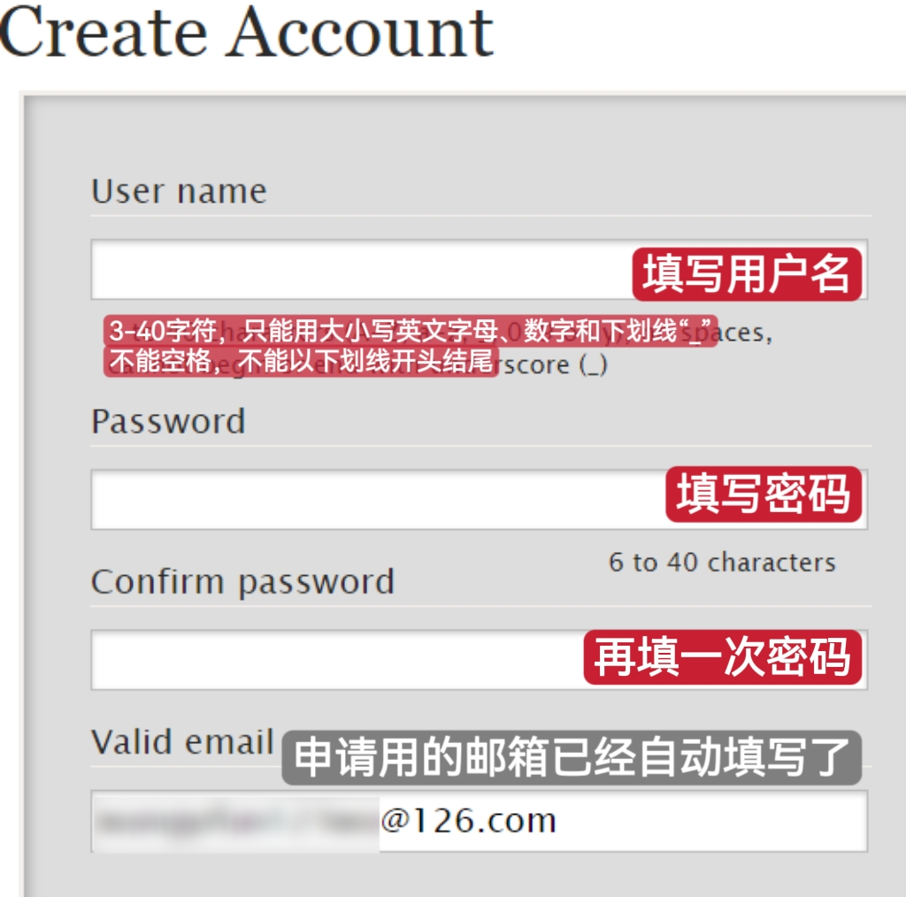<figcaption></figcaption></figure>

<figure><figcaption></figcaption></figure>

<figure><figcaption></figcaption></figure>

在这之后你来到了**Almost Done!**&#x7684;界面，这意味着你即将收到第二封邮件。

<figure>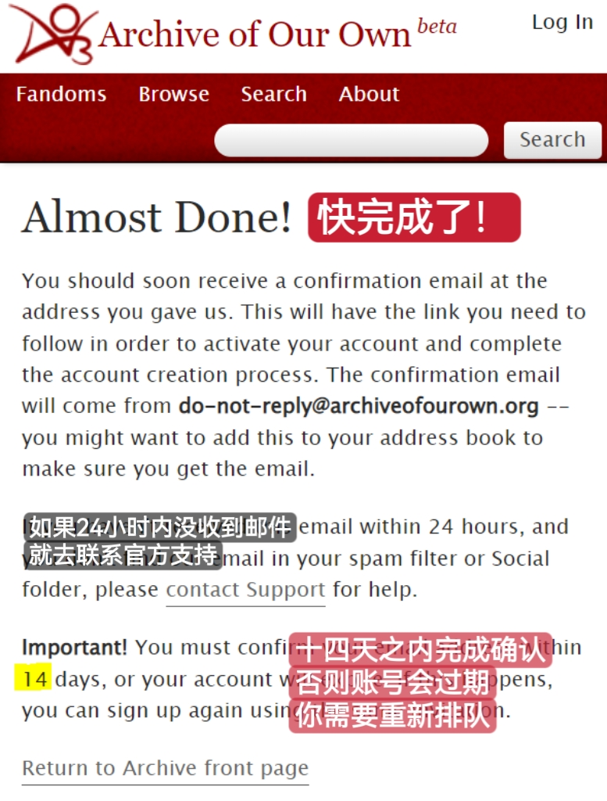<figcaption></figcaption></figure>

在第二封邮件中寻找<mark style="color:red;">follow this link to activate your account</mark>，**确认你的网络环境可以直连AO3**，然后点击它。

<figure>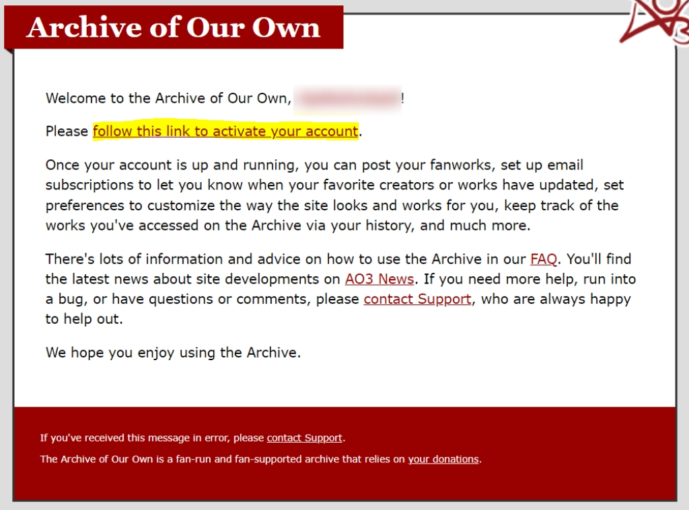<figcaption></figcaption></figure>

你将跳转至一个顶端有蓝色消息框告诉你<mark style="background-color:$primary;">「Account activation complete! Please log in.」</mark>的界面。这意味着你的账号已经激活，现在可以登录了。

第一行填写用户名或邮箱（你刚刚注册好的那个），第二行填写密码。若勾选`Remember me`，下一次打开网站会自动登录。

最后点击`Log in`，你面前的就是完全体的AO3了。

<figure>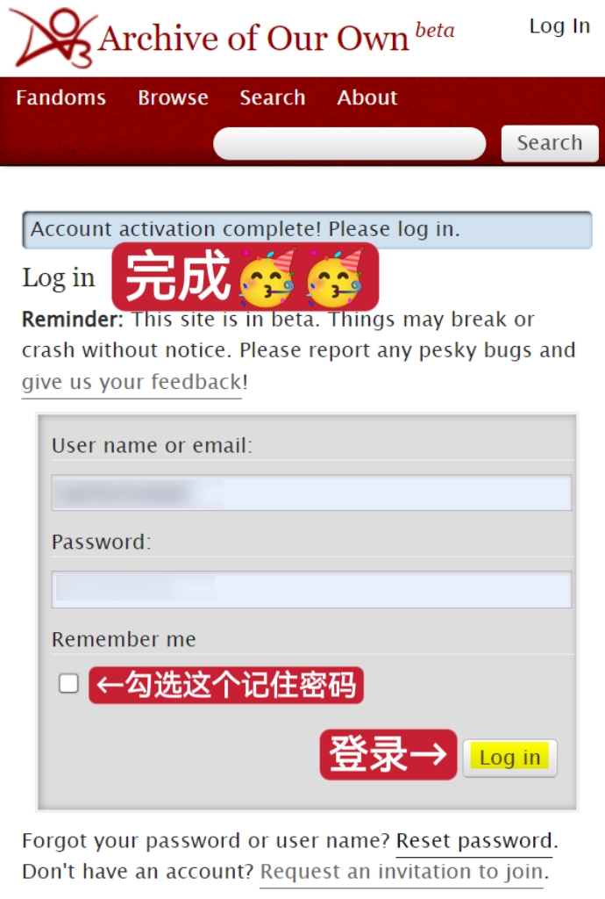<figcaption></figcaption></figure>

## 可能遇到的问题

### 怎么查看我有没有排上队？

点击首页上的`Get Invited!`按钮，跳转至**Request an invitation**页面，点击下图标黄的链接<mark style="color:red;">check your position on the waiting list</mark>。（标红的数字是表示现在有多少人在排队。）

<figure>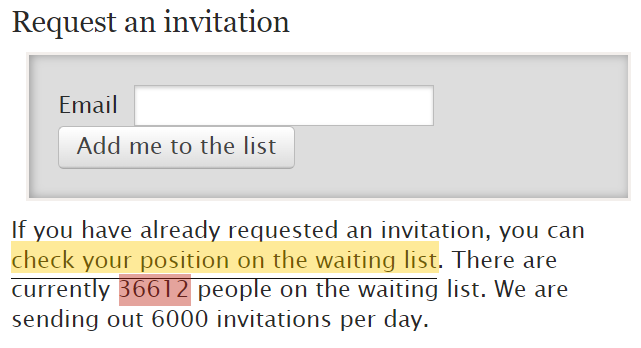<figcaption></figcaption></figure>

在输入框中填入**你申请用的邮箱**，然后点击`Look me up`，下方即会出现查询结果。

<figure>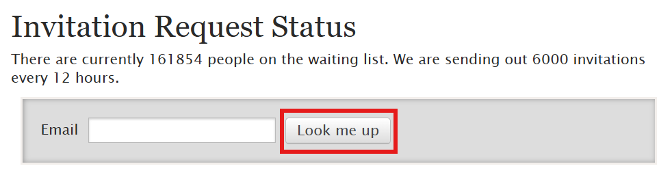<figcaption></figcaption></figure>

<figure>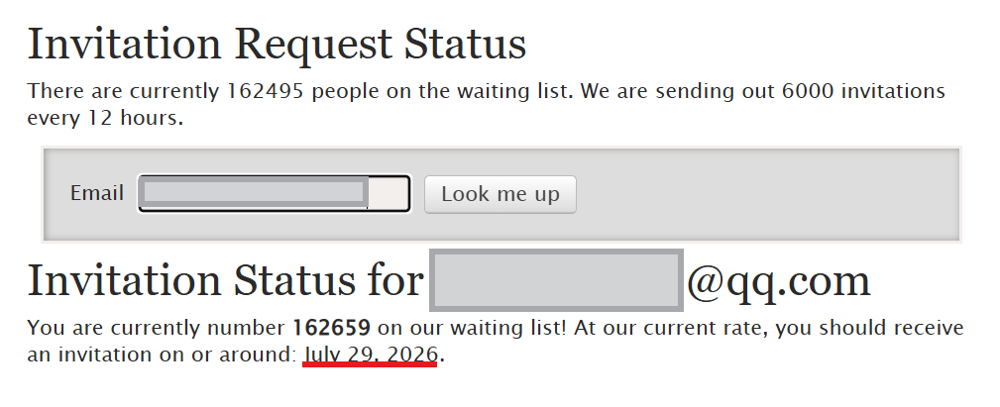<figcaption>
确认已在队列中，待发送邀请；红线标示预计收到邀请的日期
</figcaption></figure>

若查询结果显示为如下情况，则查询的邮箱不在队列中。

<figure>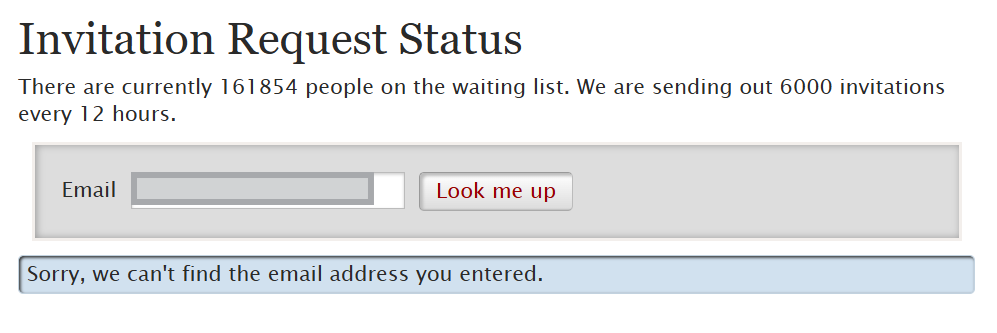<figcaption>
不在队列中，建议重新进行注册操作
</figcaption></figure>

<figure>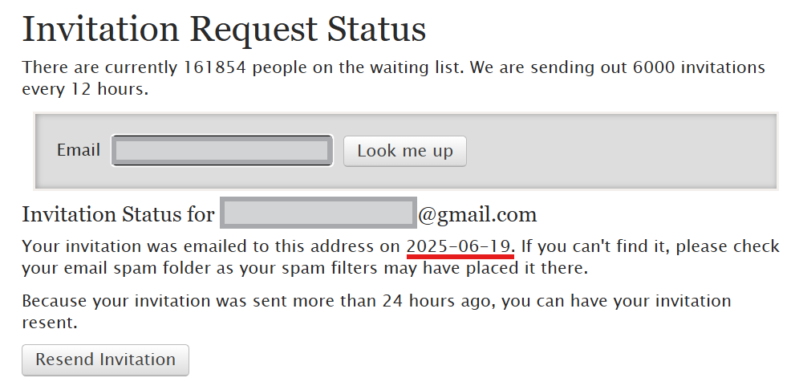<figcaption>
邮件已于红线标示的日期发送完毕，建议重新检查收件箱和垃圾箱；若邮件发送超过24小时，可以点击左下角Resend按钮重新发送
</figcaption></figure>

### 第一封邮件为什么迟迟不来？

AO3基本每时每刻都有新人加入，排队人数常年以万计量，在每12小时发送6000份邀请的速度之下，要排到号也需等待几天甚至几周。因此在申请注册时，受理界面上会显示收到邮件的预估时间。如果超过预估时间太久没有收到，请参照上一个问题的方式查看自己是否确实成功排队。

### 第二封邮件什么时候来？

第二封邮件一般会在**Almost Done!**&#x9875;面出现后的几分钟之内收到。如果没有，可以查看一下自己邮箱的垃圾箱，看看是否被当成垃圾邮件拦截了，或搜索来自<mark style="color:blue;">do-not-reply@archiveofourown.org</mark>的邮件。如果超过24小时没有收到，请联系AO3官方支持。

### Email is already part of our queue

假如你在填写邮箱申请后报错<mark style="color:red;">Email is already part of our queue（电子邮件已经是我们队列的一部分）</mark>，说明你排队成功，已经或即将收到邮件，无需重复申请。

<figure>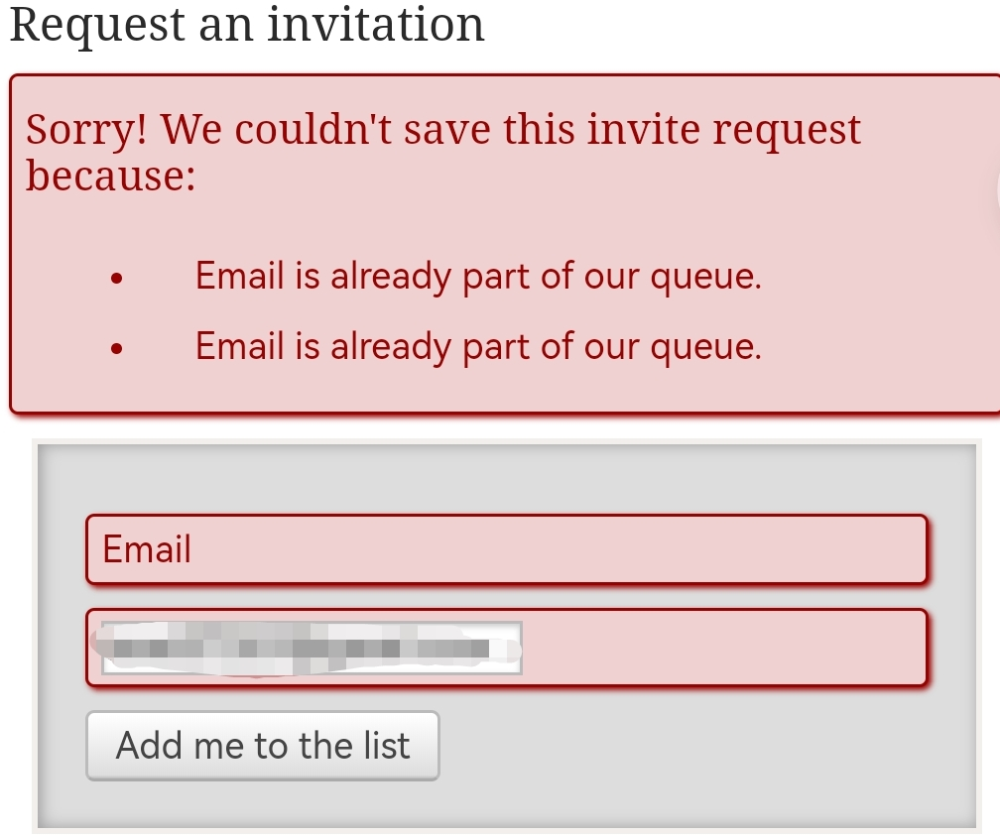<figcaption></figcaption></figure>

### Email is already being used by an account holder

这个邮箱已经被一个AO3账号绑定了。

<figure>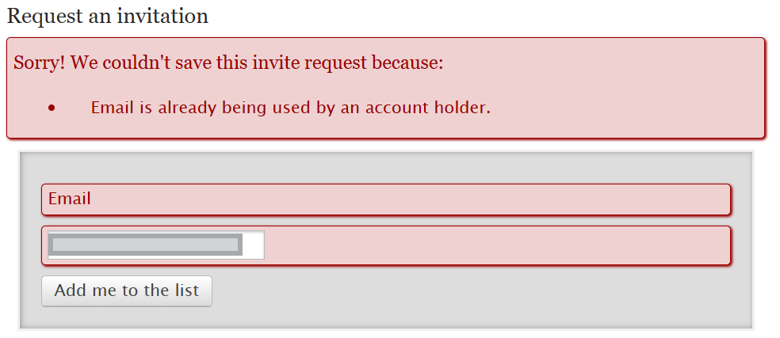<figcaption></figcaption></figure>

### Login has already been taken

如果提示<mark style="color:red;">Login has already been taken</mark>，意味着用户名重复，请更换注册用户名。

<figure>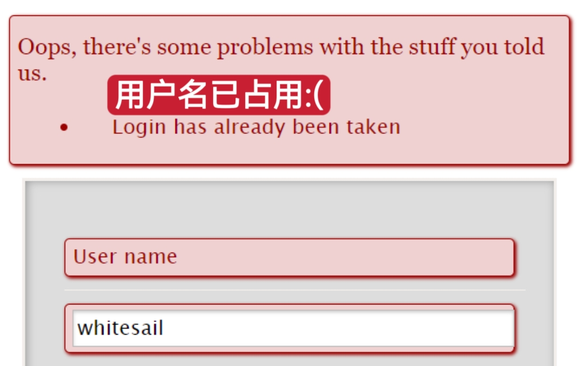<figcaption></figcaption></figure>

### Login must begin and end with a letter or number; it may also contain underscores but no other characters

用户名含有非法字符或用下划线开头结尾了。

<figure>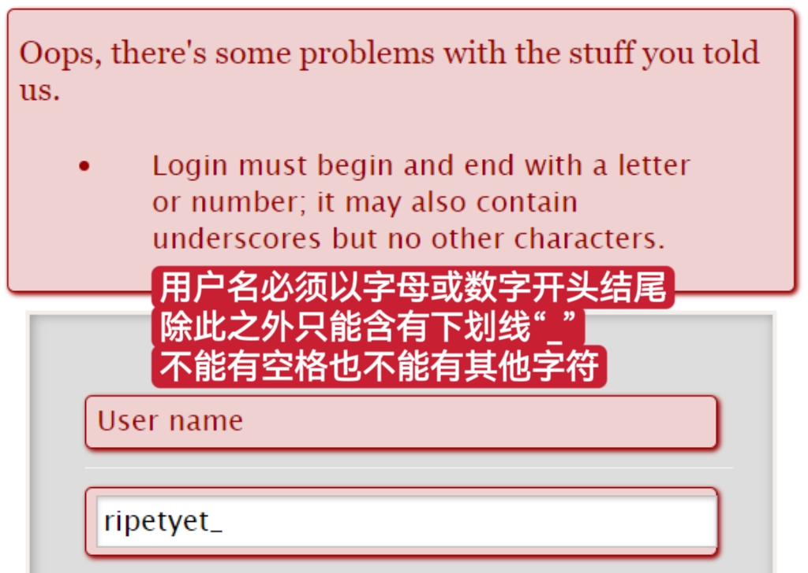<figcaption></figcaption></figure>

### Password confirmation doesn't match new password

第二遍输入的密码与第一遍不同。

[^1]: 不过，鉴于AO3是一个用户群体鱼龙混杂、内容广泛且多样化的网站，在拥有基本的判断能力后再接触它确实是更好的选择！

[^2]: 但是笔者强烈建议所有想要成为AO3用户的人至少理解并认同AO3的定义：一个**非营利、非商业性的同人作品档案馆**；由书籍、音乐、艺术、游戏、电视节目、电影、真人同人小说 (RPF) 和其他同人圈的**粉丝创建**，也**为粉丝服务**。
