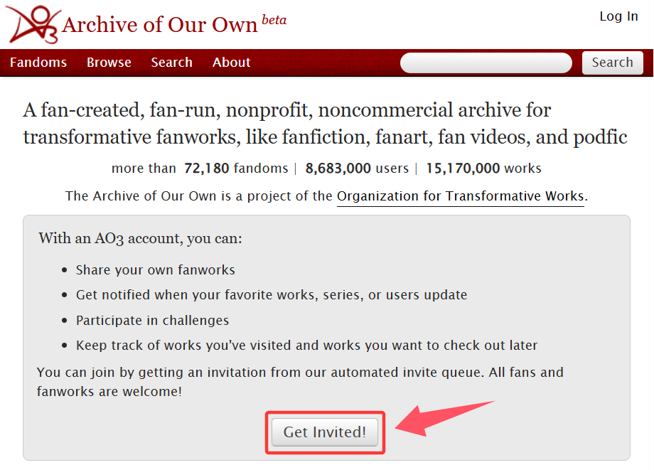
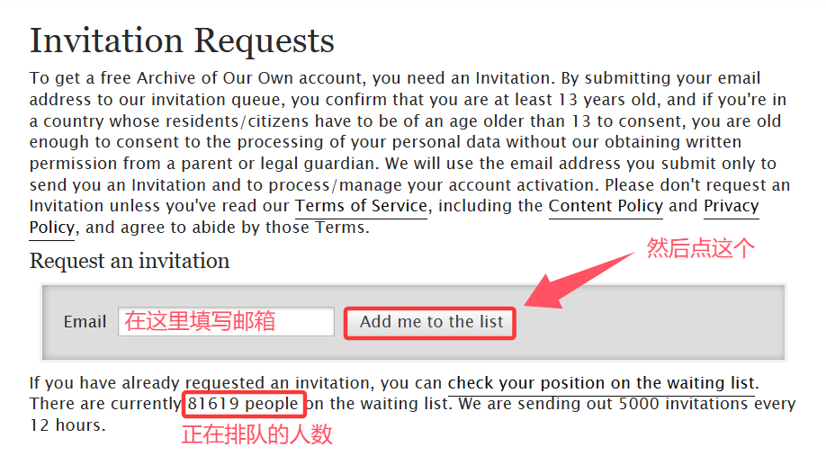
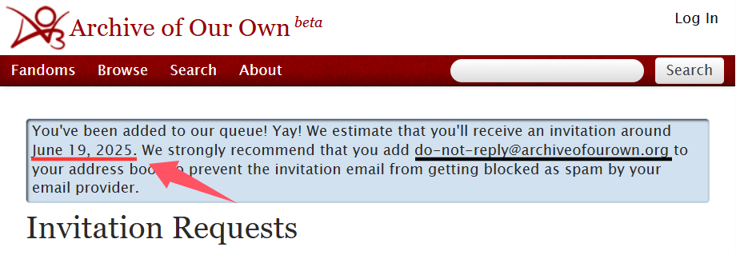
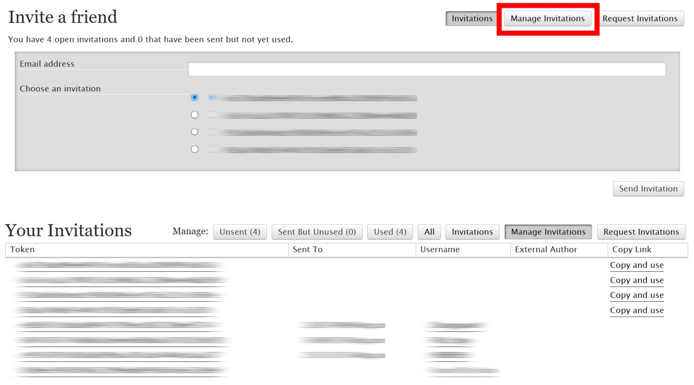

# 🔮 账号注册

虽然不注册账号也一样可以无障碍阅读AO3上的公开作品，但请让我耽误您几分钟，我想为您介绍一下我们的主，我们神圣的AO3账号……

## **注册账号的优点：**

1. 可以阅读仅对站内用户展示的作品；
2. 拥有历史记录、书签收藏、订阅更新、合集制作、小工具、网站主题换肤、屏蔽用户等功能；
3. 评论无需填写邮箱，评论收发更方便；
4. 发布自己的文章；
5. 可以给AO3募捐并成为拥有投票选举权的会员；
6. 随着AO3的不断更新，更多功能即将推出……

## **如何获得邀请：**


<mark style="color:red;">**注意：全程需挂梯子使用原网址。**</mark>


要注册AO3账号的唯一方式就是得到网站的**Invitation（邀请）**。获得邀请的途径有两种：让一名已经注册账号的AO3用户给你发送邀请码，或者去网站首页排队。前者，被邀请即可立刻创建账户，无需等待；后者往往需要等待几天甚至数周（这是正常的！世界很大）。

大部分用户都是靠排队注册的，所以先讲这个比较传统的方法。

### 方法一：邮件方法

1. 挂梯子打开原网址[https://archiveofourown.org](https://archiveofourown.org)后，点击首页上的`Get Invited!`按钮。

<figure><figcaption></figcaption></figure>

2. 在输入框内填写邮箱（任何邮箱都可以，但出于安全考虑建议使用不会绑定个人身份的邮箱如Outlook或Gmail）并点击`Add me to the list`按钮。

<figure><figcaption></figcaption></figure>

3.  界面顶部出现<mark style="background-color:blue;">「You've been added to our queue!」</mark>的蓝色消息框的时候，证明你已经排上队了。AO3将以5000条/12小时的速度发放邀请（并不是均匀发送的，人数不一定时刻变化）。

    消息框中，<mark style="color:red;">红线标示的是预计收到邮件的时间</mark>；黑线标示的是会给你发送邮件的邮箱。如果希望能正常收到邮件，避免邮件被拦截或进入垃圾箱，可以先把<mark style="color:blue;">do-not-reply@archiveofourown.org</mark>加入邮箱联系人或白名单。

<figure><figcaption></figcaption></figure>

4. 在漫长的等待之后，你收到了第一封邮件！（如果没有，找找邮件垃圾箱。）找到邮件里的<mark style="color:red;">follow this link to sign up</mark>，挂好梯子并点击。接下来，你就可以进入[创建账号](zhang-hao-zhu-ce.md#ru-he-chuang-jian-zhang-hao)步骤了。

<figure><figcaption></figcaption></figure>

### 方法二：邀请码法

内容较长，已折叠

2019年之前注册的账号自带8条邀请码，2019年后AO3停止向新账号提供快捷邀请码。

请注意：每个已注册用户拥有的邀请码数量是有限的，被使用过的邀请码即作废；另外，被邀请者在使用邀请码创建账号后，用户名和邮箱将对邀请者可见。

**邀请者需要做什么？**

1. 点开自己的**个人主页（Dashboard）**，找到`Invitations`按钮并点击。

<figure><figcaption></figcaption></figure>

界面如图所示：

<figure><figcaption></figcaption></figure>

2. 向受邀者发送邀请码有三种方法。

**方法一：**&#x5728;Email address中填入被邀请者想要用来注册的邮箱，选择一个邀请码，然后点击`Send Invitation`。之后应该跳转到这个界面：

<figure><figcaption></figcaption></figure>

不久，被邀请者就应该收到一封邮件：

<figure><figcaption></figcaption></figure>

请ta找到如图的<mark style="color:red;">follow this link to sign up</mark>，**挂好梯子**并点击。接下来的操作请参见「[如何创建账号](zhang-hao-zhu-ce.md#ru-he-chuang-jian-zhang-hao)」。

**方法二：**&#x5982;图，在Invite a friend界面选择`Manage Invitations`和`Unsent`。然后，复制`copy and use`这个超链接的网址（不是点开！是复制链接！）。

* 在Windows系统电脑上：右键该链接，然后选择「复制链接地址」
* 在MacOS系统电脑上：同时按下control键并点击链接，然后选择「复制链接」
* 在手机上：长按链接，然后选择「复制链接」

最后把链接发给你想邀请的人，请ta点开链接按照「[如何创建账号](zhang-hao-zhu-ce.md#ru-he-chuang-jian-zhang-hao)」操作即可（**别忘了挂梯子**）。

<figure><figcaption></figcaption></figure>

**方法三：**&#x76F4;接把邀请码那一长串字符复制并发送给被邀请者，请对方**挂好梯子**，在浏览器的地址栏输入「https://archiveofourown.org/signup/####」，并将「####」替换为邀请码字符串；替换完成后的链接会导向注册页面。接下来的操作参见「[如何创建账号](zhang-hao-zhu-ce.md#ru-he-chuang-jian-zhang-hao)」。

**如何查看自己的邀请码状态？**

在**Invite a friend**界面选择`Manage Invitations`，在Manage那一栏可以看见。

<figure><figcaption></figcaption></figure>

`Unsent`是未送出的，`Sent But Unused`是送出但未被认领的，`Used`就是已使用作废的。

## 如何创建账号


<mark style="color:red;">**注意：全程需挂梯子使用原网址。**</mark>


现在，你来到了**Creat Account（创建账号）**&#x754C;面。你需要填写的信息是

1. **User name**：用户名，只能含有大小写英文字母、数字和下划线（这个东西“\_”）且不能以下划线开头结尾
2. **Password**：密码，长度6到40个字符
3. **Confirm password**：确认密码，再输一遍
4. 勾选**Yes, I am at least 13**（我已满13岁）和**Yes, I have read the Terms of Service and agree to them**（我已阅读并同意AO3的服务条款）

最后点击`Create Account`就可以了。

<figure><figcaption></figcaption></figure>

<figure><figcaption></figcaption></figure>

<figure><figcaption></figcaption></figure>

在这之后你来到了一个告诉你**Almost Done!**&#x7684;界面，这意味着你即将收到第二封邮件。

<figure><figcaption></figcaption></figure>

在第二封邮件中寻找<mark style="color:red;">follow this link to activate your account</mark>，**挂好梯子**，点击它。

<figure><figcaption></figcaption></figure>

此时你来到一个顶端有蓝色消息框告诉你<mark style="background-color:blue;">「Account activation complete! Please log in.」</mark>的界面。第一行填的是用户名或邮箱，第二行填写密码；勾选`Remember me`的话下一次打开网站会自动登录。最后点击`Log in`，你面前的就是完全体的AO3了。

<figure><figcaption></figcaption></figure>

## 可能遇到的问题

### 怎么查看我有没有排上队？

点击首页上的`Get Invited!`按钮，打开**Request an invitation**页面，点击下图标黄的链接<mark style="color:red;">check your position on the waiting list</mark>。标红的数字是表示现在有多少人在排队。

<figure><figcaption></figcaption></figure>

在空白框中填入**你申请用的邮箱**，然后点击`Look me up`，下方即会出现查询结果。

<figure><figcaption></figcaption></figure>

<figure><figcaption></figcaption></figure>

### 第一封邮件为什么迟迟不来？

AO3基本每时每刻都在有新的加入者，排队人数以万计量，即使AO3每天发出一万份邀请，要排到你也得几天甚至几周。在你申请的时候，申请已受理的界面上也会告诉你收到邮件的预估时间。如果超过预估时间太久没有收到，请查看自己是否已经排上队；如果没有，重新申请。

### Email is already part of the queue

假如你在填写邮箱申请后报错<mark style="color:red;">「Email is already part of the queue」</mark>或<mark style="color:red;">「电子邮件已经是我们队列的一部分」</mark>，说明你已经在队列内，已经或者即将收到邮件，无需重复申请。

### 第二封邮件什么时候来？

第二封邮件一般会在Almost Done!页面出现后的几分钟之内收到。如果没有，可以查看一下自己邮箱的垃圾桶，看看是否被当成垃圾邮件拦截了，或搜索来自<mark style="color:blue;">do-not-reply@archiveofourown.org</mark>的邮件。如果超过24小时没有收到，请联系AO3官方支持。

### Login has been taken

如果提示<mark style="color:red;">「Login has been taken」</mark>或<mark style="color:red;">「登录已经被接受」</mark>意味着用户名重复，请更换注册用户名。

<figure><figcaption></figcaption></figure>

### Login must begin and end with a letter or number; it may also contain underscores but no other characters

用户名含有非法字符或用下划线开头结尾了。

<figure><figcaption></figcaption></figure>

### Password confirmation doesn't match new password

第二遍密码输错了。

<figure><figcaption></figcaption></figure>
